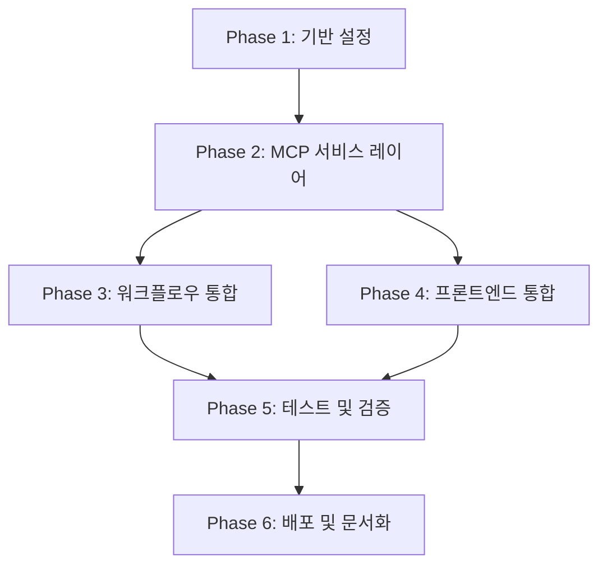

# MCP 통합 기능 구현 계획

## 문서 정보

- **작성일**: 2025-01-10
- **최종 수정**: 2025-01-11
- **프로젝트**: FastAPI RAG Backend - MCP Integration
- **기반 문서**: `MCP_INTEGRATION_API_SPECIFICATION.md`
- **목적**: 바로 구현 가능한 단계별 구현 계획 제공

---

## ⚠️ 중요 변경사항 (2025-01-11 업데이트)

이 문서는 코드베이스의 실제 구조에 맞춰 다음 사항들을 반영하도록 수정되었습니다:

### 1. 사용자 기반 소유권 모델 (팀 시스템 제거)
- **변경 전**: MCP 키가 `team_id`로 관리됨
- **변경 후**: MCP 키가 `user_id` 기반으로 관리됨
- **이유**: 코드베이스에서 이미 팀 테이블이 삭제되고 `user_id` 기반으로 전환됨 (`alembic/versions/f7e8d9c0a1b2_remove_team_add_user_ownership.py`)
- **영향**:
  - `MCPKey` 모델: `team_id` → `user_id`, `bot_id` 추가 (선택사항)
  - 모든 MCP 서비스 메서드: `team_id` 파라미터 → `user_id` 파라미터
  - 프론트엔드 타입: `team_id` → `user_id`, `created_by_email` → `user_email`

### 2. 워크플로 컨텍스트 계약 (dict 기반)
- **변경 전**: 노드가 `WorkflowExecutionContext` 객체를 받음
- **변경 후**: 노드가 `context.to_dict()` 결과(dict)를 받음
- **이유**: 현재 워크플로 실행기는 BaseNode.execute()에 dict를 전달함
- **영향**:
  - `MCPNode.execute()` 시그니처: `context: WorkflowExecutionContext` → `context: Dict[str, Any]`
  - `context.metadata.get()` → `context.get()`
  - bot_id를 통한 user_id 조회 로직 추가 (Bot.user_id)

### 3. 라우터 등록 위치
- **변경 전**: `app/api/v1/__init__.py`에 라우터 등록
- **변경 후**: `app/main.py`에 직접 라우터 등록
- **이유**: `app/api/v1/__init__.py`는 어디에서도 import되지 않음

### 4. 암호화 모듈 초기화 (지연 로드)
- **변경 전**: 모듈 import 시 즉시 `MCP_ENCRYPTION_KEY` 검증
- **변경 후**: 지연 로드로 변경 (`_get_aesgcm()` 함수)
- **이유**: .env 설정 전에도 테스트/CLI/Alembic 실행 가능하도록
- **영향**: `app.config.settings.mcp_encryption_key`에서 키를 가져옴

### 5. Settings 속성 수정
- **변경 전**: `settings.DATABASE_URL` (대문자)
- **변경 후**: `settings.get_database_url()` (메서드 호출)
- **이유**: Settings 클래스에 DATABASE_URL 속성 없음
- **영향**: 시드 스크립트 및 모든 DB URL 참조

### 6. MCP 키 스코핑 전략
- **사용자 레벨**: 기본, 모든 봇에서 사용 가능
- **봇 레벨**: 선택사항, 특정 봇에만 제한
- **조회 우선순위**: 봇 레벨 키 → 사용자 레벨 키 (폴백)

---

## 목차

1. [프로젝트 구조 분석](#1-프로젝트-구조-분석)
2. [Phase 1: 기반 설정](#phase-1-기반-설정)
3. [Phase 2: MCP 서비스 레이어](#phase-2-mcp-서비스-레이어)
4. [Phase 3: 워크플로우 통합](#phase-3-워크플로우-통합)
5. [Phase 4: 프론트엔드 통합](#phase-4-프론트엔드-통합)
6. [Phase 5: 테스트 및 검증](#phase-5-테스트-및-검증)
7. [Phase 6: 배포 및 문서화](#phase-6-배포-및-문서화)
8. [의존성 맵](#의존성-맵)
9. [체크리스트](#체크리스트)

---

## 1. 프로젝트 구조 분석

### 1.1 백엔드 현황

```
Backend/
├── app/
│   ├── main.py                      # FastAPI 앱 진입점
│   ├── config.py                    # 환경 설정
│   │
│   ├── models/                      # SQLAlchemy ORM 모델
│   │   ├── user.py                  # User, APIKey, RefreshToken
│   │   ├── bot.py                   # Bot, BotKnowledge
│   │   └── documents.py             # 문서 관련 모델
│   │
│   ├── schemas/                     # Pydantic 스키마
│   │   ├── auth.py
│   │   ├── bot.py
│   │   └── workflow.py
│   │
│   ├── core/                        # 핵심 로직
│   │   ├── database.py              # DB 연결 (asyncpg)
│   │   ├── redis_client.py          # Redis 연결
│   │   ├── auth/                    # 인증 (JWT, OAuth, API Key)
│   │   ├── providers/               # LLM 제공자 (OpenAI, Anthropic)
│   │   └── workflow/                # 워크플로우 엔진
│   │       ├── base_node.py         # 노드 추상 클래스
│   │       ├── node_registry.py     # 노드 레지스트리 (싱글톤)
│   │       ├── executor.py          # 워크플로우 실행 엔진
│   │       ├── validator.py         # 워크플로우 검증
│   │       └── nodes/               # 노드 구현체
│   │           ├── llm_node.py      # LLM 노드
│   │           ├── knowledge_node.py # Knowledge Retrieval 노드
│   │           ├── start_node.py
│   │           └── end_node.py
│   │
│   ├── services/                    # 비즈니스 로직
│   │   ├── bot_service.py
│   │   ├── chat_service.py
│   │   ├── document_service.py
│   │   ├── vector_service.py
│   │   ├── llm_service.py
│   │   └── workflow_engine.py       # 레거시 (deprecated)
│   │
│   └── api/v1/endpoints/            # API 엔드포인트
│       ├── auth.py
│       ├── bots.py
│       ├── chat.py
│       ├── upload.py
│       └── workflows.py
│
└── alembic/                         # DB 마이그레이션
    └── versions/
```

### 1.2 프론트엔드 현황

```
Frontend/my-project/src/
├── features/workflow/
│   ├── components/
│   │   ├── WorkflowBuilder/         # React Flow 기반 빌더
│   │   ├── nodes/                   # 노드 컴포넌트
│   │   │   ├── start/
│   │   │   ├── llm/
│   │   │   ├── knowledge-retrieval/
│   │   │   └── end/
│   │   ├── NodeConfigPanel/         # 노드 설정 패널
│   │   └── sidebar/                 # 노드 팔레트
│   │
│   ├── api/
│   │   └── workflowApi.ts          # API 클라이언트
│   │
│   ├── stores/
│   │   └── workflowStore.ts        # Zustand 상태 관리
│   │
│   └── types/
│       └── api.types.ts            # API 타입 정의
│
└── shared/
    ├── types/workflow.types.ts      # 워크플로우 공통 타입
    ├── constants/apiEndpoints.ts    # API 엔드포인트 상수
    └── api/client.ts                # Axios 클라이언트
```

### 1.3 주요 패턴 및 아키텍처

#### 백엔드

1. **워크플로우 노드 시스템**
   - `BaseNode` 추상 클래스
   - `@register_node` 데코레이터로 노드 타입 등록
   - `NodeRegistry` 싱글톤으로 노드 관리
   - `WorkflowExecutor`가 토폴로지 정렬 후 순차 실행

2. **인증 시스템**
   - JWT Bearer Token (15분)
   - Refresh Token (7일, DB 저장)
   - API Key (bcrypt 해싱, 사용자별 관리)

3. **데이터베이스**
   - SQLAlchemy 2.0 (비동기)
   - Alembic 마이그레이션
   - PostgreSQL (asyncpg 드라이버)

4. **캐싱**
   - Redis (비동기 클라이언트)
   - 현재 사용: 세션 관리, Rate Limiting

#### 프론트엔드

1. **워크플로우 빌더**
   - React Flow 라이브러리
   - Zustand 상태 관리
   - TypeScript 타입 안전성

2. **노드 구조**
   - `BlockEnum`: 노드 타입 열거형
   - `CommonNodeType`: 공통 속성 (title, desc, type, position)
   - 각 노드별 전용 타입 (LLMNodeType, KnowledgeRetrievalNodeType 등)

3. **API 통신**
   - Axios 기반 클라이언트
   - 환경변수 기반 Base URL
   - JWT 토큰 자동 첨부

---

## Phase 1: 기반 설정

**목표**: DB 모델, 마이그레이션, 암호화 레이어 구축

**예상 소요 시간**: 2-3일

### 1.1 데이터베이스 모델 생성

#### 📁 `app/models/mcp.py` (신규 생성)

```python
"""
MCP (Model Context Protocol) 관련 데이터베이스 모델
"""
from sqlalchemy import Column, Integer, String, DateTime, ForeignKey, Boolean, Text, Index
from sqlalchemy.orm import relationship
from sqlalchemy.sql import func
import uuid

from app.core.database import Base


class MCPProvider(Base):
    """MCP 제공자 메타데이터 테이블"""
    __tablename__ = "mcp_providers"

    id = Column(Integer, primary_key=True, index=True)
    provider_id = Column(String(50), unique=True, index=True, nullable=False)  # "youtube-summary", "slack"
    name = Column(String(100), nullable=False)
    description = Column(Text, nullable=True)
    icon = Column(String(500), nullable=True)  # 아이콘 (이모지 또는 URL)

    # 워크플로우 빌더용 메타데이터 (JSON)
    supported_actions = Column(Text, nullable=False)  # JSON: [{"action_id": "...", "name": "...", "parameters": [...]}]
    required_keys = Column(Text, nullable=False)  # JSON: [{"key_name": "api_key", "display_name": "...", "is_secret": true}]
    config_schema = Column(Text, nullable=True)  # JSON: {"type": "object", "properties": {...}}

    is_active = Column(Boolean, default=True)
    created_at = Column(DateTime(timezone=True), server_default=func.now())
    updated_at = Column(DateTime(timezone=True), onupdate=func.now())

    # 관계
    mcp_keys = relationship("MCPKey", back_populates="provider", cascade="all, delete-orphan")


class MCPKey(Base):
    """사용자별 MCP API 키 테이블"""
    __tablename__ = "mcp_keys"

    id = Column(Integer, primary_key=True, index=True)
    key_id = Column(String(50), unique=True, index=True, nullable=False)  # "mcp_key_1234567890_abc"

    # 외래키 - 사용자 기반 소유권 (팀 시스템 삭제됨)
    user_id = Column(Integer, ForeignKey("users.id", ondelete="CASCADE"), nullable=False, index=True)
    provider_id = Column(String(50), ForeignKey("mcp_providers.provider_id", ondelete="CASCADE"), nullable=False, index=True)

    # Bot 레벨 스코핑 (선택사항: 특정 봇에만 키를 제한하려면 사용)
    bot_id = Column(String(50), ForeignKey("bots.bot_id", ondelete="CASCADE"), nullable=True, index=True)

    # 암호화된 키 값 (AES-256-GCM)
    encrypted_blob = Column(Text, nullable=False)  # Base64 인코딩된 암호화 데이터

    # 메타데이터
    display_name = Column(String(200), nullable=False)
    description = Column(Text, nullable=True)

    # 상태
    is_active = Column(Boolean, default=True)
    last_used_at = Column(DateTime(timezone=True), nullable=True)

    created_at = Column(DateTime(timezone=True), server_default=func.now())
    updated_at = Column(DateTime(timezone=True), onupdate=func.now())

    # 관계
    provider = relationship("MCPProvider", back_populates="mcp_keys")
    user = relationship("User", backref="mcp_keys")
    bot = relationship("Bot", backref="mcp_keys")  # bot_id가 있을 경우

    # 복합 유니크 제약 (사용자당 제공자별 display_name 중복 방지)
    __table_args__ = (
        Index('idx_user_provider', 'user_id', 'provider_id'),
        Index('idx_user_provider_display', 'user_id', 'provider_id', 'display_name', unique=True),
    )
```

#### 📁 `app/models/__init__.py` (수정)

```python
from app.models.user import User, RefreshToken, APIKey
from app.models.bot import Bot, BotKnowledge
from app.models.documents import Document
from app.models.mcp import MCPProvider, MCPKey  # 추가
```

### 1.2 Alembic 마이그레이션 생성

#### ⚠️ 마이그레이션 전략

**중요**: 현재 코드베이스는 이미 팀 시스템을 제거하고 user_id 기반으로 전환됨 (`alembic/versions/f7e8d9c0a1b2_remove_team_add_user_ownership.py` 참조).
MCP 키는 처음부터 user_id 기반으로 생성되며, 기존 team FK가 존재하지 않음.

**마이그레이션 검증 사항**:
- teams 테이블이 존재하지 않으므로 team_id FK를 추가하면 안 됨
- user_id 외래키는 users.id를 참조
- bot_id 외래키는 bots.bot_id를 참조 (선택사항)

#### 🔧 명령어 실행

```bash
# 마이그레이션 파일 자동 생성
alembic revision --autogenerate -m "Add MCP provider and key tables with user ownership"

# 생성된 파일 경로: alembic/versions/XXXX_add_mcp_provider_and_key_tables_with_user_ownership.py
```

#### 📁 `alembic/versions/XXXX_add_mcp_provider_and_key_tables_with_user_ownership.py` (생성 후 검토)

마이그레이션 파일이 생성되면 다음을 확인:
- `mcp_providers` 테이블 생성
- `mcp_keys` 테이블 생성
- 외래키 제약 조건 (user_id, provider_id, bot_id)
- 인덱스 생성 (idx_user_provider, idx_user_provider_display)
- 유니크 제약 조건 (user_id + provider_id + display_name)
- **team_id 관련 코드가 없는지 확인 필수**

#### 🔧 마이그레이션 적용

```bash
# 마이그레이션 적용
alembic upgrade head

# 롤백 테스트 (필수)
alembic downgrade -1
alembic upgrade head

# 검증: mcp_keys 테이블에서 user_id 컬럼 확인
psql -U user -d dbname -c "\d mcp_keys"
```

### 1.3 암호화 레이어 구현

#### 📁 `app/core/mcp/crypto.py` (신규 생성)

```python
"""
MCP 키 암호화/복호화 모듈

AES-256-GCM을 사용하여 MCP API 키를 안전하게 암호화합니다.
"""
from cryptography.hazmat.primitives.ciphers.aead import AESGCM
from cryptography.hazmat.backends import default_backend
import base64
import json
import logging
from typing import Dict, Optional

from app.config import settings

logger = logging.getLogger(__name__)

# 전역 암호화 객체 (지연 초기화)
_aesgcm: Optional[AESGCM] = None


def _get_aesgcm() -> AESGCM:
    """
    AESGCM 인스턴스를 지연 초기화 (Lazy Loading)

    설정 파일에서 MCP_ENCRYPTION_KEY를 가져와 검증 후 AESGCM 객체 생성.
    이렇게 하면 .env 세팅 전에도 모듈을 import할 수 있음 (테스트/CLI/Alembic 등).

    Returns:
        AESGCM: 암호화 객체

    Raises:
        ValueError: MCP_ENCRYPTION_KEY가 설정되지 않았거나 형식이 잘못됨
    """
    global _aesgcm

    if _aesgcm is not None:
        return _aesgcm

    # Settings에서 키 가져오기
    encryption_key = settings.mcp_encryption_key

    if not encryption_key:
        raise ValueError(
            "MCP_ENCRYPTION_KEY environment variable is not set. "
            "Please add it to your .env file."
        )

    try:
        master_key = base64.b64decode(encryption_key)
        if len(master_key) != 32:
            raise ValueError("MCP_ENCRYPTION_KEY must be 32 bytes (256 bits)")
    except Exception as e:
        raise ValueError(f"Invalid MCP_ENCRYPTION_KEY format: {e}")

    _aesgcm = AESGCM(master_key)
    logger.info("MCP encryption module initialized")

    return _aesgcm


def encrypt_secrets(secrets: Dict[str, str]) -> str:
    """
    MCP 키 값들을 AES-256-GCM으로 암호화

    Args:
        secrets: {"api_key": "AIza...", "bot_token": "xoxb-..."}

    Returns:
        Base64 인코딩된 암호화 데이터 (nonce + ciphertext + tag)

    Raises:
        ValueError: 잘못된 입력 형식
        Exception: 암호화 실패
    """
    if not isinstance(secrets, dict):
        raise ValueError("secrets must be a dictionary")

    if not secrets:
        raise ValueError("secrets cannot be empty")

    try:
        # AESGCM 인스턴스 가져오기 (지연 로드)
        aesgcm = _get_aesgcm()

        # JSON 직렬화
        plaintext = json.dumps(secrets, ensure_ascii=False).encode('utf-8')

        # 랜덤 nonce 생성 (96비트 권장)
        import os
        nonce = os.urandom(12)

        # 암호화 (인증 태그 자동 생성)
        ciphertext = aesgcm.encrypt(nonce, plaintext, None)

        # nonce + ciphertext 결합 후 Base64 인코딩
        encrypted = nonce + ciphertext
        encoded = base64.b64encode(encrypted).decode('utf-8')

        logger.debug(f"Encrypted {len(secrets)} secret(s)")
        return encoded

    except Exception as e:
        logger.error(f"Encryption failed: {e}")
        raise


def decrypt_secrets(encrypted_data: str) -> Dict[str, str]:
    """
    암호화된 MCP 키 값들을 복호화

    Args:
        encrypted_data: Base64 인코딩된 암호화 데이터

    Returns:
        {"api_key": "AIza...", "bot_token": "xoxb-..."}

    Raises:
        ValueError: 잘못된 입력 형식
        Exception: 복호화 실패 (인증 실패 포함)
    """
    if not isinstance(encrypted_data, str):
        raise ValueError("encrypted_data must be a string")

    if not encrypted_data:
        raise ValueError("encrypted_data cannot be empty")

    try:
        # AESGCM 인스턴스 가져오기 (지연 로드)
        aesgcm = _get_aesgcm()

        # Base64 디코딩
        encrypted = base64.b64decode(encrypted_data)

        # nonce와 ciphertext 분리
        nonce = encrypted[:12]
        ciphertext = encrypted[12:]

        # 복호화 (인증 태그 자동 검증)
        plaintext = aesgcm.decrypt(nonce, ciphertext, None)

        # JSON 역직렬화
        secrets = json.loads(plaintext.decode('utf-8'))

        logger.debug(f"Decrypted {len(secrets)} secret(s)")
        return secrets

    except Exception as e:
        logger.error(f"Decryption failed: {e}")
        raise


def generate_master_key() -> str:
    """
    새로운 마스터 키 생성 (개발/테스트용)

    Returns:
        Base64 인코딩된 32바이트 랜덤 키
    """
    random_key = os.urandom(32)
    return base64.b64encode(random_key).decode('utf-8')
```

#### 📁 `app/core/mcp/__init__.py` (신규 생성)

```python
"""MCP 핵심 모듈"""
from app.core.mcp.crypto import encrypt_secrets, decrypt_secrets, generate_master_key

__all__ = ['encrypt_secrets', 'decrypt_secrets', 'generate_master_key']
```

### 1.4 환경 변수 추가

#### 📁 `.env.local` (수정)

```bash
# MCP 암호화 키 (256비트 = 32바이트, Base64 인코딩)
# 생성 방법: python -c "import os, base64; print(base64.b64encode(os.urandom(32)).decode())"
MCP_ENCRYPTION_KEY=your_base64_encoded_32_byte_key_here

# Redis (캐싱용)
REDIS_HOST=localhost
REDIS_PORT=6379
REDIS_DB=0
REDIS_PASSWORD=
```

#### 📁 `app/config.py` (수정)

**중요**: Pydantic Settings는 snake_case 필드를 자동으로 UPPER_CASE 환경 변수와 매핑합니다.

```python
from pydantic_settings import BaseSettings
from typing import Optional

class Settings(BaseSettings):
    # ... 기존 설정 ...

    # MCP 설정 (환경 변수: MCP_ENCRYPTION_KEY)
    mcp_encryption_key: str

    # Redis 설정
    redis_host: str = "localhost"
    redis_port: int = 6379
    redis_db: int = 0
    redis_password: Optional[str] = None

    class Config:
        env_file = ".env.local"
        case_sensitive = False  # 환경 변수는 대소문자 구분 안 함

settings = Settings()
```

### 1.5 Phase 1 체크리스트

- [ ] `app/models/mcp.py` 파일 생성 (MCPProvider, MCPKey 모델)
- [ ] `app/models/__init__.py`에 모델 임포트 추가
- [ ] Alembic 마이그레이션 파일 생성
- [ ] 마이그레이션 적용 및 롤백 테스트
- [ ] PostgreSQL에서 테이블 생성 확인
- [ ] `app/core/mcp/crypto.py` 파일 생성 (암호화/복호화)
- [ ] `app/core/mcp/__init__.py` 파일 생성
- [ ] `.env.local`에 `MCP_ENCRYPTION_KEY` 추가
- [ ] `app/config.py`에 MCP 설정 추가
- [ ] 암호화/복호화 함수 단위 테스트 작성 및 실행
- [ ] 마스터 키 생성 스크립트 작성 (`scripts/generate_mcp_key.py`)

---

## Phase 2: MCP 서비스 레이어

**목표**: MCP API 엔드포인트 및 비즈니스 로직 구현

**예상 소요 시간**: 3-4일

### 2.1 Pydantic 스키마 정의

#### 📁 `app/schemas/mcp.py` (신규 생성)

```python
"""
MCP 관련 Pydantic 스키마
"""
from pydantic import BaseModel, Field, validator
from typing import Optional, List, Dict, Any
from datetime import datetime


# ============= MCP 제공자 스키마 =============

class MCPProviderBase(BaseModel):
    """MCP 제공자 기본 스키마"""
    provider_id: str = Field(..., min_length=1, max_length=50)
    name: str = Field(..., min_length=1, max_length=100)
    description: Optional[str] = None
    icon: Optional[str] = None


class MCPProviderCreate(MCPProviderBase):
    """MCP 제공자 생성 스키마"""
    supported_actions: List[Dict[str, Any]]  # 액션 목록 및 파라미터 정의
    required_keys: List[Dict[str, Any]]  # [{"key_name": "api_key", "display_name": "...", "is_secret": true}]
    config_schema: Optional[Dict[str, Any]] = None  # JSON Schema


class MCPProviderResponse(MCPProviderBase):
    """MCP 제공자 응답 스키마"""
    supported_actions: List[Dict[str, Any]]
    required_keys: List[Dict[str, Any]]
    config_schema: Optional[Dict[str, Any]]
    is_active: bool

    class Config:
        from_attributes = True


# ============= MCP 키 스키마 =============

class MCPKeyCreate(BaseModel):
    """MCP 키 생성 요청 스키마"""
    provider_id: str = Field(..., min_length=1)
    display_name: str = Field(..., min_length=1, max_length=200)
    description: Optional[str] = None
    bot_id: Optional[str] = None  # 봇 레벨 스코핑 (선택사항)
    keys: Dict[str, str] = Field(..., min_items=1)  # {"api_key": "AIza123..."}

    @validator('keys')
    def validate_keys(cls, v):
        """키 값 검증"""
        if not v:
            raise ValueError("At least one key is required")
        for key_name, key_value in v.items():
            if not key_value or not key_value.strip():
                raise ValueError(f"Key '{key_name}' cannot be empty")
        return v


class MCPKeyUpdate(BaseModel):
    """MCP 키 업데이트 요청 스키마"""
    display_name: Optional[str] = Field(None, min_length=1, max_length=200)
    description: Optional[str] = None
    keys: Optional[Dict[str, str]] = Field(None, min_items=1)
    is_active: Optional[bool] = None


class MCPKeyResponse(BaseModel):
    """MCP 키 응답 스키마 (키 값 제외)"""
    key_id: str
    user_id: int  # 사용자 기반 소유권 (팀 시스템 삭제됨)
    bot_id: Optional[str]  # 봇 레벨 스코핑 (선택사항)
    provider_id: str
    provider_name: str
    display_name: str
    description: Optional[str]
    is_active: bool
    keys_registered: List[str]  # ["api_key", "bot_token"]
    last_used_at: Optional[datetime]
    created_at: datetime
    user_email: str  # 소유자 이메일

    class Config:
        from_attributes = True


class MCPKeyListResponse(BaseModel):
    """MCP 키 목록 응답 스키마"""
    total: int
    keys: List[MCPKeyResponse]


# ============= 에러 응답 스키마 =============

class MCPErrorResponse(BaseModel):
    """MCP 에러 응답 스키마"""
    error_code: str
    message: str
    details: Optional[Dict[str, any]] = None
```

#### 📁 `app/schemas/__init__.py` (수정)

```python
from app.schemas.auth import *
from app.schemas.bot import *
from app.schemas.workflow import *
from app.schemas.mcp import *  # 추가
```

### 2.2 MCP 서비스 구현

#### 📁 `app/services/mcp_service.py` (신규 생성)

```python
"""
MCP 서비스 레이어

MCP 제공자 및 키 관리 비즈니스 로직을 처리합니다.
"""
import logging
import json
from typing import List, Optional, Dict
from sqlalchemy.ext.asyncio import AsyncSession
from sqlalchemy import select, and_
from datetime import datetime
import secrets

from app.models.mcp import MCPProvider, MCPKey
from app.models.user import User
from app.schemas.mcp import (
    MCPProviderResponse,
    MCPKeyCreate,
    MCPKeyUpdate,
    MCPKeyResponse,
    MCPKeyListResponse
)
from app.core.mcp.crypto import encrypt_secrets, decrypt_secrets
from app.core.exceptions import (
    MCPProviderNotFoundError,
    MCPKeyNotFoundError,
    DuplicateKeyNameError,
    KeyValidationError,
    PermissionDeniedError
)

logger = logging.getLogger(__name__)


class MCPService:
    """MCP 관리 서비스"""

    async def get_providers(self, db: AsyncSession) -> List[MCPProviderResponse]:
        """
        MCP 제공자 목록 조회

        Args:
            db: 데이터베이스 세션

        Returns:
            제공자 목록
        """
        stmt = select(MCPProvider).where(MCPProvider.is_active == True)
        result = await db.execute(stmt)
        providers = result.scalars().all()

        return [
            MCPProviderResponse(
                provider_id=p.provider_id,
                name=p.name,
                description=p.description,
                icon=p.icon,
                supported_actions=json.loads(p.supported_actions) if p.supported_actions else [],
                required_keys=json.loads(p.required_keys) if p.required_keys else [],
                config_schema=json.loads(p.config_schema) if p.config_schema else None,
                is_active=p.is_active
            )
            for p in providers
        ]

    async def get_provider(
        self,
        provider_id: str,
        db: AsyncSession
    ) -> MCPProviderResponse:
        """
        특정 MCP 제공자 조회

        Args:
            provider_id: 제공자 ID
            db: 데이터베이스 세션

        Returns:
            제공자 정보

        Raises:
            MCPProviderNotFoundError: 제공자를 찾을 수 없는 경우
        """
        stmt = select(MCPProvider).where(MCPProvider.provider_id == provider_id)
        result = await db.execute(stmt)
        provider = result.scalar_one_or_none()

        if not provider:
            raise MCPProviderNotFoundError(f"Provider '{provider_id}' not found")

        return MCPProviderResponse(
            provider_id=provider.provider_id,
            name=provider.name,
            description=provider.description,
            icon=provider.icon,
            supported_actions=json.loads(provider.supported_actions) if provider.supported_actions else [],
            required_keys=json.loads(provider.required_keys) if provider.required_keys else [],
            config_schema=json.loads(provider.config_schema) if provider.config_schema else None,
            is_active=provider.is_active
        )

    async def create_key(
        self,
        user_id: int,
        key_data: MCPKeyCreate,
        db: AsyncSession,
        bot_id: Optional[str] = None
    ) -> MCPKeyResponse:
        """
        MCP 키 생성 (사용자 기반 소유권)

        Args:
            user_id: 사용자 ID (소유자)
            key_data: 키 생성 데이터
            db: 데이터베이스 세션
            bot_id: 봇 ID (선택사항, 특정 봇에만 키를 제한)

        Returns:
            생성된 키 정보

        Raises:
            MCPProviderNotFoundError: 제공자를 찾을 수 없는 경우
            DuplicateKeyNameError: 동일한 display_name이 이미 존재하는 경우
            KeyValidationError: 키 검증 실패
        """
        # 제공자 존재 확인
        provider_stmt = select(MCPProvider).where(
            MCPProvider.provider_id == key_data.provider_id
        )
        provider_result = await db.execute(provider_stmt)
        provider = provider_result.scalar_one_or_none()

        if not provider:
            raise MCPProviderNotFoundError(
                f"Provider '{key_data.provider_id}' not found"
            )

        # 중복 display_name 확인 (사용자 단위)
        duplicate_stmt = select(MCPKey).where(
            and_(
                MCPKey.user_id == user_id,
                MCPKey.provider_id == key_data.provider_id,
                MCPKey.display_name == key_data.display_name
            )
        )
        duplicate_result = await db.execute(duplicate_stmt)
        if duplicate_result.scalar_one_or_none():
            raise DuplicateKeyNameError(
                f"Key with name '{key_data.display_name}' already exists"
            )

        # 필수 키 검증
        required_keys = json.loads(provider.required_keys)
        required_key_names = [k['key_name'] for k in required_keys]

        provided_key_names = set(key_data.keys.keys())
        required_key_set = set(required_key_names)

        if not required_key_set.issubset(provided_key_names):
            missing_keys = required_key_set - provided_key_names
            raise KeyValidationError(
                f"Missing required keys: {', '.join(missing_keys)}"
            )

        # 키 암호화
        try:
            encrypted_blob = encrypt_secrets(key_data.keys)
        except Exception as e:
            logger.error(f"Encryption failed: {e}")
            raise KeyValidationError("Failed to encrypt keys")

        # 키 ID 생성 (mcp_key_{timestamp}_{random})
        key_id = f"mcp_key_{int(datetime.utcnow().timestamp())}_{secrets.token_hex(6)}"

        # DB 저장 (사용자 기반)
        mcp_key = MCPKey(
            key_id=key_id,
            user_id=user_id,
            bot_id=bot_id,  # 선택사항
            provider_id=key_data.provider_id,
            encrypted_blob=encrypted_blob,
            display_name=key_data.display_name,
            description=key_data.description,
            is_active=True
        )

        db.add(mcp_key)
        await db.commit()
        await db.refresh(mcp_key)

        logger.info(f"Created MCP key: {key_id} for user {user_id}")

        # 응답 생성
        user_stmt = select(User).where(User.id == user_id)
        user_result = await db.execute(user_stmt)
        user = user_result.scalar_one()

        return MCPKeyResponse(
            key_id=mcp_key.key_id,
            user_id=mcp_key.user_id,
            bot_id=mcp_key.bot_id,
            provider_id=mcp_key.provider_id,
            provider_name=provider.name,
            display_name=mcp_key.display_name,
            description=mcp_key.description,
            is_active=mcp_key.is_active,
            keys_registered=list(key_data.keys.keys()),
            last_used_at=mcp_key.last_used_at,
            created_at=mcp_key.created_at,
            user_email=user.email
        )

    async def list_keys(
        self,
        user_id: int,
        db: AsyncSession,
        provider_id: Optional[str] = None,
        bot_id: Optional[str] = None,
        is_active: Optional[bool] = None
    ) -> MCPKeyListResponse:
        """
        사용자의 MCP 키 목록 조회

        Args:
            user_id: 사용자 ID
            db: 데이터베이스 세션
            provider_id: 제공자 ID (선택)
            bot_id: 봇 ID (선택, 특정 봇의 키만 필터링)
            is_active: 활성 상태 (선택, True/False로 필터링)

        Returns:
            키 목록
        """
        stmt = select(MCPKey).where(MCPKey.user_id == user_id)

        if provider_id:
            stmt = stmt.where(MCPKey.provider_id == provider_id)

        if bot_id:
            stmt = stmt.where(MCPKey.bot_id == bot_id)

        if is_active is not None:
            stmt = stmt.where(MCPKey.is_active == is_active)

        stmt = stmt.order_by(MCPKey.created_at.desc())

        result = await db.execute(stmt)
        keys = result.scalars().all()

        # 응답 생성
        key_responses = []
        for key in keys:
            # 제공자 정보 조회
            provider_stmt = select(MCPProvider).where(
                MCPProvider.provider_id == key.provider_id
            )
            provider_result = await db.execute(provider_stmt)
            provider = provider_result.scalar_one()

            # 사용자 정보 조회
            user_stmt = select(User).where(User.id == key.user_id)
            user_result = await db.execute(user_stmt)
            user = user_result.scalar_one()

            # 등록된 키 이름 추출
            try:
                decrypted_keys = decrypt_secrets(key.encrypted_blob)
                keys_registered = list(decrypted_keys.keys())
            except Exception as e:
                logger.error(f"Failed to decrypt key {key.key_id}: {e}")
                keys_registered = []

            key_responses.append(
                MCPKeyResponse(
                    key_id=key.key_id,
                    user_id=key.user_id,
                    bot_id=key.bot_id,
                    provider_id=key.provider_id,
                    provider_name=provider.name,
                    display_name=key.display_name,
                    description=key.description,
                    is_active=key.is_active,
                    keys_registered=keys_registered,
                    last_used_at=key.last_used_at,
                    created_at=key.created_at,
                    user_email=user.email
                )
            )

        return MCPKeyListResponse(
            total=len(key_responses),
            keys=key_responses
        )

    async def get_key(
        self,
        key_id: str,
        user_id: int,
        db: AsyncSession
    ) -> MCPKeyResponse:
        """
        특정 MCP 키 조회 (사용자 권한 확인)

        Args:
            key_id: 키 ID
            user_id: 사용자 ID (소유자 확인)
            db: 데이터베이스 세션

        Returns:
            키 정보

        Raises:
            MCPKeyNotFoundError: 키를 찾을 수 없는 경우
        """
        stmt = select(MCPKey).where(
            and_(
                MCPKey.key_id == key_id,
                MCPKey.user_id == user_id
            )
        )
        result = await db.execute(stmt)
        key = result.scalar_one_or_none()

        if not key:
            raise MCPKeyNotFoundError(f"Key '{key_id}' not found")

        # 제공자 정보 조회
        provider_stmt = select(MCPProvider).where(
            MCPProvider.provider_id == key.provider_id
        )
        provider_result = await db.execute(provider_stmt)
        provider = provider_result.scalar_one()

        # 사용자 정보 조회 (소유자)
        user_stmt = select(User).where(User.id == key.user_id)
        user_result = await db.execute(user_stmt)
        user = user_result.scalar_one()

        # 등록된 키 이름 추출
        try:
            decrypted_keys = decrypt_secrets(key.encrypted_blob)
            keys_registered = list(decrypted_keys.keys())
        except Exception as e:
            logger.error(f"Failed to decrypt key {key.key_id}: {e}")
            keys_registered = []

        return MCPKeyResponse(
            key_id=key.key_id,
            user_id=key.user_id,
            bot_id=key.bot_id,
            provider_id=key.provider_id,
            provider_name=provider.name,
            display_name=key.display_name,
            description=key.description,
            is_active=key.is_active,
            keys_registered=keys_registered,
            last_used_at=key.last_used_at,
            created_at=key.created_at,
            user_email=user.email
        )

    async def delete_key(
        self,
        key_id: str,
        user_id: int,
        db: AsyncSession
    ) -> None:
        """
        MCP 키 삭제 (사용자 권한 확인)

        Args:
            key_id: 키 ID
            user_id: 사용자 ID (소유자 확인)
            db: 데이터베이스 세션

        Raises:
            MCPKeyNotFoundError: 키를 찾을 수 없는 경우
        """
        stmt = select(MCPKey).where(
            and_(
                MCPKey.key_id == key_id,
                MCPKey.user_id == user_id
            )
        )
        result = await db.execute(stmt)
        key = result.scalar_one_or_none()

        if not key:
            raise MCPKeyNotFoundError(f"Key '{key_id}' not found")

        await db.delete(key)
        await db.commit()

        logger.info(f"Deleted MCP key: {key_id} (user: {user_id})")

    async def get_decrypted_keys(
        self,
        user_id: int,
        provider_id: str,
        db: AsyncSession,
        bot_id: Optional[str] = None
    ) -> Optional[Dict[str, str]]:
        """
        워크플로우 실행용: 복호화된 키 조회 (사용자 기반)

        Args:
            user_id: 사용자 ID
            provider_id: 제공자 ID
            db: 데이터베이스 세션
            bot_id: 봇 ID (선택사항, 봇 레벨 스코핑용)

        Returns:
            복호화된 키 딕셔너리 또는 None
        """
        # 봇 레벨 키 우선, 사용자 레벨 키 폴백
        stmt = select(MCPKey).where(
            and_(
                MCPKey.user_id == user_id,
                MCPKey.provider_id == provider_id,
                MCPKey.is_active == True
            )
        )

        # bot_id가 주어지면 봇 레벨 키 우선 조회
        if bot_id:
            stmt = stmt.where(MCPKey.bot_id == bot_id)

        stmt = stmt.order_by(MCPKey.created_at.desc()).limit(1)

        result = await db.execute(stmt)
        key = result.scalar_one_or_none()

        # 봇 레벨 키가 없으면 사용자 레벨 키 조회
        if not key and bot_id:
            stmt_fallback = select(MCPKey).where(
                and_(
                    MCPKey.user_id == user_id,
                    MCPKey.provider_id == provider_id,
                    MCPKey.bot_id.is_(None),  # 봇 레벨이 아닌 사용자 레벨 키
                    MCPKey.is_active == True
                )
            ).order_by(MCPKey.created_at.desc()).limit(1)

            result = await db.execute(stmt_fallback)
            key = result.scalar_one_or_none()

        if not key:
            return None

        # 마지막 사용 시간 업데이트
        key.last_used_at = datetime.utcnow()
        await db.commit()

        # 복호화
        try:
            return decrypt_secrets(key.encrypted_blob)
        except Exception as e:
            logger.error(f"Failed to decrypt key {key.key_id}: {e}")
            return None
```

### 2.3 예외 클래스 추가

#### 📁 `app/core/exceptions.py` (수정)

```python
# 기존 예외 클래스들...

class MCPProviderNotFoundError(Exception):
    """MCP 제공자를 찾을 수 없음"""
    pass


class MCPKeyNotFoundError(Exception):
    """MCP 키를 찾을 수 없음"""
    pass


class DuplicateKeyNameError(Exception):
    """중복된 키 이름"""
    pass


class KeyValidationError(Exception):
    """키 검증 실패"""
    pass
```

### 2.4 API 엔드포인트 구현

#### 📁 `app/api/v1/endpoints/mcp.py` (신규 생성)

```python
"""
MCP API 엔드포인트

MCP 제공자 및 키 관리 API를 제공합니다.
"""
from fastapi import APIRouter, Depends, HTTPException, status
from sqlalchemy.ext.asyncio import AsyncSession
from typing import List, Optional

from app.core.database import get_db
from app.core.auth.dependencies import get_current_user_from_jwt
from app.models.user import User
from app.services.mcp_service import MCPService
from app.schemas.mcp import (
    MCPProviderResponse,
    MCPKeyCreate,
    MCPKeyResponse,
    MCPKeyListResponse,
    MCPErrorResponse
)
from app.core.exceptions import (
    MCPProviderNotFoundError,
    MCPKeyNotFoundError,
    DuplicateKeyNameError,
    KeyValidationError
)

router = APIRouter()
mcp_service = MCPService()


@router.get(
    "/providers",
    response_model=List[MCPProviderResponse],
    summary="MCP 제공자 목록 조회",
    description="지원되는 모든 MCP 제공자 목록을 조회합니다."
)
async def get_providers(
    current_user: User = Depends(get_current_user_from_jwt),
    db: AsyncSession = Depends(get_db)
):
    """MCP 제공자 목록 조회"""
    providers = await mcp_service.get_providers(db)
    return providers


@router.get(
    "/providers/{provider_id}",
    response_model=MCPProviderResponse,
    summary="MCP 제공자 상세 조회",
    responses={404: {"model": MCPErrorResponse}}
)
async def get_provider(
    provider_id: str,
    current_user: User = Depends(get_current_user_from_jwt),
    db: AsyncSession = Depends(get_db)
):
    """특정 MCP 제공자 상세 정보 조회"""
    try:
        provider = await mcp_service.get_provider(provider_id, db)
        return provider
    except MCPProviderNotFoundError as e:
        raise HTTPException(
            status_code=status.HTTP_404_NOT_FOUND,
            detail={"error_code": "PROVIDER_NOT_FOUND", "message": str(e)}
        )


@router.post(
    "/keys",
    response_model=MCPKeyResponse,
    status_code=status.HTTP_201_CREATED,
    summary="MCP 키 생성",
    responses={
        400: {"model": MCPErrorResponse},
        404: {"model": MCPErrorResponse},
        409: {"model": MCPErrorResponse}
    }
)
async def create_key(
    key_data: MCPKeyCreate,
    current_user: User = Depends(get_current_user_from_jwt),
    db: AsyncSession = Depends(get_db)
):
    """
    MCP 키 생성

    - 사용자 본인만 생성 가능
    - 키는 AES-256-GCM으로 암호화되어 저장
    """
    try:
        key = await mcp_service.create_key(
            user_id=current_user.id,
            bot_id=key_data.bot_id,  # 선택사항 (봇 레벨 스코핑)
            key_data=key_data,
            db=db
        )
        return key
    except MCPProviderNotFoundError as e:
        raise HTTPException(
            status_code=status.HTTP_404_NOT_FOUND,
            detail={"error_code": "PROVIDER_NOT_FOUND", "message": str(e)}
        )
    except DuplicateKeyNameError as e:
        raise HTTPException(
            status_code=status.HTTP_409_CONFLICT,
            detail={"error_code": "DUPLICATE_KEY_NAME", "message": str(e)}
        )
    except KeyValidationError as e:
        raise HTTPException(
            status_code=status.HTTP_400_BAD_REQUEST,
            detail={"error_code": "KEY_VALIDATION_ERROR", "message": str(e)}
        )


@router.get(
    "/keys",
    response_model=MCPKeyListResponse,
    summary="MCP 키 목록 조회"
)
async def list_keys(
    provider_id: Optional[str] = None,
    bot_id: Optional[str] = None,
    is_active: Optional[bool] = None,
    current_user: User = Depends(get_current_user_from_jwt),
    db: AsyncSession = Depends(get_db)
):
    """
    사용자의 MCP 키 목록 조회

    - provider_id를 지정하면 해당 제공자의 키만 조회
    - bot_id를 지정하면 해당 봇의 키만 조회
    - is_active를 지정하면 활성/비활성 키만 조회
    """
    keys = await mcp_service.list_keys(
        user_id=current_user.id,
        provider_id=provider_id,
        bot_id=bot_id,
        is_active=is_active,
        db=db
    )
    return keys


@router.get(
    "/keys/{key_id}",
    response_model=MCPKeyResponse,
    summary="MCP 키 상세 조회",
    responses={404: {"model": MCPErrorResponse}}
)
async def get_key(
    key_id: str,
    current_user: User = Depends(get_current_user_from_jwt),
    db: AsyncSession = Depends(get_db)
):
    """특정 MCP 키 상세 정보 조회"""
    try:
        key = await mcp_service.get_key(
            key_id=key_id,
            user_id=current_user.id,
            db=db
        )
        return key
    except MCPKeyNotFoundError as e:
        raise HTTPException(
            status_code=status.HTTP_404_NOT_FOUND,
            detail={"error_code": "KEY_NOT_FOUND", "message": str(e)}
        )


@router.delete(
    "/keys/{key_id}",
    status_code=status.HTTP_204_NO_CONTENT,
    summary="MCP 키 삭제",
    responses={404: {"model": MCPErrorResponse}}
)
async def delete_key(
    key_id: str,
    current_user: User = Depends(get_current_user_from_jwt),
    db: AsyncSession = Depends(get_db)
):
    """
    MCP 키 삭제

    - 사용자 본인만 삭제 가능
    """
    try:
        await mcp_service.delete_key(
            key_id=key_id,
            user_id=current_user.id,
            db=db
        )
    except MCPKeyNotFoundError as e:
        raise HTTPException(
            status_code=status.HTTP_404_NOT_FOUND,
            detail={"error_code": "KEY_NOT_FOUND", "message": str(e)}
        )
```

### 2.5 라우터 등록

**중요**: app/api/v1/__init__.py는 어디에서도 import되지 않음.
실제 라우터 등록은 app/main.py에서 직접 수행됩니다.

#### 📁 `app/main.py` (수정)

```python
from fastapi import FastAPI
from app.api.v1.endpoints import auth, bots, chat, upload, workflows
from app.api.v1.endpoints import mcp  # MCP 라우터 추가

app = FastAPI(
    title="FastAPI RAG Backend",
    version="1.0.0",
    # ... 기존 설정 ...
)

# 라우터 등록
app.include_router(auth.router, prefix="/api/v1/auth", tags=["Auth"])
app.include_router(bots.router, prefix="/api/v1/bots", tags=["Bots"])
app.include_router(chat.router, prefix="/api/v1/chat", tags=["Chat"])
app.include_router(upload.router, prefix="/api/v1/documents", tags=["Documents"])
app.include_router(workflows.router, prefix="/api/v1/workflows", tags=["Workflows"])
app.include_router(mcp.router, prefix="/api/v1/mcp", tags=["MCP"])  # MCP 라우터 추가
```

### 2.6 MCP 제공자 시드 데이터

#### 📁 `scripts/seed_mcp_providers.py` (신규 생성)

```python
"""
MCP 제공자 시드 데이터 삽입 스크립트
"""
import asyncio
import json
from sqlalchemy.ext.asyncio import create_async_engine, AsyncSession
from sqlalchemy.orm import sessionmaker

from app.config import settings
from app.models.mcp import MCPProvider


async def seed_mcp_providers():
    """MCP 제공자 초기 데이터 삽입"""
    # Settings에는 DATABASE_URL 속성이 없고 get_database_url() 메서드 사용
    database_url = settings.get_database_url()
    engine = create_async_engine(database_url, echo=True)
    async_session = sessionmaker(engine, class_=AsyncSession, expire_on_commit=False)

    providers = [
        {
            "provider_id": "youtube-summary",
            "name": "YouTube Summary",
            "description": "YouTube 영상을 요약합니다.",
            "icon": "🎥",
            "supported_actions": json.dumps([
                {
                    "action_id": "summarize",
                    "name": "Summarize Video",
                    "description": "YouTube 영상을 분석하여 요약 생성",
                    "parameters": [
                        {
                            "name": "video_url",
                            "type": "string",
                            "required": True,
                            "description": "YouTube 영상 URL"
                        },
                        {
                            "name": "language",
                            "type": "string",
                            "required": False,
                            "default": "ko",
                            "options": ["ko", "en", "ja"],
                            "description": "요약 언어"
                        },
                        {
                            "name": "summary_length",
                            "type": "string",
                            "required": False,
                            "default": "medium",
                            "options": ["short", "medium", "long"],
                            "description": "요약 길이"
                        }
                    ]
                }
            ]),
            "required_keys": json.dumps([
                {
                    "key_name": "api_key",
                    "display_name": "YouTube API Key",
                    "description": "Google Cloud Console에서 발급받은 YouTube Data API v3 키",
                    "is_secret": True,
                    "validation_pattern": "^AIza[0-9A-Za-z-_]{35}$"
                }
            ]),
            "config_schema": json.dumps({
                "type": "object",
                "properties": {
                    "action": {
                        "type": "string",
                        "enum": ["summarize"],
                        "description": "실행할 액션"
                    },
                    "parameters": {
                        "type": "object",
                        "description": "액션별 파라미터"
                    }
                },
                "required": ["action"]
            }),
            "is_active": True
        },
        {
            "provider_id": "slack",
            "name": "Slack Integration",
            "description": "Slack으로 메시지를 전송합니다.",
            "icon": "💬",
            "supported_actions": json.dumps([
                {
                    "action_id": "send_message",
                    "name": "Send Message",
                    "description": "Slack 채널에 메시지 전송",
                    "parameters": [
                        {
                            "name": "channel",
                            "type": "string",
                            "required": True,
                            "description": "채널 ID 또는 이름"
                        },
                        {
                            "name": "message",
                            "type": "string",
                            "required": True,
                            "description": "전송할 메시지 내용"
                        },
                        {
                            "name": "thread_ts",
                            "type": "string",
                            "required": False,
                            "description": "스레드로 답장할 메시지의 timestamp"
                        }
                    ]
                }
            ]),
            "required_keys": json.dumps([
                {
                    "key_name": "bot_token",
                    "display_name": "Slack Bot Token",
                    "description": "Slack App 설정에서 발급받은 Bot User OAuth Token",
                    "is_secret": True,
                    "validation_pattern": "^xoxb-[0-9]{10,13}-[0-9]{10,13}-[a-zA-Z0-9]{24}$"
                }
            ]),
            "config_schema": json.dumps({
                "type": "object",
                "properties": {
                    "action": {
                        "type": "string",
                        "enum": ["send_message"],
                        "description": "실행할 액션"
                    },
                    "parameters": {
                        "type": "object",
                        "description": "액션별 파라미터"
                    }
                },
                "required": ["action"]
            }),
            "is_active": True
        },
        {
            "provider_id": "notion",
            "name": "Notion",
            "description": "Notion 페이지를 조회하고 생성합니다.",
            "icon": "📝",
            "supported_actions": json.dumps([
                {
                    "action_id": "create_page",
                    "name": "Create Page",
                    "description": "새로운 Notion 페이지 생성",
                    "parameters": [
                        {
                            "name": "parent_id",
                            "type": "string",
                            "required": True,
                            "description": "부모 페이지 또는 데이터베이스 ID"
                        },
                        {
                            "name": "title",
                            "type": "string",
                            "required": True,
                            "description": "페이지 제목"
                        },
                        {
                            "name": "content",
                            "type": "string",
                            "required": False,
                            "description": "페이지 내용"
                        }
                    ]
                }
            ]),
            "required_keys": json.dumps([
                {
                    "key_name": "api_key",
                    "display_name": "Notion Integration Token",
                    "description": "Notion 통합 설정에서 발급받은 Internal Integration Token",
                    "is_secret": True,
                    "validation_pattern": "^secret_[a-zA-Z0-9]{43}$"
                },
                {
                    "key_name": "integration_id",
                    "display_name": "Notion Integration ID",
                    "description": "Notion 통합 ID (UUID 형식)",
                    "is_secret": False,
                    "validation_pattern": "^[0-9a-f]{8}-[0-9a-f]{4}-[0-9a-f]{4}-[0-9a-f]{4}-[0-9a-f]{12}$"
                }
            ]),
            "config_schema": json.dumps({
                "type": "object",
                "properties": {
                    "action": {
                        "type": "string",
                        "enum": ["create_page"],
                        "description": "실행할 액션"
                    },
                    "parameters": {
                        "type": "object",
                        "description": "액션별 파라미터"
                    }
                },
                "required": ["action"]
            }),
            "is_active": False  # 향후 지원
        }
    ]

    async with async_session() as session:
        for provider_data in providers:
            provider = MCPProvider(**provider_data)
            session.add(provider)

        await session.commit()
        print(f"✅ {len(providers)} MCP providers seeded successfully")


if __name__ == "__main__":
    asyncio.run(seed_mcp_providers())
```

### 2.7 Phase 2 체크리스트

- [ ] `app/schemas/mcp.py` 파일 생성 (Pydantic 스키마)
- [ ] `app/services/mcp_service.py` 파일 생성 (비즈니스 로직)
- [ ] `app/core/exceptions.py`에 MCP 예외 클래스 추가
- [ ] `app/api/v1/endpoints/mcp.py` 파일 생성 (API 엔드포인트)
- [ ] `app/api/v1/__init__.py`에 MCP 라우터 등록
- [ ] `scripts/seed_mcp_providers.py` 파일 생성
- [ ] MCP 제공자 시드 데이터 삽입 실행
- [ ] Swagger UI에서 API 문서 확인 (`/docs`)
- [ ] Postman/Thunder Client로 API 테스트
- [ ] 제공자 목록 조회 API 테스트
- [ ] 키 생성 API 테스트 (암호화 확인)
- [ ] 키 목록 조회 API 테스트
- [ ] 키 삭제 API 테스트

---

## Phase 3: 워크플로우 통합

**목표**: MCP 노드 구현 및 워크플로우 엔진 통합

**예상 소요 시간**: 3-4일

### 3.1 MCP 노드 구현

#### 📁 `app/core/workflow/base_node.py` (수정)

```python
# 기존 코드에 추가

class NodeType(str, Enum):
    """노드 타입 열거형"""
    START = "start"
    KNOWLEDGE_RETRIEVAL = "knowledge-retrieval"
    LLM = "llm"
    END = "end"
    MCP = "mcp"  # 추가
    # ... 기존 타입들
```

#### 📁 `app/core/workflow/nodes/mcp_node.py` (신규 생성)

**중요**: 현재 워크플로우 시스템은 WorkflowExecutionContext 객체가 아닌 `context.to_dict()` 결과(dict)를 노드에 전달합니다.
따라서 context는 dict 타입으로 처리하고, bot_id를 통해 user_id를 조회해야 합니다.

```python
"""
MCP 노드 구현

외부 MCP 서비스를 호출하는 워크플로우 노드입니다.
"""
import logging
from typing import Dict, Any, Optional
from pydantic import BaseModel, Field
from sqlalchemy import select

from app.core.workflow.base_node import BaseNode, NodeType, NodeConfig, NodeSchema
from app.core.workflow.node_registry import register_node
from app.models.bot import Bot
from app.services.mcp_service import MCPService
from app.core.mcp.client import MCPClient  # Phase 3.2에서 구현

logger = logging.getLogger(__name__)


class MCPNodeConfig(NodeConfig):
    """MCP 노드 설정"""
    provider_id: str = Field(..., description="MCP 제공자 ID (예: youtube-summary)")
    action: str = Field(..., description="실행할 액션 (예: summarize)")
    parameters: Dict[str, Any] = Field(default_factory=dict, description="액션 파라미터")


@register_node(NodeType.MCP)
class MCPNode(BaseNode[MCPNodeConfig]):
    """
    MCP 노드

    외부 MCP 서비스를 호출하여 결과를 반환합니다.
    """

    @classmethod
    def get_schema(cls) -> NodeSchema:
        """노드 스키마 반환"""
        return NodeSchema(
            type=NodeType.MCP,
            label="MCP Service",
            icon="🔌",
            description="외부 MCP 서비스 호출",
            max_instances=-1,  # 무제한
            configurable=True,
            config_schema={
                "type": "object",
                "properties": {
                    "provider_id": {
                        "type": "string",
                        "title": "MCP 제공자",
                        "description": "사용할 MCP 제공자를 선택하세요"
                    },
                    "action": {
                        "type": "string",
                        "title": "액션",
                        "description": "실행할 액션"
                    },
                    "parameters": {
                        "type": "object",
                        "title": "파라미터",
                        "description": "액션 파라미터"
                    }
                },
                "required": ["provider_id", "action"]
            }
        )

    @classmethod
    def get_config_class(cls):
        """설정 클래스 반환"""
        return MCPNodeConfig

    async def execute(self, context: Dict[str, Any]) -> Dict[str, Any]:
        """
        MCP 노드 실행 (dict 기반 컨텍스트)

        Args:
            context: 워크플로우 실행 컨텍스트 (dict 형태)
                     - context['bot_id']: 봇 ID
                     - context['db']: 데이터베이스 세션
                     - context['variables']: 워크플로우 변수

        Returns:
            MCP 서비스 실행 결과
        """
        logger.info(f"Executing MCP node: {self.node_id} (provider: {self.config.provider_id})")

        try:
            # 1. bot_id 조회 (컨텍스트에서)
            bot_id = context.get("bot_id")
            if not bot_id:
                raise ValueError("bot_id not found in context")

            # 2. bot_id를 통해 user_id 조회 (소유자 확인)
            db = context.get("db")
            if not db:
                raise ValueError("Database session not found in context")

            stmt = select(Bot).where(Bot.bot_id == bot_id)
            result = await db.execute(stmt)
            bot = result.scalar_one_or_none()

            if not bot:
                raise ValueError(f"Bot '{bot_id}' not found")

            user_id = bot.user_id  # 현재 소유 모델에서는 Bot.user_id

            # 3. MCP 키 조회 및 복호화 (user_id 기반)
            mcp_service = MCPService()
            decrypted_keys = await mcp_service.get_decrypted_keys(
                user_id=user_id,
                provider_id=self.config.provider_id,
                bot_id=bot_id,  # 봇 레벨 스코핑 (선택사항)
                db=db
            )

            if not decrypted_keys:
                raise ValueError(
                    f"No active MCP key found for provider '{self.config.provider_id}'"
                )

            # 4. 파라미터 변수 치환 (예: {user_input.video_url})
            parameters = self._resolve_parameters(
                self.config.parameters,
                context
            )

            # 5. MCP 클라이언트 초기화 및 실행
            mcp_client = MCPClient(
                provider_id=self.config.provider_id,
                api_keys=decrypted_keys
            )

            result = await mcp_client.execute(
                action=self.config.action,
                parameters=parameters
            )

            logger.info(f"MCP node {self.node_id} executed successfully")

            return {
                "status": "success",
                "provider": self.config.provider_id,
                "action": self.config.action,
                "result": result
            }

        except Exception as e:
            logger.error(f"MCP node {self.node_id} execution failed: {e}")
            return {
                "status": "error",
                "provider": self.config.provider_id,
                "action": self.config.action,
                "error": str(e)
            }

    def _resolve_parameters(
        self,
        parameters: Dict[str, Any],
        context: WorkflowExecutionContext
    ) -> Dict[str, Any]:
        """
        파라미터 변수 치환

        예: {"video_url": "{user_input.video_url}"}
            → {"video_url": "https://youtube.com/watch?v=..."}
        """
        resolved = {}

        for key, value in parameters.items():
            if isinstance(value, str) and value.startswith("{") and value.endswith("}"):
                # 변수 치환
                var_path = value[1:-1].split(".")

                if var_path[0] == "user_input":
                    # 사용자 입력에서 조회
                    resolved[key] = context.metadata.get(var_path[1])
                elif var_path[0] == "node":
                    # 이전 노드 출력에서 조회
                    node_id = var_path[1]
                    field = var_path[2] if len(var_path) > 2 else None
                    node_output = context.get_node_output(node_id)

                    if field and isinstance(node_output, dict):
                        resolved[key] = node_output.get(field)
                    else:
                        resolved[key] = node_output
                else:
                    resolved[key] = value
            else:
                resolved[key] = value

        return resolved

    def validate(self) -> bool:
        """노드 설정 검증"""
        if not self.config:
            return False

        if not self.config.provider_id:
            logger.error("provider_id is required")
            return False

        if not self.config.action:
            logger.error("action is required")
            return False

        return True
```

### 3.2 MCP 클라이언트 구현

#### 📁 `app/core/mcp/client.py` (신규 생성)

```python
"""
MCP 클라이언트

외부 MCP 서비스와 통신하는 클라이언트입니다.
"""
import logging
import httpx
from typing import Dict, Any, Optional
from abc import ABC, abstractmethod

logger = logging.getLogger(__name__)


class BaseMCPProvider(ABC):
    """MCP 제공자 베이스 클래스"""

    @abstractmethod
    async def execute(self, action: str, parameters: Dict[str, Any]) -> Any:
        """액션 실행"""
        pass


class YouTubeSummaryProvider(BaseMCPProvider):
    """YouTube 요약 제공자"""

    def __init__(self, api_key: str):
        self.api_key = api_key

    async def execute(self, action: str, parameters: Dict[str, Any]) -> Any:
        """
        YouTube 요약 실행

        Args:
            action: "summarize"
            parameters: {"video_url": "https://youtube.com/watch?v=..."}
        """
        if action != "summarize":
            raise ValueError(f"Unsupported action: {action}")

        video_url = parameters.get("video_url")
        if not video_url:
            raise ValueError("video_url is required")

        # TODO: 실제 YouTube API 호출 구현
        # 1. YouTube Data API로 비디오 정보 조회
        # 2. 자막 다운로드 (youtube_transcript_api)
        # 3. LLM으로 요약 생성

        logger.info(f"Summarizing YouTube video: {video_url}")

        # 임시 Mock 응답
        return {
            "summary": "이 영상은 Python 프로그래밍에 대한 튜토리얼입니다...",
            "duration": "10:30",
            "title": "Python Tutorial for Beginners"
        }


class SlackProvider(BaseMCPProvider):
    """Slack 제공자"""

    def __init__(self, bot_token: str):
        self.bot_token = bot_token
        self.base_url = "https://slack.com/api"

    async def execute(self, action: str, parameters: Dict[str, Any]) -> Any:
        """
        Slack 액션 실행

        Args:
            action: "send_message" | "list_channels"
            parameters: {"channel": "...", "text": "..."}
        """
        if action == "send_message":
            return await self._send_message(parameters)
        elif action == "list_channels":
            return await self._list_channels()
        else:
            raise ValueError(f"Unsupported action: {action}")

    async def _send_message(self, parameters: Dict[str, Any]) -> Any:
        """Slack 메시지 전송"""
        channel = parameters.get("channel")
        text = parameters.get("text")

        if not channel or not text:
            raise ValueError("channel and text are required")

        async with httpx.AsyncClient() as client:
            response = await client.post(
                f"{self.base_url}/chat.postMessage",
                headers={"Authorization": f"Bearer {self.bot_token}"},
                json={"channel": channel, "text": text}
            )

            result = response.json()

            if not result.get("ok"):
                raise Exception(f"Slack API error: {result.get('error')}")

            return {
                "status": "sent",
                "channel": channel,
                "ts": result.get("ts")
            }

    async def _list_channels(self) -> Any:
        """Slack 채널 목록 조회"""
        async with httpx.AsyncClient() as client:
            response = await client.get(
                f"{self.base_url}/conversations.list",
                headers={"Authorization": f"Bearer {self.bot_token}"}
            )

            result = response.json()

            if not result.get("ok"):
                raise Exception(f"Slack API error: {result.get('error')}")

            return result.get("channels", [])


class MCPClient:
    """MCP 클라이언트 팩토리"""

    def __init__(self, provider_id: str, api_keys: Dict[str, str]):
        """
        MCP 클라이언트 초기화

        Args:
            provider_id: MCP 제공자 ID
            api_keys: 복호화된 API 키 딕셔너리
        """
        self.provider_id = provider_id
        self.api_keys = api_keys
        self.provider = self._create_provider()

    def _create_provider(self) -> BaseMCPProvider:
        """제공자별 인스턴스 생성"""
        if self.provider_id == "youtube-summary":
            api_key = self.api_keys.get("api_key")
            if not api_key:
                raise ValueError("api_key is required for YouTube provider")
            return YouTubeSummaryProvider(api_key)

        elif self.provider_id == "slack":
            bot_token = self.api_keys.get("bot_token")
            if not bot_token:
                raise ValueError("bot_token is required for Slack provider")
            return SlackProvider(bot_token)

        else:
            raise ValueError(f"Unsupported provider: {self.provider_id}")

    async def execute(self, action: str, parameters: Dict[str, Any]) -> Any:
        """
        MCP 액션 실행

        Args:
            action: 실행할 액션
            parameters: 액션 파라미터

        Returns:
            실행 결과
        """
        return await self.provider.execute(action, parameters)
```

### 3.3 워크플로우 API 엔드포인트 확장

#### 📁 `app/api/v1/endpoints/workflows.py` (수정)

```python
# 기존 코드에 추가

@router.get(
    "/node-types",
    response_model=List[Dict],
    summary="워크플로우 노드 타입 목록"
)
async def get_node_types(
    current_user: User = Depends(get_current_user_from_jwt)
):
    """
    워크플로우에서 사용 가능한 모든 노드 타입 목록 반환

    MCP 노드 포함
    """
    from app.core.workflow.node_registry import node_registry

    schemas = node_registry.list_schemas()

    return [
        {
            "type": schema.type.value,
            "label": schema.label,
            "icon": schema.icon,
            "description": schema.description,
            "max_instances": schema.max_instances,
            "configurable": schema.configurable,
            "config_schema": schema.config_schema
        }
        for schema in schemas
    ]
```

### 3.4 워크플로우 노드 등록

#### 📁 `app/main.py` (수정)

```python
from fastapi import FastAPI
# ... 기존 import

# MCP 노드 등록
from app.core.workflow.nodes.mcp_node import MCPNode  # 추가


@app.on_event("startup")
async def startup_event():
    """애플리케이션 시작 시 실행"""
    logger.info("Starting up...")

    # 워크플로우 노드 등록 확인
    from app.core.workflow.node_registry import node_registry
    logger.info(f"Registered nodes: {node_registry}")

    # ... 기존 코드
```

### 3.5 Phase 3 체크리스트

- [ ] `app/core/workflow/base_node.py`에 `NodeType.MCP` 추가
- [ ] `app/core/workflow/nodes/mcp_node.py` 파일 생성
- [ ] `app/core/mcp/client.py` 파일 생성 (MCPClient, 제공자별 구현)
- [ ] `app/main.py`에서 MCP 노드 등록 확인
- [ ] `app/api/v1/endpoints/workflows.py`에 노드 타입 API 확장
- [ ] 워크플로우 검증 API에서 MCP 노드 지원 확인
- [ ] YouTube Summary Mock 구현 테스트
- [ ] Slack Mock 구현 테스트
- [ ] 실제 YouTube API 연동 (youtube_transcript_api)
- [ ] 실제 Slack API 연동 테스트
- [ ] 워크플로우에 MCP 노드 포함하여 실행 테스트

---

## Phase 4: 프론트엔드 통합

**목표**: MCP 키 관리 UI 및 워크플로우 빌더 통합

**예상 소요 시간**: 4-5일

### 4.1 API 클라이언트 추가

#### 📁 `Frontend/my-project/src/features/mcp/api/mcpApi.ts` (신규 생성)

```typescript
/**
 * MCP API 클라이언트
 */
import { apiClient } from '@/shared/api/client';
import { API_ENDPOINTS } from '@/shared/constants/apiEndpoints';
import type {
  MCPProvider,
  MCPKeyCreate,
  MCPKeyResponse,
  MCPKeyListResponse,
} from '../types/mcp.types';

export const mcpApi = {
  /**
   * MCP 제공자 목록 조회
   */
  getProviders: async (): Promise<MCPProvider[]> => {
    const { data } = await apiClient.get(API_ENDPOINTS.MCP.PROVIDERS);
    return data;
  },

  /**
   * 특정 MCP 제공자 조회
   */
  getProvider: async (providerId: string): Promise<MCPProvider> => {
    const { data } = await apiClient.get(
      API_ENDPOINTS.MCP.PROVIDER_DETAIL(providerId)
    );
    return data;
  },

  /**
   * MCP 키 생성
   */
  createKey: async (keyData: MCPKeyCreate): Promise<MCPKeyResponse> => {
    const { data } = await apiClient.post(API_ENDPOINTS.MCP.KEYS, keyData);
    return data;
  },

  /**
   * MCP 키 목록 조회
   */
  listKeys: async (params?: { provider_id?: string; bot_id?: string; is_active?: boolean }): Promise<MCPKeyListResponse> => {
    const { data } = await apiClient.get(API_ENDPOINTS.MCP.KEYS, {
      params,
    });
    return data;
  },

  /**
   * 특정 MCP 키 조회
   */
  getKey: async (keyId: string): Promise<MCPKeyResponse> => {
    const { data} = await apiClient.get(API_ENDPOINTS.MCP.KEY_DETAIL(keyId));
    return data;
  },

  /**
   * MCP 키 삭제
   */
  deleteKey: async (keyId: string): Promise<void> => {
    await apiClient.delete(API_ENDPOINTS.MCP.KEY_DETAIL(keyId));
  },
};
```

#### 📁 `Frontend/my-project/src/shared/constants/apiEndpoints.ts` (수정)

```typescript
export const API_ENDPOINTS = {
  // ... 기존 엔드포인트

  // MCP 관리
  MCP: {
    PROVIDERS: '/api/v1/mcp/providers',
    PROVIDER_DETAIL: (providerId: string) =>
      `/api/v1/mcp/providers/${providerId}`,
    KEYS: '/api/v1/mcp/keys',
    KEY_DETAIL: (keyId: string) => `/api/v1/mcp/keys/${keyId}`,
  },
} as const;
```

### 4.2 타입 정의

#### 📁 `Frontend/my-project/src/features/mcp/types/mcp.types.ts` (신규 생성)

```typescript
/**
 * MCP 타입 정의
 */

/**
 * MCP 제공자
 */
export interface MCPProvider {
  provider_id: string;
  name: string;
  description: string | null;
  icon: string | null;
  supported_actions: MCPAction[];
  required_keys: RequiredKeyInfo[];
  config_schema: object | null;
  is_active: boolean;
}

/**
 * 필수 키 정보
 */
export interface RequiredKeyInfo {
  key_name: string;
  label: string;
  description: string;
  is_secret: boolean;
  validation_pattern: string;
}

/**
 * MCP 키 생성 요청
 */
export interface MCPKeyCreate {
  provider_id: string;
  bot_id?: string | null;  // 봇 레벨 스코핑 (선택사항)
  display_name: string;
  description?: string;
  keys: Record<string, string>; // {"api_key": "AIza123..."}
}

/**
 * MCP 키 응답
 */
export interface MCPKeyResponse {
  key_id: string;
  user_id: number;  // 사용자 기반 소유권 (팀 시스템 삭제됨)
  bot_id: string | null;  // 봇 레벨 스코핑 (선택사항)
  provider_id: string;
  provider_name: string;
  display_name: string;
  description: string | null;
  is_active: boolean;
  keys_registered: string[]; // ["api_key", "bot_token"]
  last_used_at: string | null;
  created_at: string;
  user_email: string;  // 소유자 이메일
}

/**
 * MCP 키 목록 응답
 */
export interface MCPKeyListResponse {
  total: number;
  keys: MCPKeyResponse[];
}

/**
 * MCP 에러 응답
 */
export interface MCPErrorResponse {
  error_code: string;
  message: string;
  details?: Record<string, any>;
}
```

### 4.3 워크플로우 타입 확장

#### 📁 `Frontend/my-project/src/shared/types/workflow.types.ts` (수정)

```typescript
// 기존 코드에 추가

export enum BlockEnum {
  Start = 'start',
  LLM = 'llm',
  End = 'end',
  KnowledgeRetrieval = 'knowledge-retrieval',
  MCP = 'mcp', // 추가
}

/**
 * MCP 노드 타입
 */
export type MCPNodeType = CommonNodeType<{
  type: BlockEnum.MCP;
  provider_id?: string;
  action?: string;
  parameters?: Record<string, any>;
}>;
```

### 4.4 MCP 키 관리 UI

#### 📁 `Frontend/my-project/src/features/mcp/components/MCPKeyManagement.tsx` (신규 생성)

```typescript
/**
 * MCP 키 관리 컴포넌트
 */
import React, { useEffect, useState } from 'react';
import { mcpApi } from '../api/mcpApi';
import type { MCPProvider, MCPKeyResponse } from '../types/mcp.types';

export const MCPKeyManagement: React.FC = () => {
  const [providers, setProviders] = useState<MCPProvider[]>([]);
  const [keys, setKeys] = useState<MCPKeyResponse[]>([]);
  const [loading, setLoading] = useState(true);

  useEffect(() => {
    loadData();
  }, []);

  const loadData = async () => {
    try {
      setLoading(true);
      const [providersData, keysData] = await Promise.all([
        mcpApi.getProviders(),
        mcpApi.listKeys(),
      ]);
      setProviders(providersData);
      setKeys(keysData.keys);
    } catch (error) {
      console.error('Failed to load MCP data:', error);
    } finally {
      setLoading(false);
    }
  };

  const handleDeleteKey = async (keyId: string) => {
    if (!confirm('정말 이 키를 삭제하시겠습니까?')) return;

    try {
      await mcpApi.deleteKey(keyId);
      await loadData();
    } catch (error) {
      console.error('Failed to delete key:', error);
      alert('키 삭제에 실패했습니다.');
    }
  };

  if (loading) {
    return <div>로딩 중...</div>;
  }

  return (
    <div className="mcp-key-management">
      <h1>MCP 키 관리</h1>

      <section>
        <h2>등록된 키 ({keys.length})</h2>
        <div className="key-list">
          {keys.map((key) => (
            <div key={key.key_id} className="key-item">
              <div className="key-header">
                <h3>{key.display_name}</h3>
                <span className="provider-badge">{key.provider_name}</span>
              </div>
              <div className="key-info">
                <p>등록된 키: {key.keys_registered.join(', ')}</p>
                <p>소유자: {key.user_email}</p>
                <p>
                  마지막 사용:{' '}
                  {key.last_used_at
                    ? new Date(key.last_used_at).toLocaleString()
                    : '사용 기록 없음'}
                </p>
              </div>
              <div className="key-actions">
                <button
                  onClick={() => handleDeleteKey(key.key_id)}
                  className="btn-delete"
                >
                  삭제
                </button>
              </div>
            </div>
          ))}
        </div>
      </section>

      <section>
        <h2>사용 가능한 제공자</h2>
        <div className="provider-list">
          {providers.map((provider) => (
            <div key={provider.provider_id} className="provider-card">
              <h3>{provider.name}</h3>
              <p>{provider.description}</p>
              <button className="btn-add">키 추가</button>
            </div>
          ))}
        </div>
      </section>
    </div>
  );
};
```

### 4.5 MCP 노드 컴포넌트

#### 📁 `Frontend/my-project/src/features/workflow/components/nodes/mcp/node.tsx` (신규 생성)

```typescript
/**
 * MCP 워크플로우 노드 컴포넌트
 */
import React from 'react';
import type { NodeProps } from '@/shared/types/workflow.types';
import type { MCPNodeType } from '@/shared/types/workflow.types';
import { BaseNode } from '../_base/node';
import { BlockEnum } from '@/shared/types/workflow.types';

export const MCPNode: React.FC<NodeProps<MCPNodeType>> = ({ id, data }) => {
  const title = data.title || 'MCP Service';
  const providerName = data.provider_id
    ? data.provider_id.replace('-', ' ').toUpperCase()
    : 'Not Configured';

  return (
    <BaseNode
      id={id}
      data={data}
      title={title}
      icon="🔌"
      type={BlockEnum.MCP}
    >
      <div className="node-content">
        <div className="provider-name">{providerName}</div>
        {data.action && <div className="action-name">{data.action}</div>}
      </div>
    </BaseNode>
  );
};
```

### 4.6 노드 설정 패널 확장

#### 📁 `Frontend/my-project/src/features/workflow/components/NodeConfigPanel/NodeConfigPanel.tsx` (수정)

```typescript
// 기존 코드에 추가

import { MCPNodeConfig } from './configs/MCPNodeConfig';

export const NodeConfigPanel: React.FC = () => {
  // ... 기존 코드

  const renderConfig = () => {
    switch (selectedNode.data.type) {
      case BlockEnum.Start:
        return <StartNodeConfig />;
      case BlockEnum.LLM:
        return <LLMNodeConfig />;
      case BlockEnum.KnowledgeRetrieval:
        return <KnowledgeRetrievalNodeConfig />;
      case BlockEnum.MCP:
        return <MCPNodeConfig />; // 추가
      case BlockEnum.End:
        return <EndNodeConfig />;
      default:
        return <div>지원하지 않는 노드 타입</div>;
    }
  };

  // ... 기존 코드
};
```

#### 📁 `Frontend/my-project/src/features/workflow/components/NodeConfigPanel/configs/MCPNodeConfig.tsx` (신규 생성)

```typescript
/**
 * MCP 노드 설정 컴포넌트
 */
import React, { useEffect, useState } from 'react';
import { useWorkflowStore } from '@/features/workflow/stores/workflowStore';
import { mcpApi } from '@/features/mcp/api/mcpApi';
import type { MCPProvider } from '@/features/mcp/types/mcp.types';

export const MCPNodeConfig: React.FC = () => {
  const { selectedNode, updateNodeData } = useWorkflowStore();
  const [providers, setProviders] = useState<MCPProvider[]>([]);
  const [loading, setLoading] = useState(true);

  useEffect(() => {
    loadProviders();
  }, []);

  const loadProviders = async () => {
    try {
      const data = await mcpApi.getProviders();
      setProviders(data);
    } catch (error) {
      console.error('Failed to load providers:', error);
    } finally {
      setLoading(false);
    }
  };

  const handleProviderChange = (providerId: string) => {
    updateNodeData(selectedNode.id, {
      provider_id: providerId,
      action: '',
      parameters: {},
    });
  };

  const handleActionChange = (action: string) => {
    updateNodeData(selectedNode.id, { action });
  };

  const handleParameterChange = (key: string, value: string) => {
    const currentParams = selectedNode.data.parameters || {};
    updateNodeData(selectedNode.id, {
      parameters: {
        ...currentParams,
        [key]: value,
      },
    });
  };

  if (loading) {
    return <div>로딩 중...</div>;
  }

  return (
    <div className="mcp-node-config">
      <div className="config-group">
        <label>MCP 제공자</label>
        <select
          value={selectedNode.data.provider_id || ''}
          onChange={(e) => handleProviderChange(e.target.value)}
        >
          <option value="">선택하세요</option>
          {providers.map((provider) => (
            <option key={provider.provider_id} value={provider.provider_id}>
              {provider.name}
            </option>
          ))}
        </select>
      </div>

      {selectedNode.data.provider_id && (
        <>
          <div className="config-group">
            <label>액션</label>
            <input
              type="text"
              value={selectedNode.data.action || ''}
              onChange={(e) => handleActionChange(e.target.value)}
              placeholder="예: summarize"
            />
          </div>

          <div className="config-group">
            <label>파라미터</label>
            <div className="parameter-list">
              <input
                type="text"
                placeholder="키"
                value=""
                onChange={(e) => {
                  /* 키 입력 */
                }}
              />
              <input
                type="text"
                placeholder="값 (예: {user_input.video_url})"
                value=""
                onChange={(e) => {
                  /* 값 입력 */
                }}
              />
              <button>추가</button>
            </div>
          </div>
        </>
      )}
    </div>
  );
};
```

### 4.7 사이드바에 MCP 노드 추가

#### 📁 `Frontend/my-project/src/features/workflow/components/sidebar/WorkflowSlimSidebar.tsx` (수정)

```typescript
// 기존 코드에 추가

const nodeTypes = [
  { type: BlockEnum.Start, icon: '🏠', label: 'Start' },
  { type: BlockEnum.LLM, icon: '🤖', label: 'LLM' },
  { type: BlockEnum.KnowledgeRetrieval, icon: '📚', label: 'Knowledge' },
  { type: BlockEnum.MCP, icon: '🔌', label: 'MCP Service' }, // 추가
  { type: BlockEnum.End, icon: '🏁', label: 'End' },
];
```

### 4.8 Phase 4 체크리스트

- [ ] `src/features/mcp/api/mcpApi.ts` 파일 생성
- [ ] `src/shared/constants/apiEndpoints.ts`에 MCP 엔드포인트 추가
- [ ] `src/features/mcp/types/mcp.types.ts` 파일 생성
- [ ] `src/shared/types/workflow.types.ts`에 MCP 노드 타입 추가
- [ ] `src/features/mcp/components/MCPKeyManagement.tsx` 파일 생성
- [ ] MCP 키 관리 페이지 라우팅 추가
- [ ] `src/features/workflow/components/nodes/mcp/node.tsx` 파일 생성
- [ ] `NodeConfigPanel.tsx`에 MCP 설정 패널 추가
- [ ] `src/features/workflow/components/NodeConfigPanel/configs/MCPNodeConfig.tsx` 파일 생성
- [ ] `WorkflowSlimSidebar.tsx`에 MCP 노드 추가
- [ ] 워크플로우 빌더에서 MCP 노드 드래그 앤 드롭 테스트
- [ ] MCP 노드 설정 UI 동작 테스트
- [ ] 워크플로우 저장/불러오기 시 MCP 노드 데이터 유지 확인

---

## Phase 5: 테스트 및 검증

**목표**: 전체 기능 통합 테스트 및 버그 수정

**예상 소요 시간**: 2-3일

### 5.1 백엔드 단위 테스트

#### 📁 `tests/unit/test_mcp_crypto.py` (신규 생성)

```python
"""
MCP 암호화 단위 테스트
"""
import pytest
from app.core.mcp.crypto import encrypt_secrets, decrypt_secrets


def test_encrypt_decrypt():
    """암호화/복호화 정상 동작 테스트"""
    secrets = {"api_key": "AIza123456789", "bot_token": "xoxb-123"}

    encrypted = encrypt_secrets(secrets)
    assert encrypted != secrets
    assert isinstance(encrypted, str)

    decrypted = decrypt_secrets(encrypted)
    assert decrypted == secrets


def test_encrypt_empty_dict():
    """빈 딕셔너리 암호화 시 예외 발생"""
    with pytest.raises(ValueError):
        encrypt_secrets({})


def test_decrypt_invalid_data():
    """잘못된 데이터 복호화 시 예외 발생"""
    with pytest.raises(Exception):
        decrypt_secrets("invalid_base64_data")
```

#### 📁 `tests/unit/test_mcp_service.py` (신규 생성)

```python
"""
MCP 서비스 단위 테스트
"""
import pytest
from unittest.mock import AsyncMock, MagicMock
from app.services.mcp_service import MCPService
from app.schemas.mcp import MCPKeyCreate


@pytest.mark.asyncio
async def test_create_key():
    """MCP 키 생성 테스트"""
    service = MCPService()
    db_mock = AsyncMock()

    key_data = MCPKeyCreate(
        provider_id="youtube-summary",
        display_name="Test Key",
        keys={"api_key": "AIza123"}
    )

    # TODO: Mock 설정 및 테스트 구현
```

### 5.2 백엔드 통합 테스트

#### 📁 `tests/integration/test_mcp_api.py` (신규 생성)

```python
"""
MCP API 통합 테스트
"""
import pytest
from httpx import AsyncClient
from app.main import app


@pytest.mark.asyncio
async def test_get_providers():
    """MCP 제공자 목록 조회 API 테스트"""
    async with AsyncClient(app=app, base_url="http://test") as client:
        response = await client.get(
            "/api/v1/mcp/providers",
            headers={"Authorization": f"Bearer {TEST_TOKEN}"}
        )

        assert response.status_code == 200
        data = response.json()
        assert isinstance(data, list)
        assert len(data) > 0


@pytest.mark.asyncio
async def test_create_key():
    """MCP 키 생성 API 테스트"""
    # TODO: 구현
```

### 5.3 E2E 시나리오 테스트

#### 📁 `tests/e2e/test_mcp_workflow.py` (신규 생성)

```python
"""
MCP 워크플로우 E2E 테스트
"""
import pytest


@pytest.mark.asyncio
async def test_youtube_summary_workflow():
    """
    YouTube 요약 워크플로우 전체 흐름 테스트

    1. MCP 키 생성
    2. 워크플로우 생성 (Start → MCP → LLM → End)
    3. 워크플로우 실행
    4. 결과 검증
    """
    # TODO: 구현
```

### 5.4 Phase 5 체크리스트

- [ ] `tests/unit/test_mcp_crypto.py` 파일 생성 및 실행
- [ ] `tests/unit/test_mcp_service.py` 파일 생성 및 실행
- [ ] `tests/integration/test_mcp_api.py` 파일 생성 및 실행
- [ ] 제공자 목록 조회 API 테스트
- [ ] 키 생성 API 테스트 (암호화 검증)
- [ ] 키 목록 조회 API 테스트
- [ ] 키 삭제 API 테스트
- [ ] 워크플로우 노드 등록 테스트
- [ ] MCP 노드 실행 테스트 (Mock)
- [ ] YouTube Summary 워크플로우 E2E 테스트
- [ ] Slack 메시지 전송 워크플로우 E2E 테스트
- [ ] 프론트엔드 UI 테스트 (키 관리)
- [ ] 프론트엔드 UI 테스트 (워크플로우 빌더)
- [ ] 에러 처리 테스트 (키 없음, 복호화 실패 등)
- [ ] 권한 테스트 (사용자 소유권, 봇 레벨 접근 권한)

---

## Phase 6: 배포 및 문서화

**목표**: 프로덕션 배포 준비 및 사용자 문서 작성

**예상 소요 시간**: 1-2일

### 6.1 환경변수 설정

#### 📁 `docker-compose.yml` (수정)

```yaml
services:
  backend:
    environment:
      # ... 기존 환경변수
      MCP_ENCRYPTION_KEY: ${MCP_ENCRYPTION_KEY}
      REDIS_HOST: redis
      REDIS_PORT: 6379

  redis:
    image: redis:7-alpine
    ports:
      - "6379:6379"
    volumes:
      - redis_data:/data

volumes:
  redis_data:
```

### 6.2 프로덕션 설정

#### 📁 `.env.production` (신규 생성)

```bash
# MCP 암호화 키 (프로덕션용 - 안전하게 관리)
MCP_ENCRYPTION_KEY=

# Redis
REDIS_HOST=redis
REDIS_PORT=6379
REDIS_PASSWORD=
```

### 6.3 사용자 문서

#### 📁 `docs/MCP_USER_GUIDE.md` (신규 생성)

```markdown
# MCP 사용자 가이드

## 1. MCP 키 등록

1. 설정 > MCP 키 관리 메뉴 진입
2. "키 추가" 버튼 클릭
3. MCP 제공자 선택 (예: YouTube Summary)
4. 필수 키 입력 (예: YouTube API Key)
5. 표시 이름 입력 (예: "프로덕션 YouTube 키")
6. "저장" 버튼 클릭

## 2. 워크플로우에서 MCP 노드 사용

1. 워크플로우 빌더 진입
2. 좌측 사이드바에서 "MCP Service" 노드 드래그
3. 노드 클릭 → 설정 패널 열림
4. MCP 제공자 선택
5. 액션 입력 (예: summarize)
6. 파라미터 설정 (예: video_url: {user_input.video_url})
7. 워크플로우 저장

## 3. 예시: YouTube 요약 워크플로우

[워크플로우 구조 다이어그램]

Start → MCP (YouTube Summary) → LLM (재구성) → End
```

### 6.4 Phase 6 체크리스트

- [ ] `docker-compose.yml`에 Redis 서비스 추가
- [ ] `.env.production` 파일 생성
- [ ] 프로덕션 환경변수 설정 (AWS Secrets Manager 등)
- [ ] `docs/MCP_USER_GUIDE.md` 파일 작성
- [ ] API 문서 업데이트 (Swagger UI)
- [ ] 배포 전 체크리스트 확인
- [ ] 스테이징 환경 배포 및 테스트
- [ ] 프로덕션 배포
- [ ] 배포 후 모니터링 (로그, 에러)
- [ ] 사용자 피드백 수집

---

## 의존성 맵



**병렬 작업 가능**:
- Phase 3 (워크플로우 통합)과 Phase 4 (프론트엔드 통합)는 Phase 2 완료 후 동시 진행 가능

---

## 체크리스트

### 전체 진행 상황

- [ ] Phase 1: 기반 설정 (2-3일)
- [ ] Phase 2: MCP 서비스 레이어 (3-4일)
- [ ] Phase 3: 워크플로우 통합 (3-4일)
- [ ] Phase 4: 프론트엔드 통합 (4-5일)
- [ ] Phase 5: 테스트 및 검증 (2-3일)
- [ ] Phase 6: 배포 및 문서화 (1-2일)

**총 예상 소요 시간**: 15-21일 (약 3-4주)

### 핵심 마일스톤

- [ ] DB 모델 및 마이그레이션 완료
- [ ] 암호화/복호화 구현 및 테스트 완료
- [ ] MCP API 엔드포인트 구현 완료
- [ ] MCP 노드 구현 및 등록 완료
- [ ] 프론트엔드 MCP 키 관리 UI 완료
- [ ] 워크플로우 빌더 MCP 노드 통합 완료
- [ ] YouTube Summary 워크플로우 E2E 테스트 성공
- [ ] Slack 메시지 전송 워크플로우 E2E 테스트 성공
- [ ] 프로덕션 배포 완료

---

## 구현 시 주의사항

### 보안

1. **마스터 키 관리**
   - 환경변수로 관리 (절대 코드에 하드코딩 금지)
   - 프로덕션: AWS Secrets Manager 또는 Vault 사용 권장
   - 개발 환경에서도 `.env.local`을 gitignore 처리

2. **API 키 노출 방지**
   - 프론트엔드에서 절대 API 키 직접 노출 금지
   - 백엔드에서만 복호화 및 사용
   - 로그에 키 값 출력 금지

3. **권한 관리**
   - 사용자 소유권 확인 필수
   - 키 등록/삭제는 사용자 본인만 가능
   - MCP 노드 실행 시 사용자별 격리 확인 (봇 소유자 검증)

### 성능

1. **Redis 캐싱**
   - MCP 키 조회 시 Redis 캐시 활용
   - TTL: 5분 권장
   - 키 업데이트/삭제 시 캐시 무효화

2. **비동기 처리**
   - 모든 DB 쿼리는 async/await 사용
   - MCP API 호출도 비동기 처리

### 확장성

1. **새 MCP 제공자 추가**
   - `app/core/mcp/client.py`에 새 제공자 클래스 추가
   - `MCPClient._create_provider()` 메서드 확장
   - 시드 데이터에 제공자 정보 추가

2. **새 워크플로우 노드 추가**
   - `BaseNode` 상속
   - `@register_node` 데코레이터 사용
   - 프론트엔드 노드 컴포넌트 추가

---

## 문의 및 지원

- **이슈 트래킹**: GitHub Issues
- **문서**: `/docs` 디렉토리
- **API 문서**: `https://api.example.com/docs` (Swagger UI)

---

**작성자**: Claude Code
**최종 수정**: 2025-01-10
