```mermaid
graph TD
    Start --> DetectLang("언어 감지 (LLM)")
    DetectLang --> AssignLang("언어 변수 설정 (Assigner)")
    
    AssignLang --> TranslateQuery("영어 번역 (LLM)")
    TranslateQuery --> ClassifyIntent("의도 분류 (Q-Classifier)")
    
    %% Intent Branches
    ClassifyIntent -->|Refund| KnowledgeRefund("환불 정책 검색 (Knowledge)")
    ClassifyIntent -->|Technical| KnowledgeTech("기술 문서 검색 (Knowledge)")
    ClassifyIntent -->|General| KnowledgeGeneral("FAQ 검색 (Knowledge)")
    
    %% Refund Process
    KnowledgeRefund --> CheckEligibility("환불 가능 여부 판단 (If-Else)")
    CheckEligibility -->|Possible| DraftRefund("환불 안내 초안 (LLM)")
    CheckEligibility -->|Impossible| DraftReject("거절 안내 초안 (LLM)")
    
    DraftRefund --> SlackAdmin("관리자 승인 요청 (Slack)")
    SlackAdmin --> WaitApprove("승인 대기 (LLM - Simulation)") 
    %% 실제로는 Human-in-the-loop이 필요하나 여기선 시뮬레이션
    
    %% Technical Process
    KnowledgeTech --> SearchGoogle("추가 해결책 검색 (Tavily)")
    SearchGoogle --> DraftTechAnswer("기술 답변 작성 (LLM)")
    
    %% General Process
    KnowledgeGeneral --> DraftGeneral("일반 답변 작성 (LLM)")
    
    %% Merge & Translate Back
    DraftReject --> TranslateBack("원어 번역 (LLM)")
    WaitApprove --> TranslateBack
    DraftTechAnswer --> TranslateBack
    DraftGeneral --> TranslateBack
    
    TranslateBack --> Answer("최종 답변 (Answer)")
```

```mermaid
graph TD
    Start --> ExtractKeywords("키워드 추출 (LLM)")
    ExtractKeywords --> AssignKey1("키워드1 할당 (Assigner)")
    ExtractKeywords --> AssignKey2("키워드2 할당 (Assigner)")
    ExtractKeywords --> AssignKey3("키워드3 할당 (Assigner)")
    
    %% Keyword 1 Process
    AssignKey1 --> SearchK1("키워드1 검색 (Tavily)")
    SearchK1 --> SummarizeK1("키워드1 요약 (LLM)")
    SummarizeK1 --> StoreK1("섹션1 저장 (Assigner)")
    
    %% Keyword 2 Process
    AssignKey2 --> SearchK2("키워드2 검색 (Tavily)")
    SearchK2 --> SummarizeK2("키워드2 요약 (LLM)")
    SummarizeK2 --> StoreK2("섹션2 저장 (Assigner)")
    
    %% Keyword 3 Process
    AssignKey3 --> SearchK3("키워드3 검색 (Tavily)")
    SearchK3 --> SummarizeK3("키워드3 요약 (LLM)")
    SummarizeK3 --> StoreK3("섹션3 저장 (Assigner)")
    
    %% Synthesis
    StoreK3 --> DraftIntro("인트로 작성 (LLM)")
    DraftIntro --> DraftOutro("아웃트로 작성 (LLM)")
    
    DraftOutro --> Assemble("전체 조립 (LLM)")
    Assemble --> FormatCheck("포맷 검수 (If-Else)")
    
    FormatCheck -->|Good| SlackSend("뉴스레터 발송 (Slack)")
    FormatCheck -->|Bad| Reformat("재포맷팅 (LLM)")
    
    Reformat --> SlackSend
    SlackSend --> Answer
```

```mermaid
graph TD
    Start --> AnalyzeStructure("구조 분석 (LLM)")
    AnalyzeStructure --> CheckSecurity("보안 취약점 점검 (LLM)")
    
    CheckSecurity --> IfSecurityIssue("보안 이슈 존재? (If-Else)")
    IfSecurityIssue -->|Yes| FixSecurity("보안 패치 생성 (LLM)")
    IfSecurityIssue -->|No| PassSecurity("통과 기록 (Assigner)")
    
    FixSecurity --> CheckPerformance("성능 병목 점검 (LLM)")
    PassSecurity --> CheckPerformance
    
    CheckPerformance --> IfPerfIssue("성능 이슈 존재? (If-Else)")
    IfPerfIssue -->|Yes| OptimizePerf("성능 최적화 (LLM)")
    IfPerfIssue -->|No| PassPerf("통과 기록 (Assigner)")
    
    OptimizePerf --> CheckStyle("스타일 가이드 점검 (LLM)")
    PassPerf --> CheckStyle
    
    CheckStyle --> RefactorCode("최종 리팩토링 코드 생성 (LLM)")
    RefactorCode --> GenerateComments("리뷰 코멘트 생성 (LLM)")
    
    GenerateComments --> FormatReport("Markdown 리포트 생성 (LLM)")
    FormatReport --> SlackNotify("개발자 알림 (Slack)")
    SlackNotify --> Answer
```

```mermaid
graph TD
    Start --> ExtractEntities("목적지/기간 추출 (LLM)")
    ExtractEntities --> GetWeather("현지 날씨 검색 (Tavily)")
    
    GetWeather --> CheckRain("비 예보 확인 (If-Else)")
    
    %% Flight & Hotel
    CheckRain --> SearchFlight("항공권 검색 (Tavily)")
    SearchFlight --> SelectFlight("최적 항공권 선정 (LLM)")
    SelectFlight --> SearchHotel("호텔 검색 (Tavily)")
    SearchHotel --> SelectHotel("최적 호텔 선정 (LLM)")
    
    %% Activities
    SelectHotel --> SearchSpots("관광지 검색 (Tavily)")
    SearchSpots --> FilterSpots("취향 기반 필터링 (LLM)")
    
    %% Indoor/Outdoor logic based on rain
    FilterSpots --> IfRainy("우천 대비 (If-Else)")
    IfRainy -->|True| SearchIndoor("실내 활동 추가 검색 (Tavily)")
    IfRainy -->|False| SearchOutdoor("야외 활동 추가 검색 (Tavily)")
    
    SearchIndoor --> MergeActivities("활동 목록 통합 (Assigner)")
    SearchOutdoor --> MergeActivities
    
    %% Dining
    MergeActivities --> SearchFood("맛집 검색 (Tavily)")
    
    %% Finalize
    SearchFood --> DraftItinerary("일정표 초안 작성 (LLM)")
    DraftItinerary --> AddTips("여행 팁 추가 (LLM)")
    AddTips --> Answer
```

```mermaid
graph TD
    Start --> ParsePortfolio("포트폴리오 파싱 (LLM)")
    ParsePortfolio --> GetPrices("현재가 조회 (Tavily)")
    
    GetPrices --> CalcValue("평가금액 계산 (LLM)")
    CalcValue --> GetTarget("목표 비중 로드 (Assigner)")
    
    GetTarget --> Compare("비중 차이 계산 (LLM)")
    Compare --> IfRebalance("리밸런싱 필요? (If-Else)")
    
    %% Rebalancing Needed
    IfRebalance -->|Yes| CheckMarket("시장 뉴스 체크 (Tavily)")
    CheckMarket --> AnalyzeSentiment("시장 심리 분석 (LLM)")
    
    AnalyzeSentiment --> IfCrash("폭락장 여부 (If-Else)")
    IfCrash -->|Yes| AdjustConservative("보수적 조정 (LLM)")
    IfCrash -->|No| AdjustStandard("표준 조정 (LLM)")
    
    AdjustConservative --> DraftOrders("주문서 생성 (LLM)")
    AdjustStandard --> DraftOrders
    
    DraftOrders --> NotifySlack("투자 제안 발송 (Slack)")
    NotifySlack --> Answer
    
    %% No Action
    IfRebalance -->|No| GenHoldReport("보유 의견 작성 (LLM)")
    GenHoldReport --> Answer
```

```mermaid
graph TD
    Start --> SearchCompany("회사 정보 검색 (Tavily)")
    SearchCompany --> SearchNews("최근 뉴스 검색 (Tavily)")
    SearchNews --> SearchContacts("담당자 검색 (Tavily)")
    
    SearchContacts --> FindCompetitors("경쟁사 검색 (Tavily)")
    FindCompetitors --> CompareToCompetitors("시장 위치 분석 (LLM)")
    
    CompareToCompetitors --> ScoreLead("리드 스코어링 (LLM)")
    ScoreLead --> CheckScore("점수 확인 (If-Else)")
    
    %% High Value Lead
    CheckScore -->|Score > 80| AnalyzePainPoints("페인포인트 분석 (LLM)")
    AnalyzePainPoints --> DraftPersonalized("맞춤형 메일 작성 (LLM)")
    DraftPersonalized --> SlackSales("영업팀 할당 알림 (Slack)")
    SlackSales --> SaveCRM("CRM 저장 포맷 변환 (Assigner)")
    SaveCRM --> Answer("고가치 리드 보고")
    
    %% Low Value Lead
    CheckScore -->|Score <= 80| DraftGeneric("일반 소개 메일 작성 (LLM)")
    DraftGeneric --> SaveLog("로그 저장 (Assigner)")
    SaveLog --> Answer("일반 리드 처리")
```

```mermaid
graph TD
    Start --> SplitClauses("조항 분리 (LLM)")
    SplitClauses --> AssignClauses("조항 리스트 저장 (Assigner)")
    
    %% Clause 1 Analysis
    AssignClauses --> AnalyzeC1("제1조 분석 (LLM)")
    AnalyzeC1 --> SearchPrecedent1("관련 판례 검색 (Tavily)")
    SearchPrecedent1 --> RiskCheck1("위험도 평가 (If-Else)")
    
    %% Clause 2 Analysis
    RiskCheck1 --> AnalyzeC2("제2조 분석 (LLM)")
    AnalyzeC2 --> SearchPrecedent2("관련 판례 검색 (Tavily)")
    SearchPrecedent2 --> RiskCheck2("위험도 평가 (If-Else)")
    
    %% Clause 3 Analysis
    RiskCheck2 --> AnalyzeC3("제3조 분석 (LLM)")
    AnalyzeC3 --> SearchPrecedent3("관련 판례 검색 (Tavily)")
    SearchPrecedent3 --> RiskCheck3("위험도 평가 (If-Else)")
    
    %% Synthesis
    RiskCheck3 --> SummarizeRisks("위험 요소 요약 (LLM)")
    SummarizeRisks --> DraftAmendments("수정안 작성 (LLM)")
    
    DraftAmendments --> IfCritical("치명적 결함? (If-Else)")
    IfCritical -->|Yes| SlackLegal("법무팀 호출 (Slack)")
    IfCritical -->|No| AutoFormat("검토서 포맷팅 (LLM)")
    
    SlackLegal --> Answer
    AutoFormat --> Answer
```

```mermaid
graph TD
    Start --> TrendSearch("트렌드 검색 (Tavily)")
    TrendSearch --> ConceptBrainstorm("컨셉 브레인스토밍 (LLM)")
    ConceptBrainstorm --> SelectBest("최적 컨셉 선정 (LLM)")
    
    %% LinkedIn
    SelectBest --> DraftLinkedIn("LinkedIn 긴 글 작성 (LLM)")
    DraftLinkedIn --> RefineBusiness("비즈니스 톤 보정 (LLM)")
    
    %% Twitter
    SelectBest --> DraftTwitter("트위터 스레드 작성 (LLM)")
    DraftTwitter --> SplitThread("스레드 분할 (Assigner)")
    
    %% Instagram
    SelectBest --> DraftInsta("인스타 캡션 작성 (LLM)")
    DraftInsta --> ImagePrompt("이미지 생성 프롬프트 (LLM)")
    ImagePrompt --> SearchRefImg("레퍼런스 이미지 검색 (Tavily)")
    
    %% Hashtags
    SearchRefImg --> GenHashtags("해시태그 생성 (LLM)")
    
    %% Review & Output
    GenHashtags --> ComplianceCheck("금지어/정책 확인 (LLM)")
    ComplianceCheck --> IfPolicySafe("정책 위반? (If-Else)")
    
    IfPolicySafe -->|Safe| PackContent("콘텐츠 패키징 (LLM)")
    IfPolicySafe -->|Unsafe| FixContent("수정 (LLM)")
    
    FixContent --> PackContent
    PackContent --> Answer
```

```mermaid
graph TD
    Start --> ParseInput("업무/일정 데이터 파싱 (LLM)")
    ParseInput --> Categorize("업무 카테고리 분류 (Q-Classifier)")
    
    %% Categorization
    Categorize -->|Dev| FormatDev("개발 업무 정리 (LLM)")
    Categorize -->|Meeting| FormatMeet("미팅 요약 (LLM)")
    Categorize -->|Admin| FormatAdmin("행정 업무 정리 (LLM)")
    
    %% Next Week Planning
    FormatDev --> CheckDeadlines("마감기한 체크 (LLM)")
    FormatMeet --> CheckDeadlines
    FormatAdmin --> CheckDeadlines
    
    CheckDeadlines --> Prioritize("우선순위 산정 (LLM)")
    Prioritize --> SearchBlockers("외부 블로커 검색 (Tavily)")
    
    SearchBlockers --> DraftWeekly("주간 보고서 초안 (LLM)")
    DraftWeekly --> DraftBrief("다음주 브리핑 초안 (LLM)")
    
    DraftBrief --> IfExec("임원 보고용? (If-Else)")
    IfExec -->|Yes| SummarizeExec("요약본 생성 (LLM)")
    IfExec -->|No| FullReport("상세본 생성 (Assigner)")
    
    SummarizeExec --> SlackReport("보고서 전송 (Slack)")
    FullReport --> SlackReport
    
    SlackReport --> Answer
```

```mermaid
graph TD
    Start --> SetTopics("토픽 및 페르소나 설정 (Assigner)")
    
    %% Tech Branch (Professional)
    SetTopics --> SearchTech("IT 기술 뉴스 검색 (Tavily)")
    SearchTech --> SelectTech("핵심 기사 선정 (LLM)")
    SelectTech --> StyleTech("엔지니어 톤 변환 (LLM)")
    StyleTech --> SlackTech("Slack 전송 (#tech) (Slack)")
    
    %% Economy Branch (Analytical)
    SetTopics --> SearchEco("경제/증시 뉴스 검색 (Tavily)")
    SearchEco --> SelectEco("핵심 기사 선정 (LLM)")
    SelectEco --> StyleEco("애널리스트 톤 변환 (LLM)")
    StyleEco --> SlackEco("Slack 전송 (#economy) (Slack)")
    
    %% Culture Branch (Emotional)
    SetTopics --> SearchCul("문화/트렌드 뉴스 검색 (Tavily)")
    SearchCul --> SelectCul("핵심 기사 선정 (LLM)")
    SelectCul --> StyleCul("에세이/감성 톤 변환 (LLM)")
    StyleCul --> SlackCul("Slack 전송 (#culture) (Slack)")
    
    %% Reporting
    SlackTech --> Aggregate("발송 결과 취합 (Assigner)")
    SlackEco --> Aggregate
    SlackCul --> Aggregate
    
    Aggregate --> GenReport("관리자 보고서 작성 (LLM)")
    GenReport --> Answer("결과 보고 (Answer)")
```

# 🚀 고도화된 AI 에이전트 템플릿 (15개 이상 노드 구성)

이 문서는 'SnapShot' 워크플로우 솔루션에서 즉시 사용 가능한, **15개 이상의 노드**로 구성된 복합 에이전트 템플릿 10종을 정의합니다. 각 템플릿은 실전 비즈니스 시나리오를 해결하기 위해 설계되었으며, 분기, 루프, 외부 연동(Slack, 검색)을 포함한 정교한 로직을 갖추고 있습니다.

---

## 1. 심층 시장 조사 및 경쟁사 분석 에이전트 (Deep Market Researcher)

### [시나리오]
사용자가 특정 산업이나 제품군을 입력하면, 최신 뉴스, 기술 동향, 재무 상태, 소비자 반응을 다각도로 수집하고 분석하여 종합 보고서를 작성합니다. 긴급한 이슈가 발견되면 Slack으로 즉시 알림을 보냅니다.

### [와이어프레임 (Mermaid Flowchart)]

```mermaid
graph TD
    Start("Start") --> Classify("분석 대상 분류 (Classifier)")
    
    Classify -->|Tech| TechSearch1("기술 뉴스 검색 (Tavily)")
    Classify -->|Finance| FinSearch1("재무/주가 검색 (Tavily)")
    Classify -->|Consumer| ReviewSearch1("소비자 리뷰 검색 (Tavily)")
    
    %% Tech Branch
    TechSearch1 --> TechLLM1("기술 트렌드 요약 (LLM)")
    TechLLM1 --> TechSearch2("주요 경쟁 제품 검색 (Tavily)")
    TechSearch2 --> TechLLM2("스펙 비교 분석 (LLM)")
    TechLLM2 --> AssignTech("기술 데이터 저장 (Assigner)")
    
    %% Finance Branch
    FinSearch1 --> FinLLM1("재무 건전성 분석 (LLM)")
    FinLLM1 --> FinSearch2("최근 실적 발표 검색 (Tavily)")
    FinSearch2 --> FinLLM2("성장성 평가 (LLM)")
    FinLLM2 --> AssignFin("재무 데이터 저장 (Assigner)")
    
    %% Consumer Branch
    ReviewSearch1 --> ReviewLLM1("긍/부정 감성 분석 (LLM)")
    ReviewLLM1 --> ReviewSearch2("SNS 바이럴 검색 (Tavily)")
    ReviewSearch2 --> ReviewLLM2("주요 불만사항 추출 (LLM)")
    ReviewLLM2 --> AssignReview("리뷰 데이터 저장 (Assigner)")
    
    %% Merge
    AssignTech --> MergeLLM("종합 보고서 작성 (LLM)")
    AssignFin --> MergeLLM
    AssignReview --> MergeLLM
    
    MergeLLM --> RiskCheck("리스크 감지 (If-Else)")
    
    RiskCheck -->|True (High Risk)| SlackAlert("긴급 알림 전송 (Slack)")
    RiskCheck -->|False (Normal)| AssignLog("로그 기록 (Assigner)")
    
    SlackAlert --> EndNode("종료 (Answer)")
    AssignLog --> EndNode
```

### [노드별 상세 설정 (Configuration)]

```json
// 1. Start
{}

// 2. Classify (Question Classifier)
{
  "model": { "provider": "openai", "name": "gpt-4o" },
  "classes": [
    { "id": "tech", "name": "Technology & Product" },
    { "id": "finance", "name": "Finance & Market" },
    { "id": "consumer", "name": "Consumer Reaction" }
  ],
  "query_template": "Analyze the user's request '{query}' and classify it into the most relevant market research category."
}

// 3. TechSearch1 (Tavily Search)
{
  "query": "{{query}} technology news",
  "topic": "news",
  "search_depth": "advanced",
  "max_results": 5,
  "include_answer": true
}

// 4. TechLLM1 (LLM)
{
  "model": "gpt-4o",
  "temperature": 0.7,
  "prompt_template": "Based on the search results:\n{{TechSearch1.context}}\n\nSummarize the latest technology trends regarding the user's query: {{query}}"
}

// 5. TechSearch2 (Tavily Search)
{
  "query": "Competitors of {{query}} specifications",
  "topic": "general",
  "search_depth": "basic",
  "max_results": 3
}

// 6. TechLLM2 (LLM)
{
  "model": "gpt-4o",
  "prompt_template": "Compare the technical specifications of {{query}} with its competitors found in:\n{{TechSearch2.context}}"
}

// 7. AssignTech (Assigner)
{
  "operations": [
    {
      "write_mode": "SET",
      "input_type": "VARIABLE",
      "target_variable": "conversation.tech_data",
      "source_variable": "TechLLM2.response"
    }
  ]
}

// 8. FinSearch1 (Tavily Search)
{
  "query": "{{query}} financial report stock price",
  "topic": "finance",
  "search_depth": "advanced",
  "max_results": 5
}

// 9. FinLLM1 (LLM)
{
  "model": "gpt-4o",
  "prompt_template": "Analyze financial health based on:\n{{FinSearch1.context}}"
}

// 10. FinSearch2 (Tavily Search)
{
  "query": "{{query}} recent earnings call transcript",
  "topic": "news",
  "search_depth": "basic",
  "max_results": 3
}

// 11. FinLLM2 (LLM)
{
  "model": "gpt-4o",
  "prompt_template": "Evaluate growth potential from:\n{{FinSearch2.context}}"
}

// 12. AssignFin (Assigner)
{
  "operations": [
    {
      "write_mode": "SET",
      "input_type": "VARIABLE",
      "target_variable": "conversation.fin_data",
      "source_variable": "FinLLM2.response"
    }
  ]
}

// 13. ReviewSearch1 (Tavily Search)
{
  "query": "{{query}} user reviews complaints",
  "topic": "general",
  "search_depth": "advanced",
  "max_results": 10
}

// 14. ReviewLLM1 (LLM)
{
  "model": "gpt-3.5-turbo",
  "prompt_template": "Analyze sentiment (Positive/Negative) from these reviews:\n{{ReviewSearch1.context}}"
}

// 15. ReviewSearch2 (Tavily Search)
{
  "query": "{{query}} viral social media posts",
  "topic": "general",
  "search_depth": "basic"
}

// 16. ReviewLLM2 (LLM)
{
  "model": "gpt-4o",
  "prompt_template": "Extract major user complaints and viral topics from:\n{{ReviewSearch2.context}}"
}

// 17. AssignReview (Assigner)
{
  "operations": [
    {
      "write_mode": "SET",
      "input_type": "VARIABLE",
      "target_variable": "conversation.review_data",
      "source_variable": "ReviewLLM2.response"
    }
  ]
}

// 18. MergeLLM (LLM)
{
  "model": "claude-3-5-sonnet-20240620",
  "prompt_template": "Combine the following analyses into a comprehensive market report:\n\nTech: {{conversation.tech_data}}\nFinance: {{conversation.fin_data}}\nConsumer: {{conversation.review_data}}\n\nStructure the report with Executive Summary, Detailed Analysis, and Strategic Recommendations. If you detect any critical threats, include the phrase 'CRITICAL RISK' in the summary."
}

// 19. RiskCheck (If-Else)
{
  "cases": [
    {
      "case_id": "high_risk",
      "logical_operator": "and",
      "conditions": [
        {
          "variable_selector": "MergeLLM.response",
          "comparison_operator": "contains",
          "value": "CRITICAL RISK",
          "varType": "string"
        }
      ]
    }
  ]
}

// 20. SlackAlert (Slack)
{
  "channel": "C01234567",
  "use_blocks": true,
  "text": "🚨 **CRITICAL RISK DETECTED**\n\nA critical risk was found in the market analysis for {{query}}.\n\nSummary:\n{{MergeLLM.response}}"
}

// 21. AssignLog (Assigner)
{
  "operations": [
    {
      "write_mode": "APPEND",
      "input_type": "CONSTANT",
      "target_variable": "conversation.logs",
      "constant_value": "Analysis completed normally."
    }
  ]
}

// 22. EndNode (Answer)
{
  "template": "{{MergeLLM.response}}"
}
```

---

## 2. 다국어 지능형 고객 지원 (Global CS Auto-Pilot)

### [시나리오]
다국어 고객 문의를 접수받아 언어를 감지하고, 해당 언어의 정책 문서를 검색(RAG)한 뒤, 상황에 맞는 답변을 생성합니다. 환불 등 민감한 주제는 관리자 승인을 요청합니다.

### [와이어프레임 (Mermaid Flowchart)]



### [노드별 상세 설정 (Configuration)]

```json
// 1. Start
{}

// 2. DetectLang (LLM)
{
  "model": "gpt-4o-mini",
  "temperature": 0.0,
  "max_tokens": 10,
  "prompt_template": "Detect the language of this text: '{{query}}'. Return only the ISO 639-1 code (e.g., ko, en, ja, fr). Do not include any other text."
}

// 3. AssignLang (Assigner)
{
  "operations": [
    {
      "write_mode": "SET",
      "input_type": "VARIABLE",
      "target_variable": "conversation.language",
      "source_variable": "DetectLang.response"
    }
  ]
}

// 4. TranslateQuery (LLM)
{
  "model": "gpt-3.5-turbo",
  "prompt_template": "Translate the following text to English for internal processing. If it is already English, return it as is.\n\nText: {{query}}"
}

// 5. ClassifyIntent (Question Classifier)
{
  "model": { "provider": "openai", "name": "gpt-4o" },
  "classes": [
    { "id": "refund", "name": "Refund & Billing" },
    { "id": "technical", "name": "Technical Support" },
    { "id": "general", "name": "General Inquiry" }
  ],
  "query_template": "Classify the user intent based on the translated query: '{{TranslateQuery.response}}'"
}

// 6. KnowledgeRefund (Knowledge Retrieval)
{
  "query": "Refund policy and billing rules for: {{TranslateQuery.response}}",
  "k": 4
}

// 7. KnowledgeTech (Knowledge Retrieval)
{
  "query": "Technical troubleshooting guide for: {{TranslateQuery.response}}",
  "k": 4
}

// 8. KnowledgeGeneral (Knowledge Retrieval)
{
  "query": "General FAQ for: {{TranslateQuery.response}}",
  "k": 4
}

// 9. CheckEligibility (If-Else)
{
  "cases": [
    {
      "case_id": "eligible",
      "logical_operator": "or",
      "conditions": [
        {
          "variable_selector": "KnowledgeRefund.context",
          "comparison_operator": "contains",
          "value": "eligible",
          "varType": "string"
        },
        {
          "variable_selector": "KnowledgeRefund.context",
          "comparison_operator": "contains",
          "value": "allow",
          "varType": "string"
        }
      ]
    }
  ]
}

// 10. DraftRefund (LLM)
{
  "model": "gpt-4o",
  "prompt_template": "Based on the policy:\n{{KnowledgeRefund.context}}\n\nDraft a refund approval message for the customer. Be polite and professional."
}

// 11. DraftReject (LLM)
{
  "model": "gpt-4o",
  "prompt_template": "Based on the policy:\n{{KnowledgeRefund.context}}\n\nDraft a polite refund rejection message explaining why they are not eligible."
}

// 12. SlackAdmin (Slack)
{
  "channel": "#cs-approvals",
  "text": "📢 **Refund Approval Request**\n\nCustomer Query: {{query}}\nProposed Response: {{DraftRefund.response}}\n\nPlease approve or reject.",
  "use_blocks": true
}

// 13. WaitApprove (LLM)
{
  "model": "gpt-3.5-turbo",
  "temperature": 0.0,
  "prompt_template": "Simulate an admin approval. Return exactly: 'Approved. Proceed with the refund process.'"
}

// 14. SearchGoogle (Tavily Search)
{
  "query": "{{TranslateQuery.response}} solution site:stackoverflow.com OR site:github.com",
  "topic": "general",
  "search_depth": "advanced",
  "max_results": 3
}

// 15. DraftTechAnswer (LLM)
{
  "model": "gpt-4o",
  "prompt_template": "Combine internal docs and web search results to answer the technical question.\n\nInternal Docs: {{KnowledgeTech.context}}\nWeb Search: {{SearchGoogle.context}}\n\nQuestion: {{TranslateQuery.response}}"
}

// 16. DraftGeneral (LLM)
{
  "model": "gpt-3.5-turbo",
  "prompt_template": "Answer the general inquiry based on the FAQ.\n\nFAQ: {{KnowledgeGeneral.context}}\nQuestion: {{TranslateQuery.response}}"
}

// 17. TranslateBack (LLM)
{
  "model": "gpt-4o",
  "prompt_template": "Translate the following response back to the customer's language ({{conversation.language}}).\n\nResponse to translate:\n{{DraftRefund.response}}{{DraftReject.response}}{{WaitApprove.response}}{{DraftTechAnswer.response}}{{DraftGeneral.response}}"
}

// 18. Answer
{
  "template": "{{TranslateBack.response}}"
}
```

---

## 3. 스마트 뉴스레터 큐레이터 (News Curator)

### [시나리오]
사용자가 관심 키워드 3개를 입력하면, 각 키워드별 최신 뉴스를 검색하고 요약하여 섹션별로 정리된 뉴스레터를 생성합니다.

### [와이어프레임 (Mermaid Flowchart)]



### [노드별 상세 설정 (Configuration)]

```json
// 1. Start
{}

// 2. ExtractKeywords (LLM)
{
  "model": "gpt-4o",
  "prompt_template": "Extract the top 3 most important topics or keywords from the user's request: '{{query}}'.\nReturn the result as a JSON list of strings, e.g., [\"keyword1\", \"keyword2\", \"keyword3\"]. Do not include any other text."
}

// 3. AssignKey1 (Assigner)
{
  "operations": [
    {
      "write_mode": "SET",
      "input_type": "VARIABLE",
      "target_variable": "conversation.k1",
      "source_variable": "ExtractKeywords.response[0]"
    }
  ]
}

// 4. AssignKey2 (Assigner)
{
  "operations": [
    {
      "write_mode": "SET",
      "input_type": "VARIABLE",
      "target_variable": "conversation.k2",
      "source_variable": "ExtractKeywords.response[1]"
    }
  ]
}

// 5. AssignKey3 (Assigner)
{
  "operations": [
    {
      "write_mode": "SET",
      "input_type": "VARIABLE",
      "target_variable": "conversation.k3",
      "source_variable": "ExtractKeywords.response[2]"
    }
  ]
}

// 6. SearchK1 (Tavily Search)
{
  "query": "{{conversation.k1}} news",
  "topic": "news",
  "time_range": "d",
  "max_results": 3
}

// 7. SummarizeK1 (LLM)
{
  "model": "gpt-3.5-turbo",
  "prompt_template": "Summarize these news articles about {{conversation.k1}}:\n{{SearchK1.context}}"
}

// 8. StoreK1 (Assigner)
{
  "operations": [{ "write_mode": "SET", "target_variable": "conversation.section1", "source_variable": "SummarizeK1.response" }]
}

// 9. SearchK2 (Tavily Search)
{
  "query": "{{conversation.k2}} news",
  "topic": "news",
  "time_range": "d",
  "max_results": 3
}

// 10. SummarizeK2 (LLM)
{
  "model": "gpt-3.5-turbo",
  "prompt_template": "Summarize these news articles about {{conversation.k2}}:\n{{SearchK2.context}}"
}

// 11. StoreK2 (Assigner)
{
  "operations": [{ "write_mode": "SET", "target_variable": "conversation.section2", "source_variable": "SummarizeK2.response" }]
}

// 12. SearchK3 (Tavily Search)
{
  "query": "{{conversation.k3}} news",
  "topic": "news",
  "time_range": "d",
  "max_results": 3
}

// 13. SummarizeK3 (LLM)
{
  "model": "gpt-3.5-turbo",
  "prompt_template": "Summarize these news articles about {{conversation.k3}}:\n{{SearchK3.context}}"
}

// 14. StoreK3 (Assigner)
{
  "operations": [{ "write_mode": "SET", "target_variable": "conversation.section3", "source_variable": "SummarizeK3.response" }]
}

// 15. DraftIntro (LLM)
{
  "model": "gpt-4o",
  "prompt_template": "Write a catchy introduction for a newsletter covering: {{conversation.k1}}, {{conversation.k2}}, {{conversation.k3}}"
}

// 16. DraftOutro (LLM)
{
  "model": "gpt-4o",
  "prompt_template": "Write a concluding remark for the newsletter, wishing the reader a productive week."
}

// 17. Assemble (LLM)
{
  "model": "gpt-4o",
  "prompt_template": "# Weekly Newsletter\n\n{{DraftIntro.response}}\n\n## 1. {{conversation.k1}}\n{{conversation.section1}}\n\n## 2. {{conversation.k2}}\n{{conversation.section2}}\n\n## 3. {{conversation.k3}}\n{{conversation.section3}}\n\n---\n{{DraftOutro.response}}"
}

// 18. FormatCheck (If-Else)
{
  "cases": [
    {
      "case_id": "good_format",
      "logical_operator": "and",
      "conditions": [
        {
          "variable_selector": "Assemble.response",
          "comparison_operator": "contains",
          "value": "## 1.",
          "varType": "string"
        },
        {
          "variable_selector": "Assemble.response",
          "comparison_operator": "contains",
          "value": "## 3.",
          "varType": "string"
        }
      ]
    }
  ]
}

// 19. Reformat (LLM)
{
  "model": "gpt-4o",
  "prompt_template": "The following newsletter is malformed. Please reformat it to strictly follow Markdown structure with headers for each section.\n\n{{Assemble.response}}"
}

// 20. SlackSend (Slack)
{
  "channel": "#daily-brief",
  "text": "{{Assemble.response}}",
  "use_blocks": false
}

// 21. Answer
{
  "template": "Newsletter sent to Slack!\n\nPreview:\n{{Assemble.response}}"
}
```

---

## 4. 코드 리팩토링 및 보안 점검 봇 (Code Reviewer)

### [시나리오]
입력된 코드 스니펫에 대해 구조, 보안, 성능, 스타일 4가지 측면을 분석하고 개선된 코드를 제안합니다.

### [와이어프레임 (Mermaid Flowchart)]



### [노드별 상세 설정 (Configuration)]

```json
// 1. Start
{}

// 2. AnalyzeStructure (LLM)
{
  "model": "claude-3-5-sonnet-20240620",
  "prompt_template": "Analyze the architectural structure of the following code. Identify any design pattern violations or poor organization.\n\nCode:\n{{query}}"
}

// 3. CheckSecurity (LLM)
{
  "model": "claude-3-opus-20240229",
  "system_prompt": "You are a senior security engineer. Find vulnerabilities.",
  "prompt_template": "Scan this code for security vulnerabilities (SQL Injection, XSS, sensitive data exposure, etc.). If found, output 'VULNERABILITY FOUND' followed by details. If clean, output 'SECURE'.\n\nCode:\n{{query}}"
}

// 4. IfSecurityIssue (If-Else)
{
  "cases": [
    {
      "case_id": "vuln_found",
      "conditions": [
        {
          "variable_selector": "CheckSecurity.response",
          "comparison_operator": "contains",
          "value": "VULNERABILITY FOUND"
        }
      ]
    }
  ]
}

// 5. FixSecurity (LLM)
{
  "model": "gpt-4o",
  "prompt_template": "Apply security patches to the code based on the analysis:\n{{CheckSecurity.response}}\n\nOriginal Code:\n{{query}}"
}

// 6. PassSecurity (Assigner)
{
  "operations": [
    {
      "write_mode": "SET",
      "input_type": "VARIABLE",
      "target_variable": "conversation.code_v1",
      "source_variable": "query"
    }
  ]
}

// 7. CheckPerformance (LLM)
{
  "model": "gpt-4o",
  "prompt_template": "Analyze the performance of this code. Look for O(n^2) loops, memory leaks, or unoptimized queries. If found, output 'PERFORMANCE ISSUE'.\n\nCode:\n{{FixSecurity.response}}"
}

// 8. IfPerfIssue (If-Else)
{
  "cases": [
    {
      "case_id": "perf_issue",
      "conditions": [
        {
          "variable_selector": "CheckPerformance.response",
          "comparison_operator": "contains",
          "value": "PERFORMANCE ISSUE"
        }
      ]
    }
  ]
}

// 9. OptimizePerf (LLM)
{
  "model": "gpt-4o",
  "prompt_template": "Optimize the code for better performance (speed/memory).\n\nCode:\n{{FixSecurity.response}}"
}

// 10. PassPerf (Assigner)
{
  "operations": [
    {
      "write_mode": "SET",
      "input_type": "VARIABLE",
      "target_variable": "conversation.code_v2",
      "source_variable": "FixSecurity.response"
    }
  ]
}

// 11. CheckStyle (LLM)
{
  "model": "gpt-3.5-turbo",
  "prompt_template": "Check if the code follows PEP8 (for Python) or standard style guides. Point out indentation or naming errors.\n\nCode:\n{{OptimizePerf.response}}"
}

// 12. RefactorCode (LLM)
{
  "model": "gpt-4o",
  "prompt_template": "Apply final refactoring to ensure clean code standards and fix style issues.\n\nCode:\n{{OptimizePerf.response}}"
}

// 13. GenerateComments (LLM)
{
  "model": "gpt-4o",
  "prompt_template": "Generate documentation comments (Docstrings) for the refactored code.\n\nCode:\n{{RefactorCode.response}}"
}

// 14. FormatReport (LLM)
{
  "model": "gpt-4o",
  "prompt_template": "Create a Markdown review report.\n\n1. Structure Analysis: {{AnalyzeStructure.response}}\n2. Security: {{CheckSecurity.response}}\n3. Performance: {{CheckPerformance.response}}\n4. Final Code:\n```\n{{GenerateComments.response}}\n```"
}

// 15. SlackNotify (Slack)
{
  "channel": "#code-reviews",
  "text": "New Code Review Available.\n\nSummary: {{AnalyzeStructure.response}}\n\nCheck the full report in the dashboard.",
  "use_blocks": false
}

// 16. Answer
{
  "template": "{{FormatReport.response}}"
}
```

---

## 5. 개인 맞춤형 여행 플래너 (Travel Planner)

### [시나리오]
목적지와 기간을 입력받아 항공권, 숙소, 맛집, 관광지를 검색하고 날씨를 고려하여 일정표를 짭니다.

### [와이어프레임 (Mermaid Flowchart)]



### [노드별 상세 설정 (Configuration)]

```json
// 1. Start
{}

// 2. ExtractEntities (LLM)
{
  "model": "gpt-4o",
  "prompt_template": "Extract the 'Destination' and 'Dates' from the user's request: {{query}}. Return as JSON: {\"destination\": \"...\", \"dates\": \"...\"}"
}

// 3. GetWeather (Tavily Search)
{
  "query": "Weather forecast in {{ExtractEntities.response}}",
  "topic": "general",
  "max_results": 3
}

// 4. CheckRain (If-Else)
{
  "cases": [
    {
      "case_id": "rainy",
      "conditions": [{ "variable_selector": "GetWeather.context", "comparison_operator": "contains", "value": "rain" }]
    }
  ]
}

// 5. SearchFlight (Tavily Search)
{
  "query": "Flights to {{ExtractEntities.response}}",
  "topic": "general",
  "max_results": 5
}

// 6. SelectFlight (LLM)
{
  "model": "gpt-4o",
  "prompt_template": "Recommend the best flight option based on price and duration:\n{{SearchFlight.context}}"
}

// 7. SearchHotel (Tavily Search)
{
  "query": "Hotels in {{ExtractEntities.response}}",
  "topic": "general",
  "max_results": 5
}

// 8. SelectHotel (LLM)
{
  "model": "gpt-4o",
  "prompt_template": "Recommend the top 3 hotels:\n{{SearchHotel.context}}"
}

// 9. SearchSpots (Tavily Search)
{
  "query": "Top tourist attractions in {{ExtractEntities.response}}",
  "topic": "general",
  "max_results": 10
}

// 10. FilterSpots (LLM)
{
  "model": "gpt-3.5-turbo",
  "prompt_template": "Filter these spots based on a 'relaxing' travel style:\n{{SearchSpots.context}}"
}

// 11. IfRainy (If-Else)
{
  "cases": [
    {
      "case_id": "rain_plan",
      "conditions": [{ "variable_selector": "GetWeather.context", "comparison_operator": "contains", "value": "rain" }]
    }
  ]
}

// 12. SearchIndoor (Tavily Search)
{
  "query": "Indoor activities museums malls in {{ExtractEntities.response}}",
  "topic": "general"
}

// 13. SearchOutdoor (Tavily Search)
{
  "query": "Outdoor parks hiking in {{ExtractEntities.response}}",
  "topic": "general"
}

// 14. MergeActivities (Assigner)
{
  "operations": [
    {
      "write_mode": "SET",
      "input_type": "VARIABLE",
      "target_variable": "conversation.activities",
      "source_variable": "SearchIndoor.context"
    }
  ]
}

// 15. SearchFood (Tavily Search)
{
  "query": "Best restaurants local food in {{ExtractEntities.response}}",
  "topic": "general"
}

// 16. DraftItinerary (LLM)
{
  "model": "gpt-4o",
  "prompt_template": "Create a day-by-day itinerary.\n\nFlights: {{SelectFlight.response}}\nHotels: {{SelectHotel.response}}\nActivities: {{conversation.activities}}\nFood: {{SearchFood.context}}"
}

// 17. AddTips (LLM)
{
  "model": "gpt-4o",
  "prompt_template": "Add practical travel tips (transport, safety, packing) for {{ExtractEntities.response}}.\n\nItinerary:\n{{DraftItinerary.response}}"
}

// 18. Answer
{
  "template": "{{AddTips.response}}"
}
```

---

## 6. 투자 포트폴리오 리밸런싱 어드바이저 (Investment Advisor)

### [시나리오]
사용자의 현재 포트폴리오와 목표 비중을 비교하여 매수/매도 주문을 제안하고 시장 상황을 체크합니다.

### [와이어프레임 (Mermaid Flowchart)]



### [노드별 상세 설정 (Configuration)]

```json
// 1. Start
{}

// 2. ParsePortfolio (LLM)
{
  "model": "gpt-4o",
  "prompt_template": "Parse the user's portfolio string into JSON.\nInput: {{query}}\nOutput format: {\"AAPL\": 10, \"TSLA\": 5, ...}"
}

// 3. GetPrices (Tavily Search)
{
  "query": "Current stock price of {{ParsePortfolio.response}}",
  "topic": "finance",
  "max_results": 5
}

// 4. CalcValue (LLM)
{
  "model": "gpt-4o",
  "prompt_template": "Calculate the total value of the portfolio based on current prices:\nPrices: {{GetPrices.context}}\nHoldings: {{ParsePortfolio.response}}"
}

// 5. GetTarget (Assigner)
{
  "operations": [
    {
      "write_mode": "SET",
      "input_type": "CONSTANT",
      "target_variable": "conversation.target_ratio",
      "constant_value": "{'AAPL': 0.3, 'TSLA': 0.2, 'MSFT': 0.2, 'GOOGL': 0.3}"
    }
  ]
}

// 6. Compare (LLM)
{
  "model": "gpt-4o",
  "prompt_template": "Compare current portfolio ratio vs target ratio. If deviation > 5%, output 'REBALANCE_REQUIRED'.\nCurrent: {{CalcValue.response}}\nTarget: {{conversation.target_ratio}}"
}

// 7. IfRebalance (If-Else)
{
  "cases": [
    {
      "case_id": "rebalance_needed",
      "conditions": [{ "variable_selector": "Compare.response", "comparison_operator": "contains", "value": "REBALANCE_REQUIRED" }]
    }
  ]
}

// 8. CheckMarket (Tavily Search)
{
  "query": "Stock market news today crash recession",
  "topic": "finance",
  "max_results": 5
}

// 9. AnalyzeSentiment (LLM)
{
  "model": "gpt-4o",
  "prompt_template": "Analyze market sentiment. If bearish/crash, output 'CRASH_DETECTED'.\nNews: {{CheckMarket.context}}"
}

// 10. IfCrash (If-Else)
{
  "cases": [
    {
      "case_id": "crash_scenario",
      "conditions": [{ "variable_selector": "AnalyzeSentiment.response", "comparison_operator": "contains", "value": "CRASH_DETECTED" }]
    }
  ]
}

// 11. AdjustConservative (LLM)
{
  "model": "gpt-4o",
  "prompt_template": "Market is crashing. Suggest a conservative rebalancing plan (increase cash/bonds)."
}

// 12. AdjustStandard (LLM)
{
  "model": "gpt-4o",
  "prompt_template": "Market is normal. Suggest standard rebalancing to match target ratios."
}

// 13. DraftOrders (LLM)
{
  "model": "gpt-4o",
  "prompt_template": "Draft precise buy/sell orders based on the plan:\n{{AdjustConservative.response}}{{AdjustStandard.response}}"
}

// 14. NotifySlack (Slack)
{
  "channel": "#investment-alerts",
  "text": "💰 **Rebalancing Proposal**\n\n{{DraftOrders.response}}",
  "use_blocks": true
}

// 15. GenHoldReport (LLM)
{
  "model": "gpt-3.5-turbo",
  "prompt_template": "No rebalancing needed. Generate a summary report of current holdings."
}

// 16. Answer
{
  "template": "{{DraftOrders.response}}{{GenHoldReport.response}}"
}
```

---

## 7. B2B 영업 리드 자격 확인 및 이메일 자동화 (Sales SDR)

### [시나리오]
잠재 고객(회사명)이 입력되면 회사 정보를 조회하여 리드 점수를 매기고, 점수에 따라 개인화된 콜드 메일을 작성합니다.

### [와이어프레임 (Mermaid Flowchart)]



### [노드별 상세 설정 (Configuration)]

```json
// 1. Start
{}

// 2. SearchCompany (Tavily Search)
{
  "query": "{{query}} company overview headquarters",
  "topic": "general"
}

// 3. SearchNews (Tavily Search)
{
  "query": "{{query}} recent business news",
  "topic": "news"
}

// 4. SearchContacts (Tavily Search)
{
  "query": "{{query}} key decision makers CEO CTO email",
  "topic": "general"
}

// 5. FindCompetitors (Tavily Search)
{
  "query": "Competitors of {{query}}",
  "topic": "general"
}

// 6. CompareToCompetitors (LLM)
{
  "model": "gpt-4o",
  "prompt_template": "Compare {{query}} with its competitors:\n{{FindCompetitors.context}}\n\nIdentify market position (Leader/Challenger)."
}

// 7. ScoreLead (LLM)
{
  "model": "gpt-4o",
  "prompt_template": "Score this lead (0-100) based on size, news activity, and market position.\nCompany: {{SearchCompany.context}}\nNews: {{SearchNews.context}}\nPosition: {{CompareToCompetitors.response}}\n\nOutput ONLY the number."
}

// 8. CheckScore (If-Else)
{
  "cases": [
    {
      "case_id": "high_value",
      "conditions": [
        {
          "variable_selector": "ScoreLead.response",
          "comparison_operator": ">",
          "value": 80,
          "varType": "number"
        }
      ]
    }
  ]
}

// 9. AnalyzePainPoints (LLM)
{
  "model": "gpt-4o",
  "prompt_template": "Identify potential pain points for {{query}} based on recent news:\n{{SearchNews.context}}"
}

// 10. DraftPersonalized (LLM)
{
  "model": "gpt-4o",
  "prompt_template": "Draft a cold email to the CTO of {{query}} addressing these pain points:\n{{AnalyzePainPoints.response}}\n\nKeep it under 150 words."
}

// 11. SlackSales (Slack)
{
  "channel": "#sales-leads",
  "text": "🔥 **High Value Lead: {{query}}**\nScore: {{ScoreLead.response}}\n\nDraft Email:\n{{DraftPersonalized.response}}",
  "use_blocks": true
}

// 12. SaveCRM (Assigner)
{
  "operations": [
    {
      "write_mode": "APPEND",
      "target_variable": "conversation.crm_leads",
      "source_variable": "query"
    }
  ]
}

// 13. DraftGeneric (LLM)
{
  "model": "gpt-3.5-turbo",
  "prompt_template": "Draft a generic introduction email for {{query}}."
}

// 14. SaveLog (Assigner)
{
  "operations": [
    {
      "write_mode": "APPEND",
      "target_variable": "conversation.low_priority_logs",
      "source_variable": "query"
    }
  ]
}

// 15. Answer
{
  "template": "Lead processing complete for {{query}}.\nScore: {{ScoreLead.response}}"
}
```

---

## 8. 법률 계약서 리스크 검토기 (Legal Reviewer)

### [시나리오]
계약서 초안을 입력받아 독소 조항을 검토하고, 관련 판례를 검색하여 수정안을 제안합니다.

### [와이어프레임 (Mermaid Flowchart)]



### [노드별 상세 설정 (Configuration)]

```json
// 1. Start
{}

// 2. SplitClauses (LLM)
{
  "model": "gpt-4o",
  "prompt_template": "Split this contract into individual clauses. Return as JSON list of strings.\nContract:\n{{query}}"
}

// 3. AssignClauses (Assigner)
{
  "operations": [
    {
      "write_mode": "SET",
      "input_type": "VARIABLE",
      "target_variable": "conversation.clauses",
      "source_variable": "SplitClauses.response"
    }
  ]
}

// 4. AnalyzeC1 (LLM)
{
  "model": "gpt-4o",
  "prompt_template": "Analyze Clause 1 for fairness and risk:\n{{conversation.clauses[0]}}"
}

// 5. SearchPrecedent1 (Tavily Search)
{
  "query": "Legal precedents for clause: {{conversation.clauses[0]}}",
  "topic": "general"
}

// 6. RiskCheck1 (If-Else)
{
  "cases": [
    {
      "case_id": "risky_c1",
      "conditions": [{ "variable_selector": "AnalyzeC1.response", "comparison_operator": "contains", "value": "HIGH RISK" }]
    }
  ]
}

// 7. AnalyzeC2 (LLM)
{
  "model": "gpt-4o",
  "prompt_template": "Analyze Clause 2 for fairness and risk:\n{{conversation.clauses[1]}}"
}

// 8. SearchPrecedent2 (Tavily Search)
{
  "query": "Legal precedents for clause: {{conversation.clauses[1]}}",
  "topic": "general"
}

// 9. RiskCheck2 (If-Else)
{
  "cases": [
    {
      "case_id": "risky_c2",
      "conditions": [{ "variable_selector": "AnalyzeC2.response", "comparison_operator": "contains", "value": "HIGH RISK" }]
    }
  ]
}

// 10. AnalyzeC3 (LLM)
{
  "model": "gpt-4o",
  "prompt_template": "Analyze Clause 3 for fairness and risk:\n{{conversation.clauses[2]}}"
}

// 11. SearchPrecedent3 (Tavily Search)
{
  "query": "Legal precedents for clause: {{conversation.clauses[2]}}",
  "topic": "general"
}

// 12. RiskCheck3 (If-Else)
{
  "cases": [
    {
      "case_id": "risky_c3",
      "conditions": [{ "variable_selector": "AnalyzeC3.response", "comparison_operator": "contains", "value": "HIGH RISK" }]
    }
  ]
}

// 13. SummarizeRisks (LLM)
{
  "model": "gpt-4o",
  "prompt_template": "Summarize all identified risks from Clauses 1, 2, 3."
}

// 14. DraftAmendments (LLM)
{
  "model": "gpt-4o",
  "prompt_template": "Draft amendments for the risky clauses to protect our interests."
}

// 15. IfCritical (If-Else)
{
  "cases": [
    {
      "case_id": "critical_issues",
      "conditions": [{ "variable_selector": "SummarizeRisks.response", "comparison_operator": "contains", "value": "CRITICAL" }]
    }
  ]
}

// 16. SlackLegal (Slack)
{
  "channel": "#legal-team",
  "text": "⚖️ **Contract Review Request**\n\nCritical issues found in {{query}}.\n\nRisks:\n{{SummarizeRisks.response}}",
  "use_blocks": true
}

// 17. AutoFormat (LLM)
{
  "model": "gpt-3.5-turbo",
  "prompt_template": "Format the review as a clean Markdown document."
}

// 18. Answer
{
  "template": "{{AutoFormat.response}}"
}
```

---

## 9. 소셜 미디어 콘텐츠 팩토리 (Content Factory)

### [시나리오]
주제를 입력하면 LinkedIn, Twitter, Instagram용 콘텐츠를 각각의 톤앤매너로 생성하고 적절한 해시태그와 이미지를 추천합니다.

### [와이어프레임 (Mermaid Flowchart)]



### [노드별 상세 설정 (Configuration)]

```json
// 1. Start
{}

// 2. TrendSearch (Tavily Search)
{
  "query": "Trending topics in {{query}}",
  "topic": "general"
}

// 3. ConceptBrainstorm (LLM)
{
  "model": "gpt-4o",
  "prompt_template": "Brainstorm 5 unique content angles for '{{query}}' based on trends:\n{{TrendSearch.context}}"
}

// 4. SelectBest (LLM)
{
  "model": "gpt-4o",
  "prompt_template": "Select the single best concept from the list that has the highest viral potential."
}

// 5. DraftLinkedIn (LLM)
{
  "model": "gpt-4o",
  "prompt_template": "Draft a LinkedIn post for the concept: {{SelectBest.response}}. Professional, insightful tone."
}

// 6. RefineBusiness (LLM)
{
  "model": "gpt-4o",
  "prompt_template": "Refine the LinkedIn post to be more engaging and business-oriented.\n\nPost:\n{{DraftLinkedIn.response}}"
}

// 7. DraftTwitter (LLM)
{
  "model": "gpt-4o",
  "prompt_template": "Draft a Twitter thread (5 tweets) for the concept: {{SelectBest.response}}. Casual, punchy tone."
}

// 8. SplitThread (Assigner)
{
  "operations": [
    {
      "write_mode": "SET",
      "input_type": "VARIABLE",
      "target_variable": "conversation.twitter_thread",
      "source_variable": "DraftTwitter.response"
    }
  ]
}

// 9. DraftInsta (LLM)
{
  "model": "gpt-4o",
  "prompt_template": "Draft an Instagram caption for the concept: {{SelectBest.response}}. Fun, emoji-rich tone."
}

// 10. ImagePrompt (LLM)
{
  "model": "gpt-3.5-turbo",
  "prompt_template": "Create an AI image generation prompt for this Instagram post."
}

// 11. SearchRefImg (Tavily Search)
{
  "query": "{{ImagePrompt.response}} reference image",
  "topic": "general",
  "include_images": true
}

// 12. GenHashtags (LLM)
{
  "prompt_template": "Generate 30 hashtags for Instagram based on: {{DraftInsta.response}}"
}

// 13. ComplianceCheck (LLM)
{
  "model": "gpt-4o",
  "prompt_template": "Check all generated content for policy violations (hate speech, misinformation).\n\nContent:\n{{RefineBusiness.response}}\n{{conversation.twitter_thread}}\n{{DraftInsta.response}}\n\nOutput 'SAFE' or 'UNSAFE'."
}

// 14. IfPolicySafe (If-Else)
{
  "cases": [
    {
      "case_id": "safe_content",
      "conditions": [{ "variable_selector": "ComplianceCheck.response", "comparison_operator": "contains", "value": "SAFE" }]
    }
  ]
}

// 15. FixContent (LLM)
{
  "model": "gpt-4o",
  "prompt_template": "Remove any unsafe content and rewrite."
}

// 16. PackContent (LLM)
{
  "model": "gpt-3.5-turbo",
  "prompt_template": "Package all content into a JSON object:\n{\n  \"linkedin\": \"...\",\n  \"twitter\": \"...\",\n  \"instagram\": \"...\"\n}"
}

// 17. Answer
{
  "template": "Content Generation Complete!\n\n{{PackContent.response}}"
}
```

---

## 10. 주간 업무 자동 보고 및 일정 브리핑 (Weekly Assistant)

### [시나리오]
캘린더 데이터(텍스트 입력 가정)와 업무 로그를 바탕으로 주간 업무 보고서를 작성하고 다음 주 중요 일정을 브리핑합니다.

### [와이어프레임 (Mermaid Flowchart)]



### [노드별 상세 설정 (Configuration)]

```json
// 1. Start
{}

// 2. ParseInput (LLM)
{
  "model": "gpt-4o",
  "prompt_template": "Parse the raw input into a list of tasks/events.\nInput: {{query}}"
}

// 3. Categorize (Question Classifier)
{
  "classes": [
    { "id": "dev", "name": "Development" },
    { "id": "meeting", "name": "Meeting" },
    { "id": "admin", "name": "Administrative" }
  ],
  "query_template": "Classify the task type: {{ParseInput.response}}"
}

// 4. FormatDev (LLM)
{
  "model": "gpt-3.5-turbo",
  "prompt_template": "Format as a development task: {{ParseInput.response}}"
}

// 5. FormatMeet (LLM)
{
  "model": "gpt-3.5-turbo",
  "prompt_template": "Format as a meeting summary: {{ParseInput.response}}"
}

// 6. FormatAdmin (LLM)
{
  "model": "gpt-3.5-turbo",
  "prompt_template": "Format as an admin task: {{ParseInput.response}}"
}

// 7. CheckDeadlines (LLM)
{
  "model": "gpt-4o",
  "prompt_template": "Check if any deadlines are approaching this week based on current date."
}

// 8. Prioritize (LLM)
{
  "model": "gpt-4o",
  "prompt_template": "Assign priority (High/Medium/Low) to each task."
}

// 9. SearchBlockers (Tavily Search)
{
  "query": "External blockers for {{Prioritize.response}}",
  "topic": "general"
}

// 10. DraftWeekly (LLM)
{
  "model": "gpt-4o",
  "prompt_template": "Draft the Weekly Report.\nTasks: {{Prioritize.response}}\nBlockers: {{SearchBlockers.context}}"
}

// 11. DraftBrief (LLM)
{
  "model": "gpt-4o",
  "prompt_template": "Draft a verbal briefing script for next week's schedule."
}

// 12. IfExec (If-Else)
{
  "cases": [
    {
      "case_id": "exec_report",
      "conditions": [{ "variable_selector": "query", "comparison_operator": "contains", "value": "executive" }]
    }
  ]
}

// 13. SummarizeExec (LLM)
{
  "model": "gpt-4o",
  "prompt_template": "Summarize the report for an executive summary (max 3 bullet points)."
}

// 14. FullReport (Assigner)
{
  "operations": [
    {
      "write_mode": "SET",
      "target_variable": "conversation.final_report",
      "source_variable": "DraftWeekly.response"
    }
  ]
}

// 15. SlackReport (Slack)
{
  "channel": "#weekly-reports",
  "text": "📅 **Weekly Report**\n\n{{conversation.final_report}}{{SummarizeExec.response}}",
  "use_blocks": true
}

// 16. Answer
{
  "template": "Report Sent!\n\n{{SlackReport.message_ts}}"
}
```

---

## 11. 카테고리별 맞춤 톤 뉴스 브리핑 봇 (Multi-Persona News Briefing)

### [시나리오]
IT(전문적/건조함), 경제(분석적/수치중심), 문화(감성적/이모지) 등 3가지 카테고리의 뉴스를 각각 수집합니다. 각 카테고리에 특화된 페르소나(Persona)를 가진 LLM이 뉴스를 재가공하여, 성격이 다른 3개의 슬랙 채널(#tech, #economy, #culture)로 개별 발송하고 최종 결과를 요약합니다.

### [와이어프레임 (Mermaid Flowchart)]



### [노드별 상세 설정 (Configuration)]

```json
// 1. Start
{}

// 2. SetTopics (Assigner)
{
  "operations": [
    {
      "write_mode": "SET",
      "input_type": "CONSTANT",
      "target_variable": "conversation.date",
      "value": "2025-11-22"
    },
    {
      "write_mode": "CLEAR",
      "target_variable": "conversation.log"
    }
  ]
}

// 3. SearchTech (Tavily Search)
{
  "query": "Latest Artificial Intelligence trends {{conversation.date}}",
  "topic": "news",
  "search_depth": "advanced",
  "max_results": 5,
  "include_raw_content": false,
  "include_answer": true
}

// 4. SelectTech (LLM)
{
  "model": "gpt-4o",
  "temperature": 0.5,
  "max_tokens": 2000,
  "system_prompt": "You are an editor filtering news. Select the most technically significant news items.",
  "prompt_template": "From the following search results, select top 3 most important technical news:\n{{SearchTech.context}}\n\nProvide a summary for each."
}

// 5. StyleTech (LLM)
{
  "model": "gpt-4o",
  "temperature": 0.7,
  "max_tokens": 1500,
  "system_prompt": "You are a cynical senior software engineer. Summarize the news using technical jargon, bullet points, and a dry, professional tone. No emojis.",
  "prompt_template": "Rewrite this news for developers:\n{{SelectTech.response}}"
}

// 6. SlackTech (Slack)
{
  "channel": "#tech-news",
  "text": "🛠 **Tech Briefing**\n\n{{StyleTech.response}}",
  "use_blocks": true,
  "title": "Daily Tech Briefing"
}

// 7. SearchEco (Tavily Search)
{
  "query": "Global stock market and economic news {{conversation.date}}",
  "topic": "finance",
  "search_depth": "advanced",
  "max_results": 5,
  "include_answer": true
}

// 8. SelectEco (LLM)
{
  "model": "gpt-4o",
  "temperature": 0.3,
  "max_tokens": 2000,
  "system_prompt": "Select news with the highest market impact.",
  "prompt_template": "Identify top 3 financial news items from:\n{{SearchEco.context}}\n\nFocus on market indicators and major company earnings."
}

// 9. StyleEco (LLM)
{
  "model": "claude-3-5-sonnet-20240620",
  "temperature": 0.2,
  "max_tokens": 1500,
  "system_prompt": "You are a Wall Street financial analyst. Focus on numbers, percentages, and market impact. Use a serious, analytical tone.",
  "prompt_template": "Analyze this news for investors:\n{{SelectEco.response}}"
}

// 10. SlackEco (Slack)
{
  "channel": "#market-watch",
  "text": "📊 **Market Analysis**\n\n{{StyleEco.response}}",
  "use_blocks": true,
  "title": "Market Watch Report"
}

// 11. SearchCul (Tavily Search)
{
  "query": "Pop culture trends and lifestyle news {{conversation.date}}",
  "topic": "general",
  "search_depth": "basic",
  "max_results": 5
}

// 12. SelectCul (LLM)
{
  "model": "gpt-3.5-turbo",
  "temperature": 0.8,
  "max_tokens": 2000,
  "system_prompt": "Pick the most viral and fun news stories.",
  "prompt_template": "Choose top 3 trending lifestyle news from:\n{{SearchCul.context}}"
}

// 13. StyleCul (LLM)
{
  "model": "gpt-4o",
  "temperature": 0.9,
  "max_tokens": 1500,
  "system_prompt": "You are a friendly lifestyle influencer. Use warm language, emotional storytelling, and plenty of emojis. ✨",
  "prompt_template": "Share this news with followers:\n{{SelectCul.response}}"
}

// 14. SlackCul (Slack)
{
  "channel": "#culture-lounge",
  "text": "☕ **Morning Vibe**\n\n{{StyleCul.response}}",
  "use_blocks": true,
  "title": "Daily Trends ✨"
}

// 15. Aggregate (Assigner)
{
  "operations": [
    {
      "write_mode": "APPEND",
      "input_type": "CONSTANT",
      "target_variable": "conversation.log",
      "constant_value": "Tech news sent at {{conversation.date}}"
    },
    {
      "write_mode": "APPEND",
      "input_type": "CONSTANT",
      "target_variable": "conversation.log",
      "constant_value": "Economy news sent at {{conversation.date}}"
    },
    {
      "write_mode": "APPEND",
      "input_type": "CONSTANT",
      "target_variable": "conversation.log",
      "constant_value": "Culture news sent at {{conversation.date}}"
    }
  ]
}

// 16. GenReport (LLM)
{
  "model": "gpt-3.5-turbo",
  "temperature": 0.0,
  "prompt_template": "Generate a brief execution report based on the logs:\n{{conversation.log}}\n\nConfirm that all 3 channels received their respective briefings."
}

// 17. Answer
{
  "template": "✅ **News Briefing Completed**\n\n{{GenReport.response}}"
}
```

---

## 공통 주의사항

1. **변수 참조:** `{{NodeName.output}}` 형식을 사용하여 이전 노드의 결과를 참조하십시오.
2. **API 키:** Tavily Search, Slack 노드는 백엔드 환경 변수 또는 설정 페이지에서 API 키 설정이 필요합니다.
3. **노드 ID:** 위 와이어프레임에 명시된 노드 ID(예: `TechSearch1`)는 실제 워크플로우 구성 시 고유해야 합니다.
4. **Assigner 모드:** Assigner 노드는 변수를 덮어쓰기(`overwrite`), 추가(`append`) 등의 모드를 정확히 설정해야 데이터 유실을 방지할 수 있습니다.

**작성자:** 수석 워크플로우 솔루션 아키텍트
**최종 수정일:** 2025-11-22

```