# ⚙️ Complex Agent Templates (15 Nodes or More, SnapShot)

아래 10개 템플릿은 SnapShot 워크플로우 노드(Start, End, Knowledge Retrieval, Tavily Search, LLM, Answer, Question Classifier, If-Else, Assigner, Slack)만을 사용하여 설계되었습니다. 각 템플릿은 실전 업무 자동화에 바로 투입 가능한 시나리오를 다루며, 모든 노드는 실제 코드의 파라미터 키(프론트 타입 및 백엔드 실행 로직 기준)를 사용했습니다.

---

### 템플릿 1: 고객 지원 오토리졸버
[시나리오]: 고객 문의를 분류(Product/Billing/Outage), 내부 KB·실시간 검색을 조합해 답변을 생성하고, 장애 추정 시 운영 Slack으로 알립니다.

[와이어프레임 (Mermaid Flowchart)]:
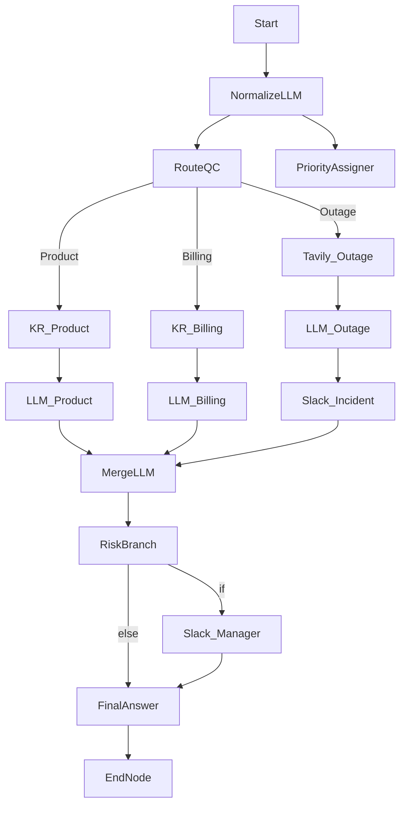

[노드별 상세 설정 (Configuration)]:
```json
// Node: Start (사용자 메시지 수신)
{
  "type": "start",
  "title": "Start",
  "port_bindings": {
    "query": { "type": "user_message" },
    "session_id": { "type": "session_id" }
  }
}

// Node: NormalizeLLM (LLM) - 입력 정규화로 분류/검색 성능 향상
{
  "type": "llm",
  "title": "쿼리 정규화",
  "provider": "openai",
  "model": "gpt-4o-mini",
  "prompt": "Rewrite the user request to a concise, explicit support query.\nInput: {query}\nOutput:",
  "temperature": 0.2,
  "maxTokens": 600,
  "variable_mappings": {
    "query": { "target_port": "query", "source": { "variable": "Start.query", "value_type": "string" } }
  }
}

// Node: RouteQC (Question Classifier) - 제품/결제/장애로 분류
{
  "type": "question-classifier",
  "title": "이슈 분류",
  "model": {
    "provider": "openai",
    "name": "gpt-4o-mini",
    "mode": "chat",
    "completion_params": { "temperature": 0.2, "max_tokens": 64 }
  },
  "classes": [
    { "id": "product", "name": "Product" },
    { "id": "billing", "name": "Billing" },
    { "id": "outage", "name": "Outage" }
  ],
  "instruction": "Classify the support intent. Return exact class name.",
  "query_variable_selector": ["NormalizeLLM", "response"],
  "variable_mappings": {
    "query": { "target_port": "query", "source": { "variable": "NormalizeLLM.response", "value_type": "string" } }
  }
}

// Node: PriorityAssigner (Assigner) - 분류 결과와 원문을 보존
{
  "type": "assigner",
  "title": "컨텍스트 저장",
  "operations": [
    {
      "id": "op_set_issue",
      "write_mode": "set",
      "input_type": "variable",
      "target_variable": { "port_name": "issue_snapshot", "data_type": "string" },
      "source_variable": { "port_name": "issue_snapshot", "data_type": "string" }
    }
  ],
  "ports": {
    "inputs": [
      { "name": "operation_0_target", "type": "any", "required": true, "description": "기존 값", "display_name": "Op0 Target" },
      { "name": "operation_0_value", "type": "any", "required": true, "description": "새 값", "display_name": "Op0 Value" }
    ],
    "outputs": [
      { "name": "operation_0_result", "type": "any", "required": true, "description": "저장된 값", "display_name": "Op0 Result" }
    ]
  },
  "variable_mappings": {
    "operation_0_target": { "target_port": "operation_0_target", "source": { "variable": "Start.query", "value_type": "string" } },
    "operation_0_value": { "target_port": "operation_0_value", "source": { "variable": "RouteQC.class_name", "value_type": "string" } }
  }
}

// Node: KR_Product (Knowledge Retrieval) - 제품 FAQ 벡터 검색
{
  "type": "knowledge-retrieval",
  "title": "제품 FAQ 검색",
  "dataset": "product-faq",
  "retrievalMode": "semantic",
  "topK": 5,
  "variable_mappings": {
    "query": { "target_port": "query", "source": { "variable": "NormalizeLLM.response", "value_type": "string" } }
  }
}

// Node: LLM_Product (LLM) - 제품 문의 답변 생성
{
  "type": "llm",
  "title": "제품 답변",
  "provider": "openai",
  "model": "gpt-4o",
  "prompt": "Use the product FAQ context to answer clearly.\nContext:\n{context}\n\nUser:\n{query}\n\nAnswer:",
  "temperature": 0.3,
  "maxTokens": 900,
  "variable_mappings": {
    "query": { "target_port": "query", "source": { "variable": "NormalizeLLM.response", "value_type": "string" } },
    "context": { "target_port": "context", "source": { "variable": "KR_Product.context", "value_type": "string" } }
  }
}

// Node: KR_Billing (Knowledge Retrieval) - 청구 정책 검색
{
  "type": "knowledge-retrieval",
  "title": "결제 정책 검색",
  "dataset": "billing-policy",
  "retrievalMode": "hybrid",
  "topK": 4,
  "variable_mappings": {
    "query": { "target_port": "query", "source": { "variable": "NormalizeLLM.response", "value_type": "string" } }
  }
}

// Node: LLM_Billing (LLM) - 청구 문의 해결
{
  "type": "llm",
  "title": "결제 답변",
  "provider": "openai",
  "model": "gpt-4o",
  "prompt": "Answer billing questions precisely using the policy context.\nContext:\n{context}\n\nQuestion:\n{query}\n\nResponse:",
  "temperature": 0.25,
  "maxTokens": 900,
  "variable_mappings": {
    "query": { "target_port": "query", "source": { "variable": "NormalizeLLM.response", "value_type": "string" } },
    "context": { "target_port": "context", "source": { "variable": "KR_Billing.context", "value_type": "string" } }
  }
}

// Node: Tavily_Outage (Tavily Search) - 장애 추정 시 실시간 검색
{
  "type": "tavily-search",
  "title": "실시간 장애 검색",
  "search_depth": "advanced",
  "topic": "news",
  "max_results": 5,
  "include_answer": true,
  "include_raw_content": false,
  "variable_mappings": {
    "query": { "target_port": "query", "source": { "variable": "NormalizeLLM.response", "value_type": "string" } }
  }
}

// Node: LLM_Outage (LLM) - 장애 징후 요약
{
  "type": "llm",
  "title": "장애 요약",
  "provider": "openai",
  "model": "gpt-4o-mini",
  "prompt": "Summarize possible outage signals and provide immediate steps.\nSearch context:\n{context}\n\nUser query:\n{query}\n\nSummary:",
  "temperature": 0.35,
  "maxTokens": 700,
  "variable_mappings": {
    "query": { "target_port": "query", "source": { "variable": "NormalizeLLM.response", "value_type": "string" } },
    "context": { "target_port": "context", "source": { "variable": "Tavily_Outage.context", "value_type": "string" } }
  }
}

// Node: Slack_Incident (Slack) - 장애 감지 시 운영 채널 알림
{
  "type": "slack",
  "title": "운영 채널 알림",
  "channel": "#ops-incidents",
  "use_blocks": true,
  "variable_mappings": {
    "text": { "target_port": "text", "source": { "variable": "LLM_Outage.response", "value_type": "string" } },
    "title": { "target_port": "title", "source": { "variable": "Tavily_Outage.result_count", "value_type": "number" } }
  }
}

// Node: MergeLLM (LLM) - 분기 결과 통합 응답 생성
{
  "type": "llm",
  "title": "최종 답변 합성",
  "provider": "openai",
  "model": "gpt-4o",
  "prompt": "Compose the best single reply.\n- Product answer: {{LLM_Product.response}}\n- Billing answer: {{LLM_Billing.response}}\n- Outage note: {{LLM_Outage.response}}\nReturn one concise answer in Korean.",
  "temperature": 0.3,
  "maxTokens": 1100,
  "variable_mappings": {
    "query": { "target_port": "query", "source": { "variable": "NormalizeLLM.response", "value_type": "string" } },
    "context": { "target_port": "context", "source": { "variable": "KR_Product.context", "value_type": "string" } }
  }
}

// Node: RiskBranch (If-Else) - 장애/결제 분쟁이면 경영 보고
{
  "type": "if-else",
  "title": "에스컬레이션 판정",
  "cases": [
    {
      "case_id": "needs_manager",
      "logical_operator": "or",
      "conditions": [
        { "id": "c1", "varType": "string", "variable_selector": "RouteQC.class_name", "comparison_operator": "=", "value": "Outage" },
        { "id": "c2", "varType": "string", "variable_selector": "RouteQC.class_name", "comparison_operator": "=", "value": "Billing" }
      ]
    }
  ]
}

// Node: Slack_Manager (Slack) - 경영 보고
{
  "type": "slack",
  "title": "경영 보고",
  "channel": "#exec-updates",
  "use_blocks": true,
  "variable_mappings": {
    "text": { "target_port": "text", "source": { "variable": "MergeLLM.response", "value_type": "string" } },
    "title": { "target_port": "title", "source": { "variable": "RouteQC.class_name", "value_type": "string" } }
  }
}

// Node: FinalAnswer (Answer) - 사용자에게 회신
{
  "type": "answer",
  "title": "사용자 회신",
  "template": "세션 {{Start.session_id}} 결과:\\n{{MergeLLM.response}}",
  "description": "최종 사용자 메시지",
  "output_format": "text",
  "variable_mappings": {
    "target": { "target_port": "target", "source": { "variable": "MergeLLM.response", "value_type": "string" } }
  }
}

// Node: EndNode (End) - 실행 종료 및 로그 묶음
{
  "type": "end",
  "title": "종료",
  "variable_mappings": {
    "response": { "target_port": "response", "source": { "variable": "FinalAnswer.final_output", "value_type": "string" } }
  }
}
```

---
### 템플릿 2: B2B 세일즈 제안 자동화
[시나리오]: 고객 문의를 리드 스코어링/분류 후 경쟁사·레퍼런스 케이스를 검색해 제안 초안을 만들고 세일즈팀 Slack에 알립니다.

[와이어프레임 (Mermaid Flowchart)]:
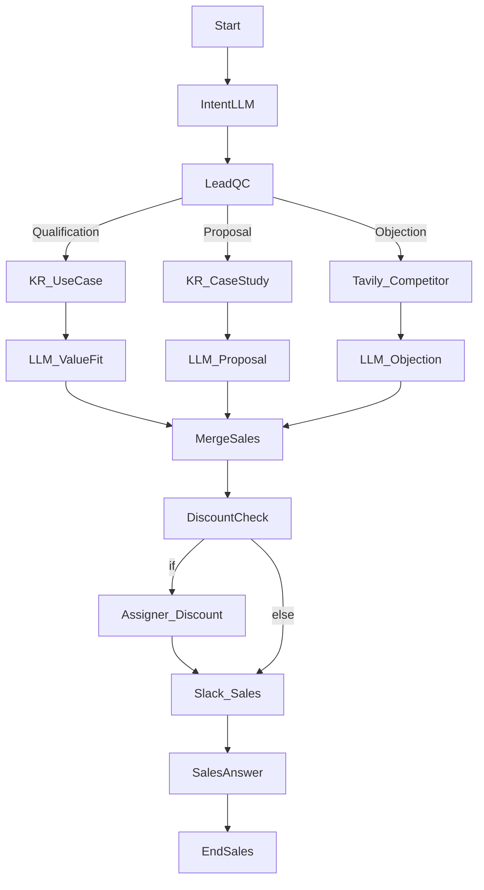

[노드별 상세 설정 (Configuration)]:
```json
// Node: Start
{
  "type": "start",
  "title": "Start",
  "port_bindings": {
    "query": { "type": "user_message" },
    "session_id": { "type": "session_id" }
  }
}

// Node: IntentLLM (LLM) - 니즈 추출
{
  "type": "llm",
  "title": "니즈 추출",
  "provider": "openai",
  "model": "gpt-4o-mini",
  "prompt": "Extract the business need, budget hints, and timeline.\nText: {query}\nReturn bullet points.",
  "temperature": 0.3,
  "maxTokens": 700,
  "variable_mappings": {
    "query": { "target_port": "query", "source": { "variable": "Start.query", "value_type": "string" } }
  }
}

// Node: LeadQC (Question Classifier) - 의도 분류
{
  "type": "question-classifier",
  "title": "리드 분류",
  "model": {
    "provider": "openai",
    "name": "gpt-4o-mini",
    "mode": "chat",
    "completion_params": { "temperature": 0.25, "max_tokens": 64 }
  },
  "classes": [
    { "id": "qualification", "name": "Qualification" },
    { "id": "proposal", "name": "Proposal" },
    { "id": "objection", "name": "ObjectionHandling" }
  ],
  "instruction": "Pick the single best class.",
  "query_variable_selector": ["IntentLLM", "response"],
  "variable_mappings": {
    "query": { "target_port": "query", "source": { "variable": "IntentLLM.response", "value_type": "string" } }
  }
}

// Node: KR_UseCase (Knowledge Retrieval) - 유스케이스 매칭
{
  "type": "knowledge-retrieval",
  "title": "유스케이스 검색",
  "dataset": "usecase-library",
  "retrievalMode": "semantic",
  "topK": 5,
  "variable_mappings": {
    "query": { "target_port": "query", "source": { "variable": "IntentLLM.response", "value_type": "string" } }
  }
}

// Node: KR_CaseStudy (Knowledge Retrieval) - 레퍼런스 케이스 검색
{
  "type": "knowledge-retrieval",
  "title": "케이스 스터디",
  "dataset": "case-studies",
  "retrievalMode": "hybrid",
  "topK": 4,
  "variable_mappings": {
    "query": { "target_port": "query", "source": { "variable": "IntentLLM.response", "value_type": "string" } }
  }
}

// Node: Tavily_Competitor (Tavily Search) - 경쟁사 최신 동향
{
  "type": "tavily-search",
  "title": "경쟁사 검색",
  "search_depth": "basic",
  "topic": "news",
  "max_results": 5,
  "include_answer": true,
  "variable_mappings": {
    "query": { "target_port": "query", "source": { "variable": "IntentLLM.response", "value_type": "string" } }
  }
}

// Node: LLM_ValueFit (LLM) - 솔루션 적합성 요약
{
  "type": "llm",
  "title": "가치 제안",
  "provider": "openai",
  "model": "gpt-4o",
  "prompt": "Summarize fit vs. pains.\nContext:\n{context}\nNeed:\n{query}\nReturn 3 bullets.",
  "temperature": 0.32,
  "maxTokens": 800,
  "variable_mappings": {
    "query": { "target_port": "query", "source": { "variable": "IntentLLM.response", "value_type": "string" } },
    "context": { "target_port": "context", "source": { "variable": "KR_UseCase.context", "value_type": "string" } }
  }
}

// Node: LLM_Proposal (LLM) - 제안 초안
{
  "type": "llm",
  "title": "제안 초안",
  "provider": "openai",
  "model": "gpt-4o",
  "prompt": "Draft a short proposal using the reference wins.\nContext:\n{context}\nNeed:\n{query}\nOutput a 120-word mini-proposal.",
  "temperature": 0.28,
  "maxTokens": 900,
  "variable_mappings": {
    "query": { "target_port": "query", "source": { "variable": "IntentLLM.response", "value_type": "string" } },
    "context": { "target_port": "context", "source": { "variable": "KR_CaseStudy.context", "value_type": "string" } }
  }
}

// Node: LLM_Objection (LLM) - 경쟁사 대비 반박
{
  "type": "llm",
  "title": "반박 스크립트",
  "provider": "openai",
  "model": "gpt-4o-mini",
  "prompt": "Craft rebuttals vs competitor claims using recent news.\nSearch snippets:\n{context}\nUser pain:\n{query}\nReturn numbered bullets.",
  "temperature": 0.35,
  "maxTokens": 700,
  "variable_mappings": {
    "query": { "target_port": "query", "source": { "variable": "IntentLLM.response", "value_type": "string" } },
    "context": { "target_port": "context", "source": { "variable": "Tavily_Competitor.context", "value_type": "string" } }
  }
}

// Node: MergeSales (LLM) - 단일 세일즈 응답 합성
{
  "type": "llm",
  "title": "세일즈 응답 합성",
  "provider": "openai",
  "model": "gpt-4o",
  "prompt": "Produce one outbound reply.\nFit: {{LLM_ValueFit.response}}\nProposal: {{LLM_Proposal.response}}\nObjection plan: {{LLM_Objection.response}}\nReturn in Korean with CTA.",
  "temperature": 0.27,
  "maxTokens": 1000,
  "variable_mappings": {
    "query": { "target_port": "query", "source": { "variable": "IntentLLM.response", "value_type": "string" } }
  }
}

// Node: DiscountCheck (If-Else) - 할인 필요 여부 판정
{
  "type": "if-else",
  "title": "할인 판정",
  "cases": [
    {
      "case_id": "apply_discount",
      "logical_operator": "or",
      "conditions": [
        { "id": "d1", "varType": "string", "variable_selector": "LeadQC.class_name", "comparison_operator": "=", "value": "Proposal" },
        { "id": "d2", "varType": "string", "variable_selector": "LeadQC.class_name", "comparison_operator": "=", "value": "ObjectionHandling" }
      ]
    }
  ]
}

// Node: Assigner_Discount (Assigner) - 할인 정보 플래그 저장
{
  "type": "assigner",
  "title": "할인 플래그",
  "operations": [
    {
      "id": "op_discount",
      "write_mode": "set",
      "input_type": "variable",
      "target_variable": { "port_name": "discount_flag", "data_type": "boolean" },
      "source_variable": { "port_name": "discount_flag", "data_type": "boolean" }
    }
  ],
  "ports": {
    "inputs": [
      { "name": "operation_0_target", "type": "any", "required": true, "description": "기존 여부", "display_name": "Op0 Target" },
      { "name": "operation_0_value", "type": "any", "required": true, "description": "새 값", "display_name": "Op0 Value" }
    ],
    "outputs": [
      { "name": "operation_0_result", "type": "any", "required": true, "description": "최종 플래그", "display_name": "Op0 Result" }
    ]
  },
  "variable_mappings": {
    "operation_0_target": { "target_port": "operation_0_target", "source": { "variable": "LeadQC.class_name", "value_type": "string" } },
    "operation_0_value": { "target_port": "operation_0_value", "source": { "variable": "DiscountCheck.if", "value_type": "boolean" } }
  }
}

// Node: Slack_Sales (Slack) - 세일즈 채널 알림
{
  "type": "slack",
  "title": "세일즈 알림",
  "channel": "#sales-team",
  "use_blocks": true,
  "variable_mappings": {
    "text": { "target_port": "text", "source": { "variable": "MergeSales.response", "value_type": "string" } },
    "title": { "target_port": "title", "source": { "variable": "LeadQC.class_name", "value_type": "string" } }
  }
}

// Node: SalesAnswer (Answer)
{
  "type": "answer",
  "title": "세일즈 회신",
  "template": "제안 초안:\\n{{MergeSales.response}}\\n(할인 필요 여부: {{Assigner_Discount.operation_0_result}})",
  "description": "영업용 사용자 회신",
  "output_format": "text",
  "variable_mappings": {
    "target": { "target_port": "target", "source": { "variable": "MergeSales.response", "value_type": "string" } }
  }
}

// Node: EndSales (End)
{
  "type": "end",
  "title": "종료",
  "variable_mappings": {
    "response": { "target_port": "response", "source": { "variable": "SalesAnswer.final_output", "value_type": "string" } }
  }
}
```

---

### 템플릿 3: 서비스 장애 대응 런북 자동화
[시나리오]: 경보 텍스트를 요약·분류한 후 런북/실시간 검색을 결합해 조치안을 만들고, 심각도에 따라 Slack 에스컬레이션을 수행합니다.

[와이어프레임 (Mermaid Flowchart)]:
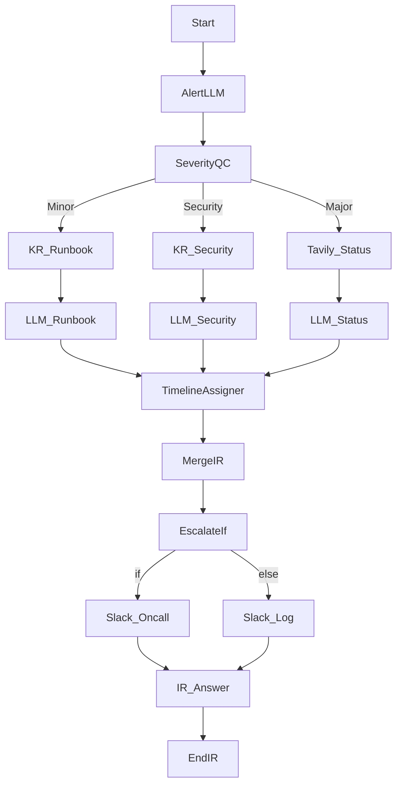

[노드별 상세 설정 (Configuration)]:
```json
// Node: Start
{
  "type": "start",
  "title": "Start",
  "port_bindings": {
    "query": { "type": "user_message" },
    "session_id": { "type": "session_id" }
  }
}

// Node: AlertLLM (LLM) - 경보 요약/핵심 신호 추출
{
  "type": "llm",
  "title": "경보 요약",
  "provider": "openai",
  "model": "gpt-4o-mini",
  "prompt": "Summarize alert signals, impacted services, and timeframe.\nAlert: {query}",
  "temperature": 0.25,
  "maxTokens": 500,
  "variable_mappings": {
    "query": { "target_port": "query", "source": { "variable": "Start.query", "value_type": "string" } }
  }
}

// Node: SeverityQC (Question Classifier) - 심각도 분류
{
  "type": "question-classifier",
  "title": "심각도 분류",
  "model": {
    "provider": "openai",
    "name": "gpt-4o-mini",
    "mode": "chat",
    "completion_params": { "temperature": 0.2, "max_tokens": 48 }
  },
  "classes": [
    { "id": "minor", "name": "Minor" },
    { "id": "major", "name": "Major" },
    { "id": "security", "name": "Security" }
  ],
  "instruction": "Pick severity only.",
  "query_variable_selector": ["AlertLLM", "response"],
  "variable_mappings": {
    "query": { "target_port": "query", "source": { "variable": "AlertLLM.response", "value_type": "string" } }
  }
}

// Node: KR_Runbook (Knowledge Retrieval) - 일반 런북
{
  "type": "knowledge-retrieval",
  "title": "Runbook 검색",
  "dataset": "ops-runbook",
  "retrievalMode": "semantic",
  "topK": 5,
  "variable_mappings": {
    "query": { "target_port": "query", "source": { "variable": "AlertLLM.response", "value_type": "string" } }
  }
}

// Node: KR_Security (Knowledge Retrieval) - 보안 런북
{
  "type": "knowledge-retrieval",
  "title": "보안 Runbook 검색",
  "dataset": "security-runbook",
  "retrievalMode": "semantic",
  "topK": 5,
  "variable_mappings": {
    "query": { "target_port": "query", "source": { "variable": "AlertLLM.response", "value_type": "string" } }
  }
}

// Node: Tavily_Status (Tavily Search) - 외부 서비스 상태
{
  "type": "tavily-search",
  "title": "상태 페이지 검색",
  "search_depth": "basic",
  "topic": "news",
  "max_results": 4,
  "include_answer": true,
  "variable_mappings": {
    "query": { "target_port": "query", "source": { "variable": "AlertLLM.response", "value_type": "string" } }
  }
}

// Node: LLM_Runbook (LLM) - 일반 조치안
{
  "type": "llm",
  "title": "조치안",
  "provider": "openai",
  "model": "gpt-4o",
  "prompt": "Create 5-step remediation from runbook.\nRunbook:\n{context}\nAlert:\n{query}",
  "temperature": 0.28,
  "maxTokens": 800,
  "variable_mappings": {
    "query": { "target_port": "query", "source": { "variable": "AlertLLM.response", "value_type": "string" } },
    "context": { "target_port": "context", "source": { "variable": "KR_Runbook.context", "value_type": "string" } }
  }
}

// Node: LLM_Security (LLM) - 보안 사고 조치
{
  "type": "llm",
  "title": "보안 조치",
  "provider": "openai",
  "model": "gpt-4o",
  "prompt": "Summarize security containment steps.\nGuides:\n{context}\nAlert:\n{query}",
  "temperature": 0.26,
  "maxTokens": 800,
  "variable_mappings": {
    "query": { "target_port": "query", "source": { "variable": "AlertLLM.response", "value_type": "string" } },
    "context": { "target_port": "context", "source": { "variable": "KR_Security.context", "value_type": "string" } }
  }
}

// Node: LLM_Status (LLM) - 외부 장애 요약
{
  "type": "llm",
  "title": "외부 장애 요약",
  "provider": "openai",
  "model": "gpt-4o-mini",
  "prompt": "Summarize external incident evidence and advise comms.\nStatus snippets:\n{context}\nAlert:\n{query}",
  "temperature": 0.3,
  "maxTokens": 700,
  "variable_mappings": {
    "query": { "target_port": "query", "source": { "variable": "AlertLLM.response", "value_type": "string" } },
    "context": { "target_port": "context", "source": { "variable": "Tavily_Status.context", "value_type": "string" } }
  }
}

// Node: TimelineAssigner (Assigner) - 실행 로그 저장
{
  "type": "assigner",
  "title": "타임라인 로그",
  "operations": [
    {
      "id": "op_log",
      "write_mode": "append",
      "input_type": "variable",
      "target_variable": { "port_name": "timeline", "data_type": "array" },
      "source_variable": { "port_name": "timeline", "data_type": "array" }
    }
  ],
  "ports": {
    "inputs": [
      { "name": "operation_0_target", "type": "any", "required": true, "description": "현재 로그", "display_name": "Op0 Target" },
      { "name": "operation_0_value", "type": "any", "required": true, "description": "추가 로그", "display_name": "Op0 Value" }
    ],
    "outputs": [
      { "name": "operation_0_result", "type": "any", "required": true, "description": "누적 로그", "display_name": "Op0 Result" }
    ]
  },
  "variable_mappings": {
    "operation_0_target": { "target_port": "operation_0_target", "source": { "variable": "Start.session_id", "value_type": "string" } },
    "operation_0_value": { "target_port": "operation_0_value", "source": { "variable": "LLM_Runbook.response", "value_type": "string" } }
  }
}

// Node: MergeIR (LLM) - 단일 실행 계획 합성
{
  "type": "llm",
  "title": "통합 실행 계획",
  "provider": "openai",
  "model": "gpt-4o",
  "prompt": "Choose the relevant plan among below and finalize with timestamps.\n- Standard: {{LLM_Runbook.response}}\n- Security: {{LLM_Security.response}}\n- External: {{LLM_Status.response}}",
  "temperature": 0.25,
  "maxTokens": 1000,
  "variable_mappings": {
    "query": { "target_port": "query", "source": { "variable": "AlertLLM.response", "value_type": "string" } }
  }
}

// Node: EscalateIf (If-Else) - 메이저/보안이면 온콜 호출
{
  "type": "if-else",
  "title": "온콜 조건",
  "cases": [
    {
      "case_id": "page_oncall",
      "logical_operator": "or",
      "conditions": [
        { "id": "s1", "varType": "string", "variable_selector": "SeverityQC.class_name", "comparison_operator": "=", "value": "Major" },
        { "id": "s2", "varType": "string", "variable_selector": "SeverityQC.class_name", "comparison_operator": "=", "value": "Security" }
      ]
    }
  ]
}

// Node: Slack_Oncall (Slack) - 온콜 알림
{
  "type": "slack",
  "title": "온콜 호출",
  "channel": "#oncall",
  "use_blocks": true,
  "variable_mappings": {
    "text": { "target_port": "text", "source": { "variable": "MergeIR.response", "value_type": "string" } },
    "title": { "target_port": "title", "source": { "variable": "SeverityQC.class_name", "value_type": "string" } }
  }
}

// Node: Slack_Log (Slack) - 상태 로그
{
  "type": "slack",
  "title": "상태 로그",
  "channel": "#ops-log",
  "use_blocks": false,
  "variable_mappings": {
    "text": { "target_port": "text", "source": { "variable": "TimelineAssigner.operation_0_result", "value_type": "any" } }
  }
}

// Node: IR_Answer (Answer)
{
  "type": "answer",
  "title": "조치 공유",
  "template": "대응 결과:\\n{{MergeIR.response}}",
  "description": "고객/내부 공지용",
  "output_format": "text",
  "variable_mappings": {
    "target": { "target_port": "target", "source": { "variable": "MergeIR.response", "value_type": "string" } }
  }
}

// Node: EndIR (End)
{
  "type": "end",
  "title": "종료",
  "variable_mappings": {
    "response": { "target_port": "response", "source": { "variable": "IR_Answer.final_output", "value_type": "string" } }
  }
}
```

---

### 템플릿 4: 금융 뉴스·리서치 모니터
[시나리오]: 사용자 질의를 시장/종목/크립토로 분류한 뒤 뉴스·공시를 검색하고, 위험 신호를 요약해 Slack 알림과 리포트를 생성합니다.

[와이어프레임 (Mermaid Flowchart)]:
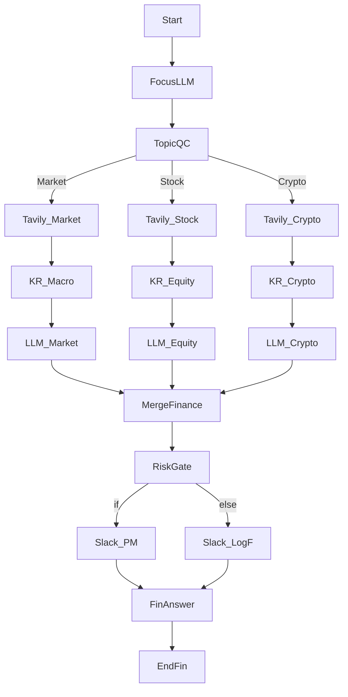

[노드별 상세 설정 (Configuration)]:
```json
// Node: Start
{
  "type": "start",
  "title": "Start",
  "port_bindings": {
    "query": { "type": "user_message" },
    "session_id": { "type": "session_id" }
  }
}

// Node: FocusLLM (LLM) - 검색 키워드 정제
{
  "type": "llm",
  "title": "키워드 정제",
  "provider": "openai",
  "model": "gpt-4o-mini",
  "prompt": "Extract ticker, asset class, and date window from:\n{query}",
  "temperature": 0.22,
  "maxTokens": 500,
  "variable_mappings": {
    "query": { "target_port": "query", "source": { "variable": "Start.query", "value_type": "string" } }
  }
}

// Node: TopicQC (Question Classifier) - 시장/주식/크립토 분류
{
  "type": "question-classifier",
  "title": "자산 분류",
  "model": {
    "provider": "openai",
    "name": "gpt-4o-mini",
    "mode": "chat",
    "completion_params": { "temperature": 0.2, "max_tokens": 48 }
  },
  "classes": [
    { "id": "market", "name": "Market" },
    { "id": "stock", "name": "Stock" },
    { "id": "crypto", "name": "Crypto" }
  ],
  "instruction": "Pick exactly one.",
  "query_variable_selector": ["FocusLLM", "response"],
  "variable_mappings": {
    "query": { "target_port": "query", "source": { "variable": "FocusLLM.response", "value_type": "string" } }
  }
}

// Node: Tavily_Market (Tavily Search) - 거시 뉴스
{
  "type": "tavily-search",
  "title": "거시 뉴스",
  "search_depth": "advanced",
  "topic": "news",
  "max_results": 6,
  "include_raw_content": false,
  "variable_mappings": {
    "query": { "target_port": "query", "source": { "variable": "FocusLLM.response", "value_type": "string" } }
  }
}

// Node: Tavily_Stock (Tavily Search) - 종목 뉴스/공시
{
  "type": "tavily-search",
  "title": "종목 뉴스",
  "search_depth": "advanced",
  "topic": "finance",
  "max_results": 6,
  "include_answer": true,
  "variable_mappings": {
    "query": { "target_port": "query", "source": { "variable": "FocusLLM.response", "value_type": "string" } }
  }
}

// Node: Tavily_Crypto (Tavily Search) - 크립토 동향
{
  "type": "tavily-search",
  "title": "크립토 동향",
  "search_depth": "basic",
  "topic": "news",
  "max_results": 5,
  "include_raw_content": true,
  "variable_mappings": {
    "query": { "target_port": "query", "source": { "variable": "FocusLLM.response", "value_type": "string" } }
  }
}

// Node: KR_Macro (Knowledge Retrieval) - 거시 보고서
{
  "type": "knowledge-retrieval",
  "title": "거시 리서치",
  "dataset": "macro-research",
  "retrievalMode": "semantic",
  "topK": 4,
  "variable_mappings": {
    "query": { "target_port": "query", "source": { "variable": "FocusLLM.response", "value_type": "string" } }
  }
}

// Node: KR_Equity (Knowledge Retrieval) - 애널리스트 노트
{
  "type": "knowledge-retrieval",
  "title": "애널리스트 노트",
  "dataset": "equity-notes",
  "retrievalMode": "hybrid",
  "topK": 4,
  "variable_mappings": {
    "query": { "target_port": "query", "source": { "variable": "FocusLLM.response", "value_type": "string" } }
  }
}

// Node: KR_Crypto (Knowledge Retrieval) - 온체인 리서치
{
  "type": "knowledge-retrieval",
  "title": "온체인 리서치",
  "dataset": "crypto-research",
  "retrievalMode": "semantic",
  "topK": 4,
  "variable_mappings": {
    "query": { "target_port": "query", "source": { "variable": "FocusLLM.response", "value_type": "string" } }
  }
}

// Node: LLM_Market (LLM) - 거시 요약
{
  "type": "llm",
  "title": "거시 요약",
  "provider": "openai",
  "model": "gpt-4o",
  "prompt": "Summarize macro signals and risks.\nSearch:\n{context}\nKB:\n{{KR_Macro.context}}",
  "temperature": 0.28,
  "maxTokens": 850,
  "variable_mappings": {
    "query": { "target_port": "query", "source": { "variable": "FocusLLM.response", "value_type": "string" } },
    "context": { "target_port": "context", "source": { "variable": "Tavily_Market.context", "value_type": "string" } }
  }
}

// Node: LLM_Equity (LLM) - 종목 요약
{
  "type": "llm",
  "title": "종목 요약",
  "provider": "openai",
  "model": "gpt-4o",
  "prompt": "Summarize equity news and valuation tone.\nNews:\n{context}\nNotes:\n{{KR_Equity.context}}",
  "temperature": 0.27,
  "maxTokens": 850,
  "variable_mappings": {
    "query": { "target_port": "query", "source": { "variable": "FocusLLM.response", "value_type": "string" } },
    "context": { "target_port": "context", "source": { "variable": "Tavily_Stock.context", "value_type": "string" } }
  }
}

// Node: LLM_Crypto (LLM) - 크립토 요약
{
  "type": "llm",
  "title": "크립토 요약",
  "provider": "openai",
  "model": "gpt-4o-mini",
  "prompt": "Summarize crypto market moves and on-chain alerts.\nSearch:\n{context}\nResearch:\n{{KR_Crypto.context}}",
  "temperature": 0.32,
  "maxTokens": 750,
  "variable_mappings": {
    "query": { "target_port": "query", "source": { "variable": "FocusLLM.response", "value_type": "string" } },
    "context": { "target_port": "context", "source": { "variable": "Tavily_Crypto.context", "value_type": "string" } }
  }
}

// Node: MergeFinance (LLM) - 단일 리포트 합성
{
  "type": "llm",
  "title": "리포트 합성",
  "provider": "openai",
  "model": "gpt-4o",
  "prompt": "Pick the relevant branch summary and craft a concise report.\nMarket: {{LLM_Market.response}}\nStock: {{LLM_Equity.response}}\nCrypto: {{LLM_Crypto.response}}\nOutput with key risks and actions.",
  "temperature": 0.25,
  "maxTokens": 1000,
  "variable_mappings": {
    "query": { "target_port": "query", "source": { "variable": "FocusLLM.response", "value_type": "string" } }
  }
}

// Node: RiskGate (If-Else) - 위험 신호시 알림
{
  "type": "if-else",
  "title": "리스크 분기",
  "cases": [
    {
      "case_id": "alert_pm",
      "logical_operator": "or",
      "conditions": [
        { "id": "r1", "varType": "string", "variable_selector": "TopicQC.class_name", "comparison_operator": "=", "value": "Stock" },
        { "id": "r2", "varType": "number", "variable_selector": "Tavily_Stock.result_count", "comparison_operator": ">", "value": 3 }
      ]
    }
  ]
}

// Node: Slack_PM (Slack) - 포트폴리오 매니저 알림
{
  "type": "slack",
  "title": "PM 알림",
  "channel": "#pm-desk",
  "use_blocks": true,
  "variable_mappings": {
    "text": { "target_port": "text", "source": { "variable": "MergeFinance.response", "value_type": "string" } },
    "title": { "target_port": "title", "source": { "variable": "TopicQC.class_name", "value_type": "string" } }
  }
}

// Node: Slack_LogF (Slack) - 모니터 로그
{
  "type": "slack",
  "title": "모니터 로그",
  "channel": "#research-log",
  "use_blocks": false,
  "variable_mappings": {
    "text": { "target_port": "text", "source": { "variable": "MergeFinance.response", "value_type": "string" } }
  }
}

// Node: FinAnswer (Answer)
{
  "type": "answer",
  "title": "리포트 출력",
  "template": "요약:\\n{{MergeFinance.response}}",
  "description": "사용자 리포트",
  "output_format": "text",
  "variable_mappings": {
    "target": { "target_port": "target", "source": { "variable": "MergeFinance.response", "value_type": "string" } }
  }
}

// Node: EndFin (End)
{
  "type": "end",
  "title": "종료",
  "variable_mappings": {
    "response": { "target_port": "response", "source": { "variable": "FinAnswer.final_output", "value_type": "string" } }
  }
}
```

---

### 템플릿 5: 콘텐츠 마케팅 캘린더 코파일럿
[시나리오]: 마케팅 목표를 분석해 채널별 아이디어를 생성하고, 트렌드 검색·브랜드 톤을 적용한 초안을 만든 뒤 승인 Slack으로 보냅니다.

[와이어프레임 (Mermaid Flowchart)]:
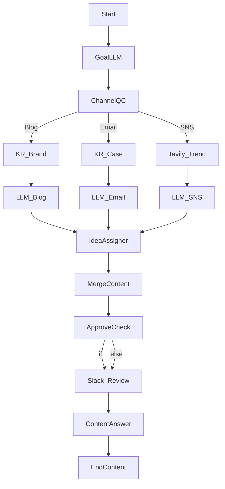

[노드별 상세 설정 (Configuration)]:
```json
// Node: Start
{
  "type": "start",
  "title": "Start",
  "port_bindings": {
    "query": { "type": "user_message" },
    "session_id": { "type": "session_id" }
  }
}

// Node: GoalLLM (LLM) - 목표/톤 추출
{
  "type": "llm",
  "title": "목표 추출",
  "provider": "openai",
  "model": "gpt-4o-mini",
  "prompt": "Extract marketing goal, target persona, and tone.\nInput: {query}",
  "temperature": 0.3,
  "maxTokens": 600,
  "variable_mappings": {
    "query": { "target_port": "query", "source": { "variable": "Start.query", "value_type": "string" } }
  }
}

// Node: ChannelQC (Question Classifier) - 채널 선택
{
  "type": "question-classifier",
  "title": "채널 분류",
  "model": {
    "provider": "openai",
    "name": "gpt-4o-mini",
    "mode": "chat",
    "completion_params": { "temperature": 0.25, "max_tokens": 48 }
  },
  "classes": [
    { "id": "blog", "name": "Blog" },
    { "id": "email", "name": "Email" },
    { "id": "sns", "name": "SNS" }
  ],
  "instruction": "Pick the single best channel.",
  "query_variable_selector": ["GoalLLM", "response"],
  "variable_mappings": {
    "query": { "target_port": "query", "source": { "variable": "GoalLLM.response", "value_type": "string" } }
  }
}

// Node: KR_Brand (Knowledge Retrieval) - 브랜드 가이드
{
  "type": "knowledge-retrieval",
  "title": "브랜드 가이드",
  "dataset": "brand-voice",
  "retrievalMode": "semantic",
  "topK": 3,
  "variable_mappings": {
    "query": { "target_port": "query", "source": { "variable": "GoalLLM.response", "value_type": "string" } }
  }
}

// Node: KR_Case (Knowledge Retrieval) - 사례 모음
{
  "type": "knowledge-retrieval",
  "title": "레퍼런스 사례",
  "dataset": "customer-stories",
  "retrievalMode": "hybrid",
  "topK": 3,
  "variable_mappings": {
    "query": { "target_port": "query", "source": { "variable": "GoalLLM.response", "value_type": "string" } }
  }
}

// Node: Tavily_Trend (Tavily Search) - SNS 트렌드
{
  "type": "tavily-search",
  "title": "트렌드 검색",
  "search_depth": "basic",
  "topic": "news",
  "max_results": 5,
  "include_raw_content": true,
  "variable_mappings": {
    "query": { "target_port": "query", "source": { "variable": "GoalLLM.response", "value_type": "string" } }
  }
}

// Node: LLM_Blog (LLM) - 블로그 초안
{
  "type": "llm",
  "title": "블로그 초안",
  "provider": "openai",
  "model": "gpt-4o",
  "prompt": "Write a 2-paragraph blog outline with CTA.\nBrand voice:\n{context}\nGoal:\n{query}",
  "temperature": 0.32,
  "maxTokens": 900,
  "variable_mappings": {
    "query": { "target_port": "query", "source": { "variable": "GoalLLM.response", "value_type": "string" } },
    "context": { "target_port": "context", "source": { "variable": "KR_Brand.context", "value_type": "string" } }
  }
}

// Node: LLM_Email (LLM) - 이메일 시퀀스
{
  "type": "llm",
  "title": "이메일 초안",
  "provider": "openai",
  "model": "gpt-4o",
  "prompt": "Draft a 3-touch email sequence using cases.\nCases:\n{context}\nGoal:\n{query}",
  "temperature": 0.3,
  "maxTokens": 850,
  "variable_mappings": {
    "query": { "target_port": "query", "source": { "variable": "GoalLLM.response", "value_type": "string" } },
    "context": { "target_port": "context", "source": { "variable": "KR_Case.context", "value_type": "string" } }
  }
}

// Node: LLM_SNS (LLM) - SNS 캡션
{
  "type": "llm",
  "title": "SNS 캡션",
  "provider": "openai",
  "model": "gpt-4o-mini",
  "prompt": "Create 5 social captions with hashtags.\nTrends:\n{context}\nGoal:\n{query}",
  "temperature": 0.38,
  "maxTokens": 650,
  "variable_mappings": {
    "query": { "target_port": "query", "source": { "variable": "GoalLLM.response", "value_type": "string" } },
    "context": { "target_port": "context", "source": { "variable": "Tavily_Trend.context", "value_type": "string" } }
  }
}

// Node: IdeaAssigner (Assigner) - 채널별 아이디어 버킷
{
  "type": "assigner",
  "title": "아이디어 버킷",
  "operations": [
    {
      "id": "op_collect",
      "write_mode": "append",
      "input_type": "variable",
      "target_variable": { "port_name": "ideas", "data_type": "array" },
      "source_variable": { "port_name": "ideas", "data_type": "array" }
    }
  ],
  "ports": {
    "inputs": [
      { "name": "operation_0_target", "type": "any", "required": true, "description": "기존 아이디어", "display_name": "Op0 Target" },
      { "name": "operation_0_value", "type": "any", "required": true, "description": "새 아이디어", "display_name": "Op0 Value" }
    ],
    "outputs": [
      { "name": "operation_0_result", "type": "any", "required": true, "description": "누적 아이디어", "display_name": "Op0 Result" }
    ]
  },
  "variable_mappings": {
    "operation_0_target": { "target_port": "operation_0_target", "source": { "variable": "GoalLLM.response", "value_type": "string" } },
    "operation_0_value": { "target_port": "operation_0_value", "source": { "variable": "LLM_Blog.response", "value_type": "string" } }
  }
}

// Node: MergeContent (LLM) - 통합 캘린더 문안
{
  "type": "llm",
  "title": "캘린더 합성",
  "provider": "openai",
  "model": "gpt-4o",
  "prompt": "Create a weekly calendar with deliverables.\nBlog: {{LLM_Blog.response}}\nEmail: {{LLM_Email.response}}\nSNS: {{LLM_SNS.response}}",
  "temperature": 0.29,
  "maxTokens": 950,
  "variable_mappings": {
    "query": { "target_port": "query", "source": { "variable": "GoalLLM.response", "value_type": "string" } }
  }
}

// Node: ApproveCheck (If-Else) - 승인 필요 여부
{
  "type": "if-else",
  "title": "승인 분기",
  "cases": [
    {
      "case_id": "needs_review",
      "logical_operator": "and",
      "conditions": [
        { "id": "ap1", "varType": "string", "variable_selector": "ChannelQC.class_name", "comparison_operator": "=", "value": "Blog" }
      ]
    }
  ]
}

// Node: Slack_Review (Slack) - 검수 요청
{
  "type": "slack",
  "title": "검수 요청",
  "channel": "#marketing-review",
  "use_blocks": true,
  "variable_mappings": {
    "text": { "target_port": "text", "source": { "variable": "MergeContent.response", "value_type": "string" } },
    "title": { "target_port": "title", "source": { "variable": "ChannelQC.class_name", "value_type": "string" } }
  }
}

// Node: ContentAnswer (Answer)
{
  "type": "answer",
  "title": "캘린더 출력",
  "template": "{{MergeContent.response}}",
  "description": "최종 사용자용 캘린더",
  "output_format": "text",
  "variable_mappings": {
    "target": { "target_port": "target", "source": { "variable": "MergeContent.response", "value_type": "string" } }
  }
}

// Node: EndContent (End)
{
  "type": "end",
  "title": "종료",
  "variable_mappings": {
    "response": { "target_port": "response", "source": { "variable": "ContentAnswer.final_output", "value_type": "string" } }
  }
}
```

---

### 템플릿 6: HR 온보딩 지원 어시스턴트
[시나리오]: 신규 입사자 문의를 정책/급여/IT 세팅으로 분류하여 KB 검색, 필요한 서류를 점검하고 Slack HR 채널에 알립니다.

[와이어프레임 (Mermaid Flowchart)]:
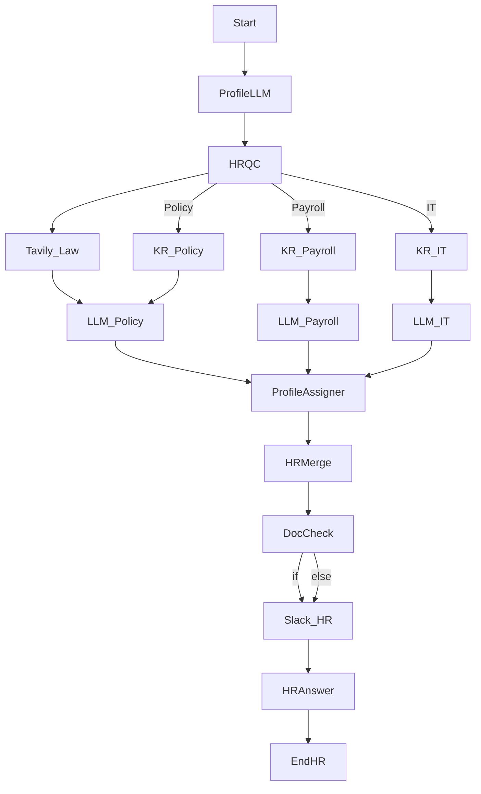

[노드별 상세 설정 (Configuration)]:
```json
// Node: Start
{
  "type": "start",
  "title": "Start",
  "port_bindings": {
    "query": { "type": "user_message" },
    "session_id": { "type": "session_id" }
  }
}

// Node: ProfileLLM (LLM) - 직원 프로필/요청 추출
{
  "type": "llm",
  "title": "프로필 추출",
  "provider": "openai",
  "model": "gpt-4o-mini",
  "prompt": "Extract employee name, role, location, and request.\nText: {query}",
  "temperature": 0.25,
  "maxTokens": 600,
  "variable_mappings": {
    "query": { "target_port": "query", "source": { "variable": "Start.query", "value_type": "string" } }
  }
}

// Node: HRQC (Question Classifier) - 정책/급여/IT 분류
{
  "type": "question-classifier",
  "title": "HR 분류",
  "model": {
    "provider": "openai",
    "name": "gpt-4o-mini",
    "mode": "chat",
    "completion_params": { "temperature": 0.2, "max_tokens": 48 }
  },
  "classes": [
    { "id": "policy", "name": "Policy" },
    { "id": "payroll", "name": "Payroll" },
    { "id": "it", "name": "ITSetup" }
  ],
  "instruction": "Classify onboarding question.",
  "query_variable_selector": ["ProfileLLM", "response"],
  "variable_mappings": {
    "query": { "target_port": "query", "source": { "variable": "ProfileLLM.response", "value_type": "string" } }
  }
}

// Node: KR_Policy (Knowledge Retrieval) - 정책 문서
{
  "type": "knowledge-retrieval",
  "title": "정책 검색",
  "dataset": "hr-policy",
  "retrievalMode": "semantic",
  "topK": 5,
  "variable_mappings": {
    "query": { "target_port": "query", "source": { "variable": "ProfileLLM.response", "value_type": "string" } }
  }
}

// Node: Tavily_Law (Tavily Search) - 최근 노동/세법 변경 사항 검색
{
  "type": "tavily-search",
  "title": "노동법 검색",
  "search_depth": "basic",
  "topic": "news",
  "max_results": 4,
  "include_answer": true,
  "variable_mappings": {
    "query": { "target_port": "query", "source": { "variable": "ProfileLLM.response", "value_type": "string" } }
  }
}

// Node: KR_Payroll (Knowledge Retrieval) - 급여/세금 가이드
{
  "type": "knowledge-retrieval",
  "title": "급여 가이드",
  "dataset": "payroll-guide",
  "retrievalMode": "hybrid",
  "topK": 4,
  "variable_mappings": {
    "query": { "target_port": "query", "source": { "variable": "ProfileLLM.response", "value_type": "string" } }
  }
}

// Node: KR_IT (Knowledge Retrieval) - IT 세팅 체크리스트
{
  "type": "knowledge-retrieval",
  "title": "IT 세팅",
  "dataset": "it-setup",
  "retrievalMode": "semantic",
  "topK": 4,
  "variable_mappings": {
    "query": { "target_port": "query", "source": { "variable": "ProfileLLM.response", "value_type": "string" } }
  }
}

// Node: LLM_Policy (LLM) - 정책 답변
{
  "type": "llm",
  "title": "정책 답변",
  "provider": "openai",
  "model": "gpt-4o",
  "prompt": "Answer with HR policy steps and reflect latest law signals.\nPolicy Context:\n{context}\nRecent Law:\n{{Tavily_Law.context}}\nRequest:\n{query}",
  "temperature": 0.25,
  "maxTokens": 800,
  "variable_mappings": {
    "query": { "target_port": "query", "source": { "variable": "ProfileLLM.response", "value_type": "string" } },
    "context": { "target_port": "context", "source": { "variable": "KR_Policy.context", "value_type": "string" } }
  }
}

// Node: LLM_Payroll (LLM) - 급여 답변
{
  "type": "llm",
  "title": "급여 답변",
  "provider": "openai",
  "model": "gpt-4o",
  "prompt": "Explain payroll/tax steps tailored to location.\nContext:\n{context}\nRequest:\n{query}",
  "temperature": 0.25,
  "maxTokens": 800,
  "variable_mappings": {
    "query": { "target_port": "query", "source": { "variable": "ProfileLLM.response", "value_type": "string" } },
    "context": { "target_port": "context", "source": { "variable": "KR_Payroll.context", "value_type": "string" } }
  }
}

// Node: LLM_IT (LLM) - IT 세팅 답변
{
  "type": "llm",
  "title": "IT 세팅 답변",
  "provider": "openai",
  "model": "gpt-4o-mini",
  "prompt": "Provide step-by-step IT setup.\nChecklist:\n{context}\nRequest:\n{query}",
  "temperature": 0.3,
  "maxTokens": 750,
  "variable_mappings": {
    "query": { "target_port": "query", "source": { "variable": "ProfileLLM.response", "value_type": "string" } },
    "context": { "target_port": "context", "source": { "variable": "KR_IT.context", "value_type": "string" } }
  }
}

// Node: ProfileAssigner (Assigner) - 요청 요약/분류 로그 저장
{
  "type": "assigner",
  "title": "요청 로그",
  "operations": [
    {
      "id": "op_profile",
      "write_mode": "append",
      "input_type": "variable",
      "target_variable": { "port_name": "hr_log", "data_type": "array" },
      "source_variable": { "port_name": "hr_log", "data_type": "array" }
    }
  ],
  "ports": {
    "inputs": [
      { "name": "operation_0_target", "type": "any", "required": true, "description": "기존 로그", "display_name": "Op0 Target" },
      { "name": "operation_0_value", "type": "any", "required": true, "description": "새 로그", "display_name": "Op0 Value" }
    ],
    "outputs": [
      { "name": "operation_0_result", "type": "any", "required": true, "description": "누적 로그", "display_name": "Op0 Result" }
    ]
  },
  "variable_mappings": {
    "operation_0_target": { "target_port": "operation_0_target", "source": { "variable": "ProfileLLM.response", "value_type": "string" } },
    "operation_0_value": { "target_port": "operation_0_value", "source": { "variable": "HRQC.class_name", "value_type": "string" } }
  }
}

// Node: HRMerge (LLM) - 단일 HR 답변 합성
{
  "type": "llm",
  "title": "HR 합성",
  "provider": "openai",
  "model": "gpt-4o",
  "prompt": "Pick the relevant branch answer and include required documents checklist.\nPolicy: {{LLM_Policy.response}}\nPayroll: {{LLM_Payroll.response}}\nIT: {{LLM_IT.response}}",
  "temperature": 0.27,
  "maxTokens": 900,
  "variable_mappings": {
    "query": { "target_port": "query", "source": { "variable": "ProfileLLM.response", "value_type": "string" } }
  }
}

// Node: DocCheck (If-Else) - 서류 필요 여부 판단
{
  "type": "if-else",
  "title": "서류 확인",
  "cases": [
    {
      "case_id": "needs_docs",
      "logical_operator": "or",
      "conditions": [
        { "id": "h1", "varType": "string", "variable_selector": "HRQC.class_name", "comparison_operator": "=", "value": "Payroll" },
        { "id": "h2", "varType": "string", "variable_selector": "HRQC.class_name", "comparison_operator": "=", "value": "ITSetup" }
      ]
    }
  ]
}

// Node: Slack_HR (Slack) - HR 알림
{
  "type": "slack",
  "title": "HR 알림",
  "channel": "#hr-ops",
  "use_blocks": true,
  "variable_mappings": {
    "text": { "target_port": "text", "source": { "variable": "HRMerge.response", "value_type": "string" } },
    "title": { "target_port": "title", "source": { "variable": "HRQC.class_name", "value_type": "string" } }
  }
}

// Node: HRAnswer (Answer)
{
  "type": "answer",
  "title": "HR 회신",
  "template": "{{HRMerge.response}}",
  "description": "신규 입사자 답변",
  "output_format": "text",
  "variable_mappings": {
    "target": { "target_port": "target", "source": { "variable": "HRMerge.response", "value_type": "string" } }
  }
}

// Node: EndHR (End)
{
  "type": "end",
  "title": "종료",
  "variable_mappings": {
    "response": { "target_port": "response", "source": { "variable": "HRAnswer.final_output", "value_type": "string" } }
  }
}
```

---

### 템플릿 7: 계약/법무 검토 보조
[시나리오]: 계약 요청을 유형별로 분류(NDA/MSA/SOW), 조항 라이브러리·규제 검색을 결합해 리스크 라벨과 수정안을 생성, Slack으로 알립니다.

[와이어프레임 (Mermaid Flowchart)]:
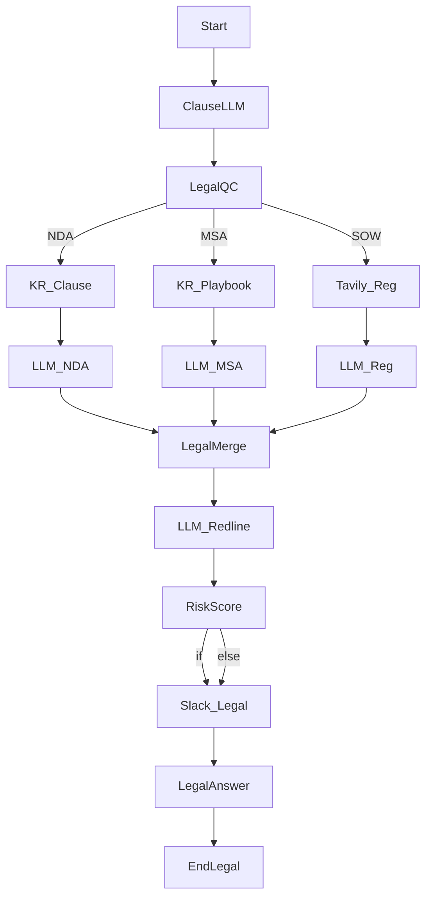

[노드별 상세 설정 (Configuration)]:
```json
// Node: Start
{
  "type": "start",
  "title": "Start",
  "port_bindings": {
    "query": { "type": "user_message" },
    "session_id": { "type": "session_id" }
  }
}

// Node: ClauseLLM (LLM) - 조항/당사자 추출
{
  "type": "llm",
  "title": "조항 추출",
  "provider": "openai",
  "model": "gpt-4o-mini",
  "prompt": "Extract contract type, parties, key clauses needing review.\nText: {query}",
  "temperature": 0.25,
  "maxTokens": 650,
  "variable_mappings": {
    "query": { "target_port": "query", "source": { "variable": "Start.query", "value_type": "string" } }
  }
}

// Node: LegalQC (Question Classifier) - 계약 유형 분류
{
  "type": "question-classifier",
  "title": "계약 분류",
  "model": {
    "provider": "openai",
    "name": "gpt-4o-mini",
    "mode": "chat",
    "completion_params": { "temperature": 0.22, "max_tokens": 48 }
  },
  "classes": [
    { "id": "nda", "name": "NDA" },
    { "id": "msa", "name": "MSA" },
    { "id": "sow", "name": "SOW" }
  ],
  "instruction": "Classify contract type.",
  "query_variable_selector": ["ClauseLLM", "response"],
  "variable_mappings": {
    "query": { "target_port": "query", "source": { "variable": "ClauseLLM.response", "value_type": "string" } }
  }
}

// Node: KR_Clause (Knowledge Retrieval) - 조항 라이브러리
{
  "type": "knowledge-retrieval",
  "title": "조항 라이브러리",
  "dataset": "clause-library",
  "retrievalMode": "semantic",
  "topK": 5,
  "variable_mappings": {
    "query": { "target_port": "query", "source": { "variable": "ClauseLLM.response", "value_type": "string" } }
  }
}

// Node: KR_Playbook (Knowledge Retrieval) - 협상 플레이북
{
  "type": "knowledge-retrieval",
  "title": "협상 플레이북",
  "dataset": "legal-playbook",
  "retrievalMode": "hybrid",
  "topK": 4,
  "variable_mappings": {
    "query": { "target_port": "query", "source": { "variable": "ClauseLLM.response", "value_type": "string" } }
  }
}

// Node: Tavily_Reg (Tavily Search) - 규제/준법 검색
{
  "type": "tavily-search",
  "title": "규제 검색",
  "search_depth": "advanced",
  "topic": "news",
  "max_results": 5,
  "include_raw_content": true,
  "variable_mappings": {
    "query": { "target_port": "query", "source": { "variable": "ClauseLLM.response", "value_type": "string" } }
  }
}

// Node: LLM_NDA (LLM) - NDA 리스크 요약/수정안
{
  "type": "llm",
  "title": "NDA 리뷰",
  "provider": "openai",
  "model": "gpt-4o",
  "prompt": "Summarize NDA risks and propose redlines.\nLibrary:\n{context}\nRequest:\n{query}",
  "temperature": 0.28,
  "maxTokens": 900,
  "variable_mappings": {
    "query": { "target_port": "query", "source": { "variable": "ClauseLLM.response", "value_type": "string" } },
    "context": { "target_port": "context", "source": { "variable": "KR_Clause.context", "value_type": "string" } }
  }
}

// Node: LLM_MSA (LLM) - MSA 협상안
{
  "type": "llm",
  "title": "MSA 리뷰",
  "provider": "openai",
  "model": "gpt-4o",
  "prompt": "Apply playbook to craft negotiation notes.\nPlaybook:\n{context}\nRequest:\n{query}",
  "temperature": 0.27,
  "maxTokens": 950,
  "variable_mappings": {
    "query": { "target_port": "query", "source": { "variable": "ClauseLLM.response", "value_type": "string" } },
    "context": { "target_port": "context", "source": { "variable": "KR_Playbook.context", "value_type": "string" } }
  }
}

// Node: LLM_Reg (LLM) - 규제 준수 체크
{
  "type": "llm",
  "title": "규제 체크",
  "provider": "openai",
  "model": "gpt-4o-mini",
  "prompt": "Flag regulatory/industry compliance gaps.\nEvidence:\n{context}\nRequest:\n{query}",
  "temperature": 0.3,
  "maxTokens": 800,
  "variable_mappings": {
    "query": { "target_port": "query", "source": { "variable": "ClauseLLM.response", "value_type": "string" } },
    "context": { "target_port": "context", "source": { "variable": "Tavily_Reg.context", "value_type": "string" } }
  }
}

// Node: LegalMerge (LLM) - 단일 리뷰 메모
{
  "type": "llm",
  "title": "리뷰 합성",
  "provider": "openai",
  "model": "gpt-4o",
  "prompt": "Produce a legal review memo with risk labels and redlines.\nNDA: {{LLM_NDA.response}}\nMSA: {{LLM_MSA.response}}\nReg: {{LLM_Reg.response}}",
  "temperature": 0.26,
  "maxTokens": 1000,
  "variable_mappings": {
    "query": { "target_port": "query", "source": { "variable": "ClauseLLM.response", "value_type": "string" } }
  }
}

// Node: LLM_Redline (LLM) - 슬랙 공유용 요약/레드라인 하이라이트
{
  "type": "llm",
  "title": "레드라인 요약",
  "provider": "openai",
  "model": "gpt-4o-mini",
  "prompt": "Summarize top 3 risks and exact redline suggestions.\nMemo:\n{context}\nRequest:\n{query}",
  "temperature": 0.3,
  "maxTokens": 650,
  "variable_mappings": {
    "query": { "target_port": "query", "source": { "variable": "ClauseLLM.response", "value_type": "string" } },
    "context": { "target_port": "context", "source": { "variable": "LegalMerge.response", "value_type": "string" } }
  }
}

// Node: RiskScore (If-Else) - 하이 리스크 여부
{
  "type": "if-else",
  "title": "리스크 게이트",
  "cases": [
    {
      "case_id": "high_risk",
      "logical_operator": "or",
      "conditions": [
        { "id": "l1", "varType": "string", "variable_selector": "LegalQC.class_name", "comparison_operator": "=", "value": "MSA" },
        { "id": "l2", "varType": "number", "variable_selector": "Tavily_Reg.result_count", "comparison_operator": ">", "value": 2 }
      ]
    }
  ]
}

// Node: Slack_Legal (Slack) - 법무 알림
{
  "type": "slack",
  "title": "법무 알림",
  "channel": "#legal-review",
  "use_blocks": true,
  "variable_mappings": {
    "text": { "target_port": "text", "source": { "variable": "LegalMerge.response", "value_type": "string" } },
    "title": { "target_port": "title", "source": { "variable": "LegalQC.class_name", "value_type": "string" } }
  }
}

// Node: LegalAnswer (Answer)
{
  "type": "answer",
  "title": "검토 결과",
  "template": "{{LegalMerge.response}}",
  "description": "요약 메모",
  "output_format": "text",
  "variable_mappings": {
    "target": { "target_port": "target", "source": { "variable": "LegalMerge.response", "value_type": "string" } }
  }
}

// Node: EndLegal (End)
{
  "type": "end",
  "title": "종료",
  "variable_mappings": {
    "response": { "target_port": "response", "source": { "variable": "LegalAnswer.final_output", "value_type": "string" } }
  }
}
```

---

### 템플릿 8: 헬스 상담 트리아지 보조
[시나리오]: 증상 서술을 정규화하고, 긴급도 분류 후 의료 가이드·최근 뉴스를 참고해 응급/일반/웰니스 응답을 생성, 필요 시 의료진 Slack 알림을 수행합니다.

[와이어프레임 (Mermaid Flowchart)]:
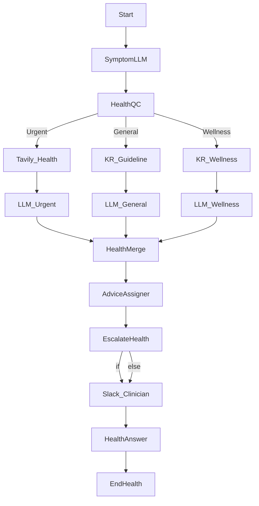

[노드별 상세 설정 (Configuration)]:
```json
// Node: Start
{
  "type": "start",
  "title": "Start",
  "port_bindings": {
    "query": { "type": "user_message" },
    "session_id": { "type": "session_id" }
  }
}

// Node: SymptomLLM (LLM) - 증상 구조화
{
  "type": "llm",
  "title": "증상 정규화",
  "provider": "openai",
  "model": "gpt-4o-mini",
  "prompt": "Normalize symptoms, onset, and severity.\nInput: {query}",
  "temperature": 0.3,
  "maxTokens": 550,
  "variable_mappings": {
    "query": { "target_port": "query", "source": { "variable": "Start.query", "value_type": "string" } }
  }
}

// Node: HealthQC (Question Classifier) - 긴급도 분류
{
  "type": "question-classifier",
  "title": "긴급도 분류",
  "model": {
    "provider": "openai",
    "name": "gpt-4o-mini",
    "mode": "chat",
    "completion_params": { "temperature": 0.2, "max_tokens": 48 }
  },
  "classes": [
    { "id": "urgent", "name": "Urgent" },
    { "id": "general", "name": "General" },
    { "id": "wellness", "name": "Wellness" }
  ],
  "instruction": "Route to Urgent/General/Wellness.",
  "query_variable_selector": ["SymptomLLM", "response"],
  "variable_mappings": {
    "query": { "target_port": "query", "source": { "variable": "SymptomLLM.response", "value_type": "string" } }
  }
}

// Node: Tavily_Health (Tavily Search) - 최신 의료 뉴스/주의보
{
  "type": "tavily-search",
  "title": "의료 뉴스",
  "search_depth": "basic",
  "topic": "news",
  "max_results": 5,
  "include_answer": true,
  "variable_mappings": {
    "query": { "target_port": "query", "source": { "variable": "SymptomLLM.response", "value_type": "string" } }
  }
}

// Node: KR_Guideline (Knowledge Retrieval) - 일반 진료 가이드
{
  "type": "knowledge-retrieval",
  "title": "진료 가이드",
  "dataset": "clinical-guides",
  "retrievalMode": "semantic",
  "topK": 4,
  "variable_mappings": {
    "query": { "target_port": "query", "source": { "variable": "SymptomLLM.response", "value_type": "string" } }
  }
}

// Node: KR_Wellness (Knowledge Retrieval) - 웰니스 자료
{
  "type": "knowledge-retrieval",
  "title": "웰니스 자료",
  "dataset": "wellness-library",
  "retrievalMode": "semantic",
  "topK": 4,
  "variable_mappings": {
    "query": { "target_port": "query", "source": { "variable": "SymptomLLM.response", "value_type": "string" } }
  }
}

// Node: LLM_Urgent (LLM) - 응급 대처 안내
{
  "type": "llm",
  "title": "응급 안내",
  "provider": "openai",
  "model": "gpt-4o",
  "prompt": "Provide urgent red-flag checks and immediate steps.\nEvidence:\n{context}\nSymptoms:\n{query}",
  "temperature": 0.28,
  "maxTokens": 700,
  "variable_mappings": {
    "query": { "target_port": "query", "source": { "variable": "SymptomLLM.response", "value_type": "string" } },
    "context": { "target_port": "context", "source": { "variable": "Tavily_Health.context", "value_type": "string" } }
  }
}

// Node: LLM_General (LLM) - 일반 상담
{
  "type": "llm",
  "title": "일반 상담",
  "provider": "openai",
  "model": "gpt-4o",
  "prompt": "Give general guidance and when to see a doctor.\nGuideline:\n{context}\nSymptoms:\n{query}",
  "temperature": 0.3,
  "maxTokens": 750,
  "variable_mappings": {
    "query": { "target_port": "query", "source": { "variable": "SymptomLLM.response", "value_type": "string" } },
    "context": { "target_port": "context", "source": { "variable": "KR_Guideline.context", "value_type": "string" } }
  }
}

// Node: LLM_Wellness (LLM) - 웰니스 팁
{
  "type": "llm",
  "title": "웰니스 팁",
  "provider": "openai",
  "model": "gpt-4o-mini",
  "prompt": "Share lifestyle tips and reminders.\nContent:\n{context}\nUser:\n{query}",
  "temperature": 0.35,
  "maxTokens": 650,
  "variable_mappings": {
    "query": { "target_port": "query", "source": { "variable": "SymptomLLM.response", "value_type": "string" } },
    "context": { "target_port": "context", "source": { "variable": "KR_Wellness.context", "value_type": "string" } }
  }
}

// Node: HealthMerge (LLM) - 단일 건강 답변
{
  "type": "llm",
  "title": "건강 답변 합성",
  "provider": "openai",
  "model": "gpt-4o",
  "prompt": "Return one safety-checked answer.\nUrgent: {{LLM_Urgent.response}}\nGeneral: {{LLM_General.response}}\nWellness: {{LLM_Wellness.response}}",
  "temperature": 0.3,
  "maxTokens": 900,
  "variable_mappings": {
    "query": { "target_port": "query", "source": { "variable": "SymptomLLM.response", "value_type": "string" } }
  }
}

// Node: AdviceAssigner (Assigner) - 상담 로그 누적
{
  "type": "assigner",
  "title": "상담 로그",
  "operations": [
    {
      "id": "op_advice",
      "write_mode": "append",
      "input_type": "variable",
      "target_variable": { "port_name": "advice_log", "data_type": "array" },
      "source_variable": { "port_name": "advice_log", "data_type": "array" }
    }
  ],
  "ports": {
    "inputs": [
      { "name": "operation_0_target", "type": "any", "required": true, "description": "기존 로그", "display_name": "Op0 Target" },
      { "name": "operation_0_value", "type": "any", "required": true, "description": "새 로그", "display_name": "Op0 Value" }
    ],
    "outputs": [
      { "name": "operation_0_result", "type": "any", "required": true, "description": "누적 로그", "display_name": "Op0 Result" }
    ]
  },
  "variable_mappings": {
    "operation_0_target": { "target_port": "operation_0_target", "source": { "variable": "SymptomLLM.response", "value_type": "string" } },
    "operation_0_value": { "target_port": "operation_0_value", "source": { "variable": "HealthMerge.response", "value_type": "string" } }
  }
}

// Node: EscalateHealth (If-Else) - 응급 여부 판정
{
  "type": "if-else",
  "title": "응급 분기",
  "cases": [
    {
      "case_id": "page_clinician",
      "logical_operator": "or",
      "conditions": [
        { "id": "e1", "varType": "string", "variable_selector": "HealthQC.class_name", "comparison_operator": "=", "value": "Urgent" },
        { "id": "e2", "varType": "number", "variable_selector": "Tavily_Health.result_count", "comparison_operator": ">", "value": 3 }
      ]
    }
  ]
}

// Node: Slack_Clinician (Slack) - 의료진 알림
{
  "type": "slack",
  "title": "의료진 알림",
  "channel": "#clinical-triage",
  "use_blocks": true,
  "variable_mappings": {
    "text": { "target_port": "text", "source": { "variable": "HealthMerge.response", "value_type": "string" } },
    "title": { "target_port": "title", "source": { "variable": "HealthQC.class_name", "value_type": "string" } }
  }
}

// Node: HealthAnswer (Answer)
{
  "type": "answer",
  "title": "사용자 답변",
  "template": "{{HealthMerge.response}}",
  "description": "건강 조언",
  "output_format": "text",
  "variable_mappings": {
    "target": { "target_port": "target", "source": { "variable": "HealthMerge.response", "value_type": "string" } }
  }
}

// Node: EndHealth (End)
{
  "type": "end",
  "title": "종료",
  "variable_mappings": {
    "response": { "target_port": "response", "source": { "variable": "HealthAnswer.final_output", "value_type": "string" } }
  }
}
```

---

### 템플릿 9: 데이터 품질 감사 도우미
[시나리오]: 데이터 품질 요청을 스키마/검증/이상감지로 분류하고, 문서·검색을 활용해 체크리스트·우선순위를 제안하며 Slack으로 보고합니다.

[와이어프레임 (Mermaid Flowchart)]:
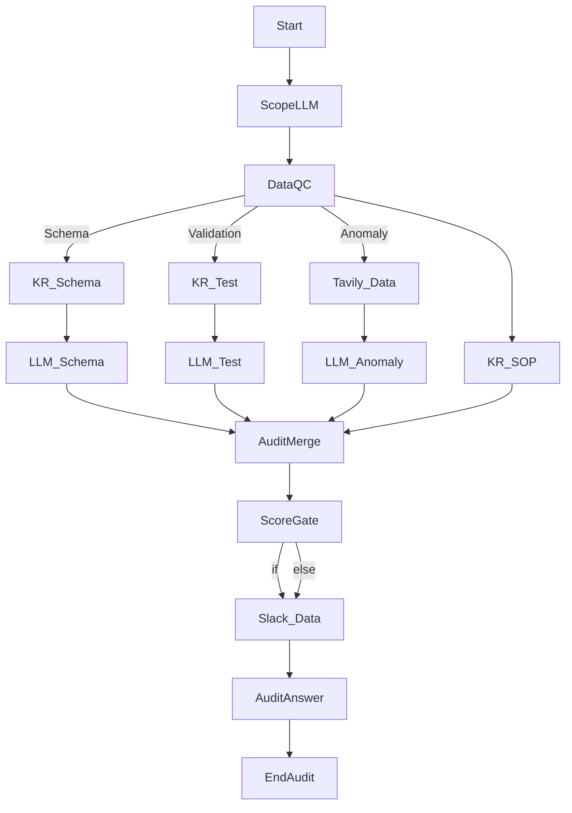

[노드별 상세 설정 (Configuration)]:
```json
// Node: Start
{
  "type": "start",
  "title": "Start",
  "port_bindings": {
    "query": { "type": "user_message" },
    "session_id": { "type": "session_id" }
  }
}

// Node: ScopeLLM (LLM) - 데이터 범위/테이블 추출
{
  "type": "llm",
  "title": "범위 추출",
  "provider": "openai",
  "model": "gpt-4o-mini",
  "prompt": "Extract dataset, tables, and quality concerns.\nText: {query}",
  "temperature": 0.28,
  "maxTokens": 600,
  "variable_mappings": {
    "query": { "target_port": "query", "source": { "variable": "Start.query", "value_type": "string" } }
  }
}

// Node: DataQC (Question Classifier) - 이슈 타입 분류
{
  "type": "question-classifier",
  "title": "품질 분류",
  "model": {
    "provider": "openai",
    "name": "gpt-4o-mini",
    "mode": "chat",
    "completion_params": { "temperature": 0.22, "max_tokens": 48 }
  },
  "classes": [
    { "id": "schema", "name": "Schema" },
    { "id": "validation", "name": "Validation" },
    { "id": "anomaly", "name": "Anomaly" }
  ],
  "instruction": "Pick issue type.",
  "query_variable_selector": ["ScopeLLM", "response"],
  "variable_mappings": {
    "query": { "target_port": "query", "source": { "variable": "ScopeLLM.response", "value_type": "string" } }
  }
}

// Node: KR_Schema (Knowledge Retrieval) - 스키마 문서 검색
{
  "type": "knowledge-retrieval",
  "title": "스키마 문서",
  "dataset": "data-catalog",
  "retrievalMode": "semantic",
  "topK": 5,
  "variable_mappings": {
    "query": { "target_port": "query", "source": { "variable": "ScopeLLM.response", "value_type": "string" } }
  }
}

// Node: KR_Test (Knowledge Retrieval) - 테스트 체크리스트
{
  "type": "knowledge-retrieval",
  "title": "테스트 체크리스트",
  "dataset": "dq-checklist",
  "retrievalMode": "hybrid",
  "topK": 4,
  "variable_mappings": {
    "query": { "target_port": "query", "source": { "variable": "ScopeLLM.response", "value_type": "string" } }
  }
}

// Node: KR_SOP (Knowledge Retrieval) - 표준 운영 절차
{
  "type": "knowledge-retrieval",
  "title": "SOP 검색",
  "dataset": "dq-sop",
  "retrievalMode": "semantic",
  "topK": 3,
  "variable_mappings": {
    "query": { "target_port": "query", "source": { "variable": "ScopeLLM.response", "value_type": "string" } }
  }
}

// Node: Tavily_Data (Tavily Search) - 툴/패턴 검색
{
  "type": "tavily-search",
  "title": "툴/패턴 검색",
  "search_depth": "basic",
  "topic": "news",
  "max_results": 5,
  "include_raw_content": false,
  "variable_mappings": {
    "query": { "target_port": "query", "source": { "variable": "ScopeLLM.response", "value_type": "string" } }
  }
}

// Node: LLM_Schema (LLM) - 스키마 검토 액션
{
  "type": "llm",
  "title": "스키마 액션",
  "provider": "openai",
  "model": "gpt-4o",
  "prompt": "List schema checks and owners.\nDocs:\n{context}\nRequest:\n{query}",
  "temperature": 0.27,
  "maxTokens": 800,
  "variable_mappings": {
    "query": { "target_port": "query", "source": { "variable": "ScopeLLM.response", "value_type": "string" } },
    "context": { "target_port": "context", "source": { "variable": "KR_Schema.context", "value_type": "string" } }
  }
}

// Node: LLM_Test (LLM) - 테스트 플랜
{
  "type": "llm",
  "title": "테스트 플랜",
  "provider": "openai",
  "model": "gpt-4o",
  "prompt": "Propose validation tests with severity.\nChecklist:\n{context}\nRequest:\n{query}",
  "temperature": 0.27,
  "maxTokens": 850,
  "variable_mappings": {
    "query": { "target_port": "query", "source": { "variable": "ScopeLLM.response", "value_type": "string" } },
    "context": { "target_port": "context", "source": { "variable": "KR_Test.context", "value_type": "string" } }
  }
}

// Node: LLM_Anomaly (LLM) - 이상 감지 아이디어
{
  "type": "llm",
  "title": "이상 감지",
  "provider": "openai",
  "model": "gpt-4o-mini",
  "prompt": "Suggest anomaly detection signals and dashboards.\nSearch:\n{context}\nRequest:\n{query}",
  "temperature": 0.32,
  "maxTokens": 750,
  "variable_mappings": {
    "query": { "target_port": "query", "source": { "variable": "ScopeLLM.response", "value_type": "string" } },
    "context": { "target_port": "context", "source": { "variable": "Tavily_Data.context", "value_type": "string" } }
  }
}

// Node: AuditMerge (LLM) - 단일 감사 플랜
{
  "type": "llm",
  "title": "감사 플랜",
  "provider": "openai",
  "model": "gpt-4o",
  "prompt": "Combine schema/test/anomaly actions with priority scores.\nSchema: {{LLM_Schema.response}}\nTests: {{LLM_Test.response}}\nAnomaly: {{LLM_Anomaly.response}}\nSOP: {{KR_SOP.context}}",
  "temperature": 0.26,
  "maxTokens": 900,
  "variable_mappings": {
    "query": { "target_port": "query", "source": { "variable": "ScopeLLM.response", "value_type": "string" } }
  }
}

// Node: ScoreGate (If-Else) - 심각도 알림 여부
{
  "type": "if-else",
  "title": "심각도 게이트",
  "cases": [
    {
      "case_id": "notify",
      "logical_operator": "or",
      "conditions": [
        { "id": "dq1", "varType": "number", "variable_selector": "Tavily_Data.result_count", "comparison_operator": ">", "value": 2 },
        { "id": "dq2", "varType": "string", "variable_selector": "DataQC.class_name", "comparison_operator": "=", "value": "Anomaly" }
      ]
    }
  ]
}

// Node: Slack_Data (Slack) - 데이터 팀 알림
{
  "type": "slack",
  "title": "데이터 알림",
  "channel": "#data-quality",
  "use_blocks": true,
  "variable_mappings": {
    "text": { "target_port": "text", "source": { "variable": "AuditMerge.response", "value_type": "string" } },
    "title": { "target_port": "title", "source": { "variable": "DataQC.class_name", "value_type": "string" } }
  }
}

// Node: AuditAnswer (Answer)
{
  "type": "answer",
  "title": "감사 결과",
  "template": "{{AuditMerge.response}}",
  "description": "품질 플랜",
  "output_format": "text",
  "variable_mappings": {
    "target": { "target_port": "target", "source": { "variable": "AuditMerge.response", "value_type": "string" } }
  }
}

// Node: EndAudit (End)
{
  "type": "end",
  "title": "종료",
  "variable_mappings": {
    "response": { "target_port": "response", "source": { "variable": "AuditAnswer.final_output", "value_type": "string" } }
  }
}
```

---

### 템플릿 10: 이벤트 운영 코디네이터
[시나리오]: 이벤트 요청을 웹세미나/오프라인/부스 운영으로 분류, 장소·벤더 검색과 내부 정책을 반영해 일정/태스크를 생성하고 Slack으로 공유합니다.

[와이어프레임 (Mermaid Flowchart)]:
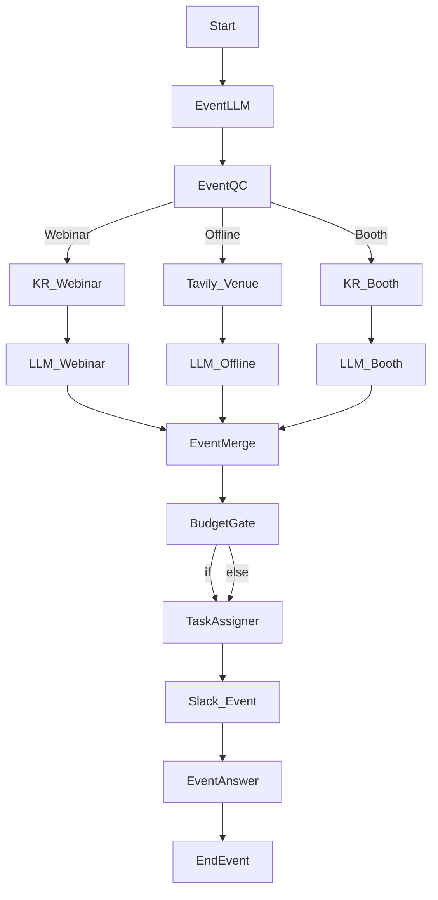

[노드별 상세 설정 (Configuration)]:
```json
// Node: Start
{
  "type": "start",
  "title": "Start",
  "port_bindings": {
    "query": { "type": "user_message" },
    "session_id": { "type": "session_id" }
  }
}

// Node: EventLLM (LLM) - 요청 파싱
{
  "type": "llm",
  "title": "요청 파싱",
  "provider": "openai",
  "model": "gpt-4o-mini",
  "prompt": "Extract event type, date, attendees, budget, and city.\nInput: {query}",
  "temperature": 0.28,
  "maxTokens": 650,
  "variable_mappings": {
    "query": { "target_port": "query", "source": { "variable": "Start.query", "value_type": "string" } }
  }
}

// Node: EventQC (Question Classifier) - 이벤트 유형 분류
{
  "type": "question-classifier",
  "title": "이벤트 분류",
  "model": {
    "provider": "openai",
    "name": "gpt-4o-mini",
    "mode": "chat",
    "completion_params": { "temperature": 0.22, "max_tokens": 48 }
  },
  "classes": [
    { "id": "webinar", "name": "Webinar" },
    { "id": "offline", "name": "Offline" },
    { "id": "booth", "name": "Booth" }
  ],
  "instruction": "Select event category.",
  "query_variable_selector": ["EventLLM", "response"],
  "variable_mappings": {
    "query": { "target_port": "query", "source": { "variable": "EventLLM.response", "value_type": "string" } }
  }
}

// Node: KR_Webinar (Knowledge Retrieval) - 웨비나 가이드
{
  "type": "knowledge-retrieval",
  "title": "웨비나 가이드",
  "dataset": "webinar-playbook",
  "retrievalMode": "semantic",
  "topK": 4,
  "variable_mappings": {
    "query": { "target_port": "query", "source": { "variable": "EventLLM.response", "value_type": "string" } }
  }
}

// Node: Tavily_Venue (Tavily Search) - 장소/벤더 검색
{
  "type": "tavily-search",
  "title": "장소 검색",
  "search_depth": "basic",
  "topic": "general",
  "max_results": 5,
  "include_answer": true,
  "variable_mappings": {
    "query": { "target_port": "query", "source": { "variable": "EventLLM.response", "value_type": "string" } }
  }
}

// Node: KR_Booth (Knowledge Retrieval) - 부스 운영 체크리스트
{
  "type": "knowledge-retrieval",
  "title": "부스 체크리스트",
  "dataset": "booth-ops",
  "retrievalMode": "hybrid",
  "topK": 4,
  "variable_mappings": {
    "query": { "target_port": "query", "source": { "variable": "EventLLM.response", "value_type": "string" } }
  }
}

// Node: LLM_Webinar (LLM) - 웨비나 일정/태스크
{
  "type": "llm",
  "title": "웨비나 플랜",
  "provider": "openai",
  "model": "gpt-4o",
  "prompt": "Create webinar timeline, speakers, promotion plan.\nGuide:\n{context}\nRequest:\n{query}",
  "temperature": 0.28,
  "maxTokens": 900,
  "variable_mappings": {
    "query": { "target_port": "query", "source": { "variable": "EventLLM.response", "value_type": "string" } },
    "context": { "target_port": "context", "source": { "variable": "KR_Webinar.context", "value_type": "string" } }
  }
}

// Node: LLM_Offline (LLM) - 오프라인 장소/벤더 계획
{
  "type": "llm",
  "title": "오프라인 플랜",
  "provider": "openai",
  "model": "gpt-4o",
  "prompt": "Select venue options and tasks.\nSearch:\n{context}\nRequest:\n{query}",
  "temperature": 0.3,
  "maxTokens": 900,
  "variable_mappings": {
    "query": { "target_port": "query", "source": { "variable": "EventLLM.response", "value_type": "string" } },
    "context": { "target_port": "context", "source": { "variable": "Tavily_Venue.context", "value_type": "string" } }
  }
}

// Node: LLM_Booth (LLM) - 부스 운영 계획
{
  "type": "llm",
  "title": "부스 플랜",
  "provider": "openai",
  "model": "gpt-4o-mini",
  "prompt": "Create booth staffing, giveaways, and lead capture steps.\nChecklist:\n{context}\nRequest:\n{query}",
  "temperature": 0.32,
  "maxTokens": 800,
  "variable_mappings": {
    "query": { "target_port": "query", "source": { "variable": "EventLLM.response", "value_type": "string" } },
    "context": { "target_port": "context", "source": { "variable": "KR_Booth.context", "value_type": "string" } }
  }
}

// Node: EventMerge (LLM) - 단일 이벤트 일정
{
  "type": "llm",
  "title": "일정 합성",
  "provider": "openai",
  "model": "gpt-4o",
  "prompt": "Produce one event schedule with tasks and owners.\nWebinar: {{LLM_Webinar.response}}\nOffline: {{LLM_Offline.response}}\nBooth: {{LLM_Booth.response}}",
  "temperature": 0.27,
  "maxTokens": 950,
  "variable_mappings": {
    "query": { "target_port": "query", "source": { "variable": "EventLLM.response", "value_type": "string" } }
  }
}

// Node: BudgetGate (If-Else) - 예산 승인 필요 여부
{
  "type": "if-else",
  "title": "예산 분기",
  "cases": [
    {
      "case_id": "need_budget",
      "logical_operator": "or",
      "conditions": [
        { "id": "b1", "varType": "string", "variable_selector": "EventQC.class_name", "comparison_operator": "=", "value": "Offline" },
        { "id": "b2", "varType": "number", "variable_selector": "Tavily_Venue.result_count", "comparison_operator": ">", "value": 2 }
      ]
    }
  ]
}

// Node: TaskAssigner (Assigner) - 태스크 목록 저장
{
  "type": "assigner",
  "title": "태스크 저장",
  "operations": [
    {
      "id": "op_task",
      "write_mode": "append",
      "input_type": "variable",
      "target_variable": { "port_name": "tasks", "data_type": "array" },
      "source_variable": { "port_name": "tasks", "data_type": "array" }
    }
  ],
  "ports": {
    "inputs": [
      { "name": "operation_0_target", "type": "any", "required": true, "description": "기존 태스크", "display_name": "Op0 Target" },
      { "name": "operation_0_value", "type": "any", "required": true, "description": "새 태스크", "display_name": "Op0 Value" }
    ],
    "outputs": [
      { "name": "operation_0_result", "type": "any", "required": true, "description": "누적 태스크", "display_name": "Op0 Result" }
    ]
  },
  "variable_mappings": {
    "operation_0_target": { "target_port": "operation_0_target", "source": { "variable": "EventLLM.response", "value_type": "string" } },
    "operation_0_value": { "target_port": "operation_0_value", "source": { "variable": "EventMerge.response", "value_type": "string" } }
  }
}

// Node: Slack_Event (Slack) - 이벤트 채널 공유
{
  "type": "slack",
  "title": "이벤트 공유",
  "channel": "#event-ops",
  "use_blocks": true,
  "variable_mappings": {
    "text": { "target_port": "text", "source": { "variable": "EventMerge.response", "value_type": "string" } },
    "title": { "target_port": "title", "source": { "variable": "EventQC.class_name", "value_type": "string" } }
  }
}

// Node: EventAnswer (Answer)
{
  "type": "answer",
  "title": "일정 출력",
  "template": "{{EventMerge.response}}",
  "description": "사용자용 일정",
  "output_format": "text",
  "variable_mappings": {
    "target": { "target_port": "target", "source": { "variable": "EventMerge.response", "value_type": "string" } }
  }
}

// Node: EndEvent (End)
{
  "type": "end",
  "title": "종료",
  "variable_mappings": {
    "response": { "target_port": "response", "source": { "variable": "EventAnswer.final_output", "value_type": "string" } }
  }
}
```

---

### 템플릿 11: 카테고리별 맞춤 톤 뉴스 브리핑 봇 (Multi-Persona News Briefing)
[시나리오]: IT(전문/건조), 경제(분석/수치), 문화(감성/이모지) 뉴스 흐름을 각각 수집하고, 페르소나별 LLM이 재가공해 서로 다른 Slack 채널로 발송한 뒤 최종 요약을 제공합니다.

[와이어프레임 (Mermaid Flowchart)]:
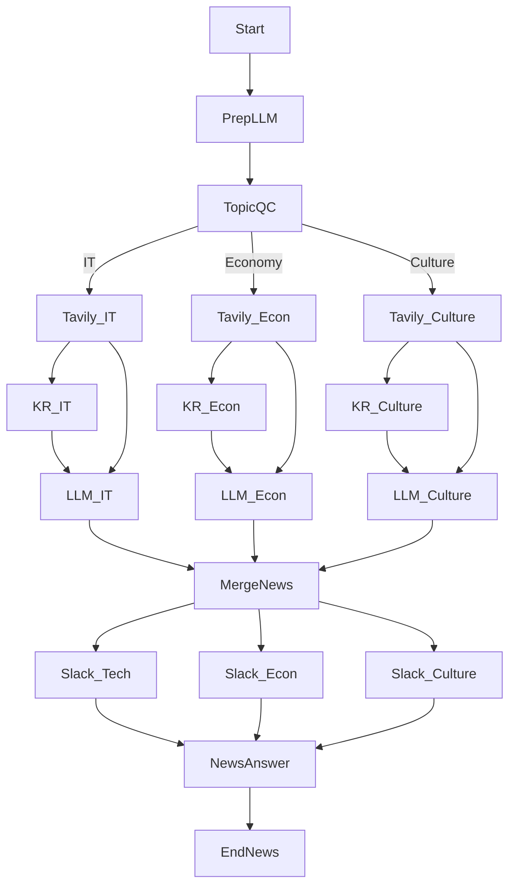

[노드별 상세 설정 (Configuration)]:
```json
// Node: Start
{
  "type": "start",
  "title": "Start",
  "port_bindings": {
    "query": { "type": "user_message" },
    "session_id": { "type": "session_id" }
  }
}

// Node: PrepLLM (LLM) - 질의 정규화
{
  "type": "llm",
  "title": "질의 정규화",
  "provider": "openai",
  "model": "gpt-4o-mini",
  "prompt": "Normalize the news briefing request to include entities, timeframe, and language.\nInput: {query}\nReturn a concise query.",
  "temperature": 0.25,
  "maxTokens": 500,
  "variable_mappings": {
    "query": { "target_port": "query", "source": { "variable": "Start.query", "value_type": "string" } }
  }
}

// Node: TopicQC (Question Classifier) - 카테고리 분류
{
  "type": "question-classifier",
  "title": "카테고리 분류",
  "model": {
    "provider": "openai",
    "name": "gpt-4o-mini",
    "mode": "chat",
    "completion_params": { "temperature": 0.2, "max_tokens": 48 }
  },
  "classes": [
    { "id": "it", "name": "IT" },
    { "id": "economy", "name": "Economy" },
    { "id": "culture", "name": "Culture" }
  ],
  "instruction": "Route the query to IT, Economy, or Culture.",
  "query_variable_selector": ["PrepLLM", "response"],
  "variable_mappings": {
    "query": { "target_port": "query", "source": { "variable": "PrepLLM.response", "value_type": "string" } }
  }
}

// Node: Tavily_IT (Tavily Search) - IT 뉴스
{
  "type": "tavily-search",
  "title": "IT 뉴스 검색",
  "search_depth": "advanced",
  "topic": "news",
  "max_results": 5,
  "include_answer": true,
  "include_raw_content": false,
  "variable_mappings": {
    "query": { "target_port": "query", "source": { "variable": "PrepLLM.response", "value_type": "string" } }
  }
}

// Node: Tavily_Econ (Tavily Search) - 경제 뉴스
{
  "type": "tavily-search",
  "title": "경제 뉴스 검색",
  "search_depth": "advanced",
  "topic": "finance",
  "max_results": 5,
  "include_answer": true,
  "include_raw_content": false,
  "variable_mappings": {
    "query": { "target_port": "query", "source": { "variable": "PrepLLM.response", "value_type": "string" } }
  }
}

// Node: Tavily_Culture (Tavily Search) - 문화 뉴스
{
  "type": "tavily-search",
  "title": "문화 뉴스 검색",
  "search_depth": "basic",
  "topic": "news",
  "max_results": 5,
  "include_answer": false,
  "include_raw_content": true,
  "variable_mappings": {
    "query": { "target_port": "query", "source": { "variable": "PrepLLM.response", "value_type": "string" } }
  }
}

// Node: KR_IT (Knowledge Retrieval) - IT 톤 가이드
{
  "type": "knowledge-retrieval",
  "title": "IT 톤/용어 가이드",
  "dataset": "tech-briefing-style",
  "retrievalMode": "semantic",
  "topK": 3,
  "variable_mappings": {
    "query": { "target_port": "query", "source": { "variable": "PrepLLM.response", "value_type": "string" } }
  }
}

// Node: KR_Econ (Knowledge Retrieval) - 경제 톤 가이드
{
  "type": "knowledge-retrieval",
  "title": "경제 톤/지표 가이드",
  "dataset": "economy-briefing-style",
  "retrievalMode": "hybrid",
  "topK": 3,
  "variable_mappings": {
    "query": { "target_port": "query", "source": { "variable": "PrepLLM.response", "value_type": "string" } }
  }
}

// Node: KR_Culture (Knowledge Retrieval) - 문화 톤 가이드
{
  "type": "knowledge-retrieval",
  "title": "문화 톤/스토리텔링",
  "dataset": "culture-briefing-style",
  "retrievalMode": "semantic",
  "topK": 3,
  "variable_mappings": {
    "query": { "target_port": "query", "source": { "variable": "PrepLLM.response", "value_type": "string" } }
  }
}

// Node: LLM_IT (LLM) - IT 페르소나 응답
{
  "type": "llm",
  "title": "IT 브리핑",
  "provider": "openai",
  "model": "gpt-4o",
  "prompt": "Persona: Senior IT Analyst (dry, concise, bullet-style).\nStyle Guide:\n{context}\nSearch Feed:\n{system_prompt}\nQuery:\n{query}\nProduce a 120-word briefing.",
  "temperature": 0.22,
  "maxTokens": 750,
  "variable_mappings": {
    "query": { "target_port": "query", "source": { "variable": "PrepLLM.response", "value_type": "string" } },
    "context": { "target_port": "context", "source": { "variable": "KR_IT.context", "value_type": "string" } },
    "system_prompt": { "target_port": "system_prompt", "source": { "variable": "Tavily_IT.context", "value_type": "string" } }
  }
}

// Node: LLM_Econ (LLM) - 경제 페르소나 응답
{
  "type": "llm",
  "title": "경제 브리핑",
  "provider": "openai",
  "model": "gpt-4o",
  "prompt": "Persona: Macro Economist (analytical, metrics-heavy, include % and index names).\nStyle Guide:\n{context}\nSearch Feed:\n{system_prompt}\nQuery:\n{query}\nProduce a 140-word briefing.",
  "temperature": 0.24,
  "maxTokens": 780,
  "variable_mappings": {
    "query": { "target_port": "query", "source": { "variable": "PrepLLM.response", "value_type": "string" } },
    "context": { "target_port": "context", "source": { "variable": "KR_Econ.context", "value_type": "string" } },
    "system_prompt": { "target_port": "system_prompt", "source": { "variable": "Tavily_Econ.context", "value_type": "string" } }
  }
}

// Node: LLM_Culture (LLM) - 문화 페르소나 응답
{
  "type": "llm",
  "title": "문화 브리핑",
  "provider": "openai",
  "model": "gpt-4o-mini",
  "prompt": "Persona: Culture Curator (emotive, emoji-rich, storytelling tone).\nStyle Guide:\n{context}\nSearch Feed:\n{system_prompt}\nQuery:\n{query}\nProduce a 100-word briefing with emojis.",
  "temperature": 0.33,
  "maxTokens": 700,
  "variable_mappings": {
    "query": { "target_port": "query", "source": { "variable": "PrepLLM.response", "value_type": "string" } },
    "context": { "target_port": "context", "source": { "variable": "KR_Culture.context", "value_type": "string" } },
    "system_prompt": { "target_port": "system_prompt", "source": { "variable": "Tavily_Culture.context", "value_type": "string" } }
  }
}

// Node: MergeNews (LLM) - 최종 요약/로그
{
  "type": "llm",
  "title": "종합 요약",
  "provider": "openai",
  "model": "gpt-4o",
  "prompt": "Summarize three personas into a one-screen digest with key deltas.\nIT: {{LLM_IT.response}}\nEconomy: {{LLM_Econ.response}}\nCulture: {{LLM_Culture.response}}\nReturn bullet summary and headline.",
  "temperature": 0.25,
  "maxTokens": 850,
  "variable_mappings": {
    "query": { "target_port": "query", "source": { "variable": "PrepLLM.response", "value_type": "string" } }
  }
}

// Node: Slack_Tech (Slack) - IT 채널 전송
{
  "type": "slack",
  "title": "IT 채널",
  "channel": "#tech",
  "use_blocks": true,
  "variable_mappings": {
    "text": { "target_port": "text", "source": { "variable": "LLM_IT.response", "value_type": "string" } },
    "title": { "target_port": "title", "source": { "variable": "TopicQC.class_name", "value_type": "string" } }
  }
}

// Node: Slack_Econ (Slack) - 경제 채널 전송
{
  "type": "slack",
  "title": "경제 채널",
  "channel": "#economy",
  "use_blocks": true,
  "variable_mappings": {
    "text": { "target_port": "text", "source": { "variable": "LLM_Econ.response", "value_type": "string" } },
    "title": { "target_port": "title", "source": { "variable": "TopicQC.class_name", "value_type": "string" } }
  }
}

// Node: Slack_Culture (Slack) - 문화 채널 전송
{
  "type": "slack",
  "title": "문화 채널",
  "channel": "#culture",
  "use_blocks": true,
  "variable_mappings": {
    "text": { "target_port": "text", "source": { "variable": "LLM_Culture.response", "value_type": "string" } },
    "title": { "target_port": "title", "source": { "variable": "TopicQC.class_name", "value_type": "string" } }
  }
}

// Node: NewsAnswer (Answer) - 사용자 응답
{
  "type": "answer",
  "title": "최종 요약",
  "template": "Session {{Start.session_id}} digest:\\n{{MergeNews.response}}",
  "description": "사용자에게 전달할 종합 요약",
  "output_format": "text",
  "variable_mappings": {
    "target": { "target_port": "target", "source": { "variable": "MergeNews.response", "value_type": "string" } }
  }
}

// Node: EndNews (End)
{
  "type": "end",
  "title": "종료",
  "variable_mappings": {
    "response": { "target_port": "response", "source": { "variable": "NewsAnswer.final_output", "value_type": "string" } }
  }
}
```