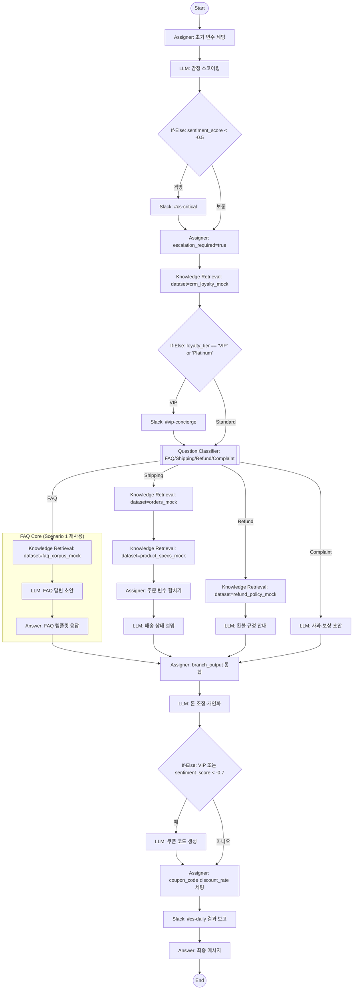
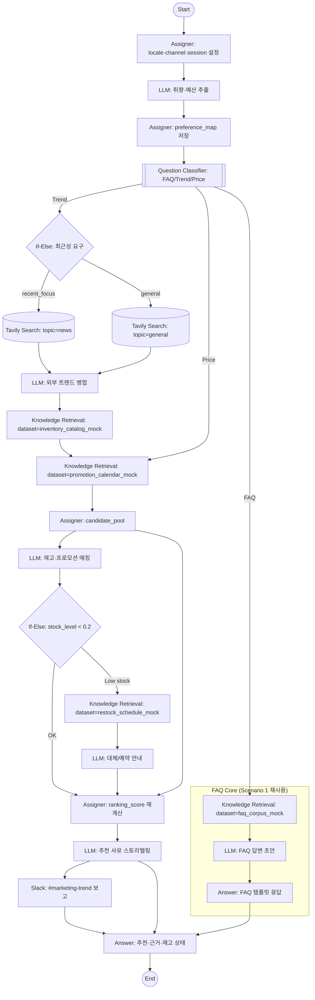
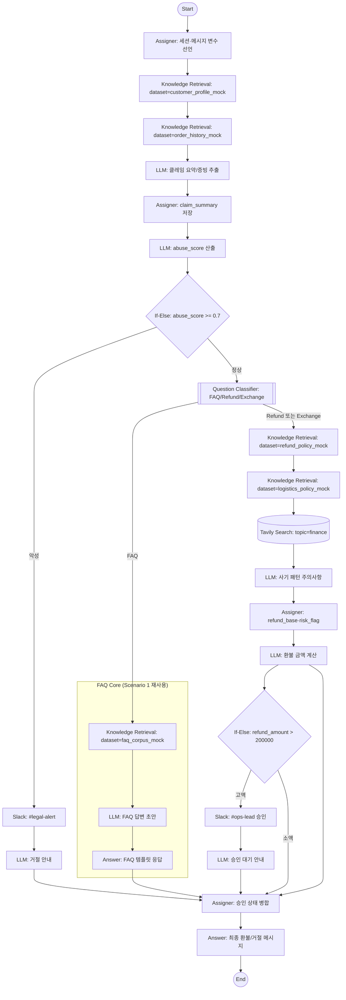

# Demo Scenario 2: Advanced Templates (Mock Store Best-Effort)

### 템플릿 1: VIP 케어 & 감정 분석 CS 봇
[시나리오 설명]: 실제 쇼핑몰 재고는 목업 상태이지만, 일반적인 이커머스 CS 흐름을 가정해 감정 점수로 위협/불만을 조기 차단하고 VIP 라우팅을 수행한다. 질문 분류에서 FAQ를 고르면 `FAQ Core (Scenario 1 재사용)` subgraph로 진입하여 기본 `Knowledge Retrieval → LLM → Answer → End` 흐름을 재사용한다. 그 외 배송/환불/컴플레인 경로는 목업 데이터셋 이름으로 구성한다.

[와이어프레임 (Mermaid Flowchart) - ⭐️ 핵심]:

[주요 파라미터 (Key Configs)]:
- **S0 Start**: `ports.outputs=[{name:"query",type:"string",required:true},{name:"session_id",type:"string",required:false}]`, `port_bindings={query:{type:"user_message"},session_id:{type:"session_id"}}`.
- **A1 Assigner**: `operations=[{id:"init_session",write_mode:"set",input_type:"constant",target_variable:{port_name:"session_id"},constant_value:"{{uuid}}"},{id:"init_flags",write_mode:"set",input_type:"constant",target_variable:{port_name:"escalation_required"},constant_value:false}]`.
- **L1 LLM (감정)**: `provider="openai"`, `model="gpt-4"`, `prompt="사용자 메시지의 sentiment_score(-1~1), intent_tag, abuse_flag를 JSON으로 반환"`, `temperature=0.2`, `maxTokens=512`, `variable_mappings={query:{source:{variable:"start.query",value_type:"string"}}}`.
- **IF1 If-Else**: `cases=[{case_id:"escalate",logical_operator:"and",conditions:[{id:"c1",varType:"number",variable_selector:"llm_sentiment.response.sentiment_score",comparison_operator:"<",value:-0.5}]},{case_id:"else_default",logical_operator:"and",conditions:[]}]`.
- **SL1 Slack**: `channel="#cs-critical"`, `use_blocks=true`, `integration_id=1001`, `variable_mappings={text:{source:{variable:"start.query",value_type:"string"}}}`.
- **A2 Assigner**: `operations=[{id:"flag_escalation",write_mode:"set",input_type:"constant",target_variable:{port_name:"escalation_required"},constant_value:true}]`.
- **KR0 Knowledge Retrieval**: `dataset="crm_loyalty_mock"`, `retrievalMode="hybrid"`, `topK=3`, `variable_mappings={query:{source:{variable:"start.query",value_type:"string"}}}`.
- **IF2 If-Else**: `cases=[{case_id:"vip_case",logical_operator:"and",conditions:[{id:"c1",varType:"string",variable_selector:"kr0.context.loyalty_tier",comparison_operator:"is",value:"VIP"}]},{case_id:"vip_platinum",logical_operator:"and",conditions:[{id:"c2",varType:"string",variable_selector:"kr0.context.loyalty_tier",comparison_operator:"is",value:"Platinum"}]},{case_id:"else_default",logical_operator:"and",conditions:[]}]`.
- **SL2 Slack**: `channel="#vip-concierge"`, `use_blocks=true`, `integration_id=1002`, `variable_mappings={text:{source:{variable:"start.query",value_type:"string"}}}`.
- **QC1 QuestionClassifier**: `classes=[{id:"faq",name:"FAQ"},{id:"shipping",name:"배송"},{id:"refund",name:"환불"},{id:"complaint",name:"컴플레인"}]`, `instruction="쇼핑 주문 문의를 FAQ/배송/환불/컴플레인으로 분류"`, `query_variable_selector=["start.query"]`, `model={provider:"openai",name:"gpt-4",mode:"chat",completion_params:{temperature:0.3}}`.
- **KR1 Knowledge Retrieval**: `dataset="orders_mock"`, `retrievalMode="hybrid"`, `topK=5`, `variable_mappings={query:{source:{variable:"start.query",value_type:"string"}}}`.
- **KR3 Knowledge Retrieval**: `dataset="product_specs_mock"`, `retrievalMode="hybrid"`, `topK=3`, `variable_mappings={query:{source:{variable:"kr1.context",value_type:"string"}}}`.
- **A3 Assigner**: `operations=[{id:"set_order_id",write_mode:"set",input_type:"variable",target_variable:{port_name:"order_id"},source_variable:{port_name:"orders_mock_id",data_type:"string"}},{id:"set_eta",write_mode:"set",input_type:"constant",target_variable:{port_name:"eta"},constant_value:"TBD (mock)"}]`.
- **L2 LLM (배송 설명)**: `provider="openai"`, `model="gpt-4",prompt="orders_mock 컨텍스트와 product_specs_mock 컨텍스트를 사용해 배송상태·지연사유·예상일을 설명"`, `temperature=0.3`, `variable_mappings={query:{source:{variable:"start.query",value_type:"string"}},context:{source:{variable:"kr3.context",value_type:"string"}}}`.
- **KR2 Knowledge Retrieval**: `dataset="refund_policy_mock"`, `retrievalMode="hybrid"`, `topK=5`, `variable_mappings={query:{source:{variable:"start.query",value_type:"string"}}}`.
- **L3 LLM (환불 안내)**: `provider="openai"`, `model="gpt-4"`, `prompt="refund_policy_mock 내용을 근거로 환불 가능 여부·필요 서류 안내"`, `temperature=0.3`, `variable_mappings={context:{source:{variable:"kr2.context",value_type:"string"}},query:{source:{variable:"start.query",value_type:"string"}}}`.
- **L4 LLM (컴플레인)**: `provider="openai"`, `model="gpt-4"`, `prompt="사과문 + 보상 옵션(적립금/쿠폰) 초안"`, `temperature=0.35`, `variable_mappings={query:{source:{variable:"start.query",value_type:"string"}}}`.
- **FAQ_CORE FQK**: `dataset="faq_corpus_mock"`, `retrievalMode="hybrid"`, `topK=5`, `variable_mappings={query:{source:{variable:"start.query",value_type:"string"}}}`.
- **FAQ_CORE FQL**: `provider="openai"`, `model="gpt-4"`, `prompt="faq_corpus_mock 컨텍스트로 답변 초안 작성"`, `temperature=0.25`, `variable_mappings={query:{source:{variable:"start.query",value_type:"string"}},context:{source:{variable:"fqk.context",value_type:"string"}}}`.
- **FAQ_CORE FQA Answer**: `template="FAQ 응답: {{fql.response}}"`, `description="FAQ 전용 출력"`.
- **A4 Assigner (머지)**: `operations=[{id:"merge_shipping",write_mode:"set",input_type:"variable",target_variable:{port_name:"branch_output"},source_variable:{port_name:"l2.response"}},{id:"merge_refund",write_mode:"set",input_type:"variable",target_variable:{port_name:"branch_output"},source_variable:{port_name:"l3.response"}},{id:"merge_complaint",write_mode:"set",input_type:"variable",target_variable:{port_name:"branch_output"},source_variable:{port_name:"l4.response"}},{id:"merge_faq",write_mode:"set",input_type:"variable",target_variable:{port_name:"branch_output"},source_variable:{port_name:"fqa.final_output"}}]`.
- **L5 LLM (톤 조정)**: `provider="openai"`, `model="gpt-4"`, `prompt="branch_output을 정중하고 간결하게 재작성. VIP면 더 공손하게"`, `temperature=0.25`, `variable_mappings={query:{source:{variable:"a4.branch_output",value_type:"string"}}}`.
- **IF3 If-Else**: `cases=[{case_id:"vip_or_angry",logical_operator:"and",conditions:[{id:"c1",varType:"string",variable_selector:"kr0.context.loyalty_tier",comparison_operator:"is",value:"VIP"},{id:"c2",varType:"number",variable_selector:"llm_sentiment.response.sentiment_score",comparison_operator:"<",value:-0.7}]},{case_id:"else_default",logical_operator:"and",conditions:[]}]`.
- **L6 LLM (쿠폰 생성)**: `provider="openai"`, `model="gpt-4"`, `prompt="5~10% 할인 쿠폰 코드와 만료일(7일) JSON 반환"`, `temperature=0.6`, `maxTokens=200`.
- **A5 Assigner**: `operations=[{id:"set_coupon_code",write_mode:"set",input_type:"variable",target_variable:{port_name:"coupon_code"},source_variable:{port_name:"l6.response"}},{id:"set_discount_rate",write_mode:"set",input_type:"constant",target_variable:{port_name:"discount_rate"},constant_value:0.1}]`.
- **SL3 Slack**: `channel="#cs-daily"`, `use_blocks=true`, `integration_id=1003`, `variable_mappings={text:{source:{variable:"l5.response",value_type:"string"}}}`.
- **ANS Answer**: `template="최종 답변: {{l5.response}}\n쿠폰: {{a5.coupon_code}} (할인율 {{a5.discount_rate}})"`, `description="CS 통합 응답"`.
- **END End**: 기본 설정.

---

### 템플릿 2: 트렌드 분석 & 상품 추천 마케터
[시나리오 설명]: 실제 재고는 목업이지만, 일반 쇼핑몰에서 할 수 있는 트렌드·재고·프로모션 교차 추천을 시연한다. 분류 결과가 FAQ면 `FAQ Core (Scenario 1 재사용)`로 내려가 기본 RAG를 재사용한다. 그 외에는 Tavily로 최신 패션 신호를 모으고 내부 목업 재고/프로모션을 매칭해 추천과 Slack 보고를 만든다.

[와이어프레임 (Mermaid Flowchart) - ⭐️ 핵심]:

[주요 파라미터 (Key Configs)]:
- **S0 Start**: `port_bindings={query:{type:"user_message"},session_id:{type:"session_id"}}`.
- **A1 Assigner**: `operations=[{id:"set_locale",write_mode:"set",input_type:"constant",target_variable:{port_name:"locale"},constant_value:"ko-KR"},{id:"set_channel",write_mode:"set",input_type:"constant",target_variable:{port_name:"channel"},constant_value:"web"}]`.
- **L0 LLM (취향 추출)**: `provider="openai"`, `model="gpt-4"`, `prompt="스타일 키워드, 시즌, 예산(budget_min,budget_max), recent_focus 여부를 JSON으로 추출"`, `temperature=0.2`, `maxTokens=400`, `variable_mappings={query:{source:{variable:"start.query",value_type:"string"}}}`.
- **A2 Assigner**: `operations=[{id:"save_preferences",write_mode:"set",input_type:"variable",target_variable:{port_name:"preference_map"},source_variable:{port_name:"l0.response"}}]`.
- **QC1 QuestionClassifier**: `classes=[{id:"faq",name:"FAQ"},{id:"trend",name:"트렌드추천"},{id:"price",name:"가격문의"}]`, `instruction="패션 관련 문의를 FAQ/Trend/Price로 분류"`, `query_variable_selector=["start.query"]`, `model={provider:"openai",name:"gpt-4",mode:"chat",completion_params:{temperature:0.3}}`.
- **IF0 If-Else**: `cases=[{case_id:"recent",logical_operator:"and",conditions:[{id:"c1",varType:"string",variable_selector:"a2.preference_map.recent_focus",comparison_operator:"is",value:"true"}]},{case_id:"else_default",logical_operator:"and",conditions:[]}]`.
- **TS1 Tavily Search**: `search_depth="basic"`, `topic="news"`, `max_results=5`, `time_range="week"`, `include_domains=[]`, `exclude_domains=["ads.example.com"]`, `include_answer=false`, `include_raw_content=false`, `variable_mappings={query:{source:{variable:"start.query",value_type:"string"}}}`.
- **TS2 Tavily Search**: 동일하나 `topic="general"`.
- **L1 LLM (외부 트렌드 병합)**: `provider="openai"`, `model="gpt-4"`, `prompt="Tavily results를 bullet 5개로 요약, 키워드 추출"`, `temperature=0.25`, `variable_mappings={context:{source:{variable:"ts1.context || ts2.context",value_type:"string"}}}`.
- **KR1 Knowledge Retrieval**: `dataset="inventory_catalog_mock"`, `retrievalMode="hybrid"`, `topK=5`, `variable_mappings={query:{source:{variable:"l1.response",value_type:"string"}}}`.
- **KR2 Knowledge Retrieval**: `dataset="promotion_calendar_mock"`, `retrievalMode="hybrid"`, `topK=5`, `variable_mappings={query:{source:{variable:"l1.response",value_type:"string"}}}`.
- **A3 Assigner**: `operations=[{id:"set_candidates",write_mode:"set",input_type:"variable",target_variable:{port_name:"candidate_pool"},source_variable:{port_name:"kr1.documents"}},{id:"attach_promotions",write_mode:"append",input_type:"variable",target_variable:{port_name:"candidate_pool"},source_variable:{port_name:"kr2.documents"}}]`.
- **L2 LLM (매칭)**: `provider="openai"`, `model="gpt-4"`, `prompt="candidate_pool에서 예산과 스타일에 맞는 상위 5개 선정, stock_level 필드 추가"`, `temperature=0.28`, `variable_mappings={context:{source:{variable:"a3.candidate_pool",value_type:"array"}},query:{source:{variable:"start.query",value_type:"string"}}}`.
- **IF1 If-Else**: `cases=[{case_id:"low_stock",logical_operator:"and",conditions:[{id:"c1",varType:"number",variable_selector:"l2.response.stock_level",comparison_operator:"<",value:0.2}]},{case_id:"else_default",logical_operator:"and",conditions:[]}]`.
- **KR3 Knowledge Retrieval**: `dataset="restock_schedule_mock"`, `retrievalMode="hybrid"`, `topK=3`, `variable_mappings={query:{source:{variable:"l2.response",value_type:"string"}}}`.
- **L3 LLM (대체/예약)**: `provider="openai"`, `model="gpt-4"`, `prompt="low_stock 항목 대체상품/예약안내 제안"`, `temperature=0.32`, `variable_mappings={context:{source:{variable:"kr3.context",value_type:"string"}}}`.
- **A4 Assigner**: `operations=[{id:"merge_ranked",write_mode:"set",input_type:"variable",target_variable:{port_name:"ranked_recommendations"},source_variable:{port_name:"l2.response"}},{id:"merge_backorder",write_mode:"append",input_type:"variable",target_variable:{port_name:"ranked_recommendations"},source_variable:{port_name:"l3.response"}}]`.
- **L4 LLM (스토리텔링)**: `provider="openai"`, `model="gpt-4"`, `prompt="추천 사유, 재고 상태, 프로모션을 마크다운 테이블로 작성"`, `temperature=0.3`, `variable_mappings={context:{source:{variable:"a4.ranked_recommendations",value_type:"array"}}}`.
- **SL1 Slack**: `channel="#marketing-trend"`, `use_blocks=true`, `integration_id=2001`, `variable_mappings={text:{source:{variable:"l4.response",value_type:"string"}}}`.
- **FAQ_CORE_2**: `FQK dataset="faq_corpus_mock"`, `FQL prompt="FAQ 컨텍스트 기반 답변"`, `FQA template="FAQ 응답: {{fql.response}}"`.
- **AN Answer**: `template="추천 결과:\n{{l4.response}}\nFAQ시: {{fqa.final_output}}"`, `description="추천/FAQ 통합 응답"`.
- **END End**: 기본.

---

### 템플릿 3: 블랙컨슈머 필터링 & 자동 환불 처리기
[시나리오 설명]: 목업 쇼핑몰 환불 요청에서 악성 여부를 판별하고 법무팀 알림 또는 정상 환불 계산을 자동화한다. FAQ 분기는 `FAQ Core (Scenario 1 재사용)`을 재활용해 기본 RAG를 제공한다. 정상 환불은 정책/물류 목업 데이터와 Tavily 사기 패턴을 조합해 금액 계산 후 고액 승인 가드를 거친다.

[와이어프레임 (Mermaid Flowchart) - ⭐️ 핵심]:

[주요 파라미터 (Key Configs)]:
- **S0 Start**: `port_bindings={query:{type:"user_message"},session_id:{type:"session_id"}}`.
- **A1 Assigner**: `operations=[{id:"init_session",write_mode:"set",input_type:"variable",target_variable:{port_name:"session_id"},source_variable:{port_name:"start.session_id"}},{id:"init_message",write_mode:"set",input_type:"variable",target_variable:{port_name:"user_message"},source_variable:{port_name:"start.query"}}]`.
- **KR1 Knowledge Retrieval**: `dataset="customer_profile_mock"`, `retrievalMode="hybrid"`, `topK=3`, `variable_mappings={query:{source:{variable:"start.query",value_type:"string"}}}`.
- **KR2 Knowledge Retrieval**: `dataset="order_history_mock"`, `retrievalMode="hybrid"`, `topK=3`, `variable_mappings={query:{source:{variable:"start.query",value_type:"string"}}}`.
- **L1 LLM (클레임 요약)**: `provider="openai"`, `model="gpt-4"`, `prompt="주문번호, 구매일, 증빙 링크, 요구사항을 JSON으로 추출"`, `temperature=0.25`, `variable_mappings={context:{source:{variable:"kr2.context",value_type:"string"}},query:{source:{variable:"start.query",value_type:"string"}}}`.
- **A2 Assigner**: `operations=[{id:"save_claim",write_mode:"set",input_type:"variable",target_variable:{port_name:"claim_summary"},source_variable:{port_name:"l1.response"}}]`.
- **L2 LLM (abuse score)**: `provider="openai"`, `model="gpt-4"`, `prompt="claim_summary 기반 abuse_score(0~1), pattern_tag, rationale JSON"`, `temperature=0.2`, `maxTokens=300`.
- **IF1 If-Else**: `cases=[{case_id:"abusive",logical_operator:"and",conditions:[{id:"c1",varType:"number",variable_selector:"l2.response.abuse_score",comparison_operator:">=",value:0.7}]},{case_id:"else_default",logical_operator:"and",conditions:[]}]`.
- **SL1 Slack**: `channel="#legal-alert"`, `use_blocks=true`, `integration_id=3001`, `variable_mappings={text:{source:{variable:"l2.response",value_type:"string"}}}`.
- **L3 LLM (거절 안내)**: `provider="openai"`, `model="gpt-4"`, `prompt="policy 조항 번호와 증빙 요청을 포함한 정중한 거절문"`, `temperature=0.3`.
- **QC1 QuestionClassifier**: `classes=[{id:"faq",name:"FAQ"},{id:"refund",name:"환불"},{id:"exchange",name:"교환"}]`, `instruction="환불/교환/FAQ 분류"`, `query_variable_selector=["start.query"]`, `model={provider:"openai",name:"gpt-4",mode:"chat",completion_params:{temperature:0.25}}`.
- **KR3 Knowledge Retrieval**: `dataset="refund_policy_mock"`, `retrievalMode="hybrid"`, `topK=5`, `variable_mappings={query:{source:{variable:"start.query",value_type:"string"}}}`.
- **KR4 Knowledge Retrieval**: `dataset="logistics_policy_mock"`, `retrievalMode="hybrid"`, `topK=3`, `variable_mappings={query:{source:{variable:"start.query",value_type:"string"}}}`.
- **TS1 Tavily Search**: `search_depth="basic"`, `topic="finance"`, `max_results=5`, `time_range="month"`, `include_answer=false`, `include_raw_content=false`, `variable_mappings={query:{source:{variable:"start.query",value_type:"string"}}}`.
- **L4 LLM (사기 패턴 안내)**: `provider="openai"`, `model="gpt-4"`, `prompt="Tavily 결과를 반영해 최근 환불 사기 패턴 주의사항 bullet 5개"`, `temperature=0.28`, `variable_mappings={context:{source:{variable:"ts1.context",value_type:"string"}}}`.
- **A3 Assigner**: `operations=[{id:"set_refund_base",write_mode:"set",input_type:"variable",target_variable:{port_name:"refund_base"},source_variable:{port_name:"kr3.context"}},{id:"set_risk_flag",write_mode:"set",input_type:"variable",target_variable:{port_name:"risk_flag"},source_variable:{port_name:"l4.response"}}]`.
- **L5 LLM (금액 계산)**: `provider="openai"`, `model="gpt-4"`, `prompt="refund_policy_mock와 logistics_policy_mock, claim_summary를 사용해 refund_amount, restocking_fee, coupon_revoke를 JSON으로 산출"`, `temperature=0.22`, `variable_mappings={context:{source:{variable:"kr3.context",value_type:"string"}},query:{source:{variable:"start.query",value_type:"string"}}}`.
- **IF2 If-Else**: `cases=[{case_id:"high_amount",logical_operator:"and",conditions:[{id:"c1",varType:"number",variable_selector:"l5.response.refund_amount",comparison_operator:">",value:200000}]},{case_id:"else_default",logical_operator:"and",conditions:[]}]`.
- **SL2 Slack**: `channel="#ops-lead"`, `use_blocks=true`, `integration_id=3002`, `variable_mappings={text:{source:{variable:"l5.response",value_type:"string"}}}`.
- **L6 LLM (승인 대기 안내)**: `provider="openai"`, `model="gpt-4"`, `prompt="고액 환불 승인 대기 알림, 예상 처리시간 포함"`, `temperature=0.25`.
- **FAQ_CORE_3**: `FQK dataset="faq_corpus_mock"`, `FQL prompt="FAQ 컨텍스트 기반 답변"`, `FQA template="FAQ 응답: {{fql.response}}"`.
- **A4 Assigner (머지)**: `operations=[{id:"merge_refund",write_mode:"set",input_type:"variable",target_variable:{port_name:"final_message"},source_variable:{port_name:"l5.response"}},{id:"merge_reject",write_mode:"set",input_type:"variable",target_variable:{port_name:"final_message"},source_variable:{port_name:"l3.response"}},{id:"merge_faq",write_mode:"set",input_type:"variable",target_variable:{port_name:"final_message"},source_variable:{port_name:"fqa.final_output"}},{id:"merge_wait",write_mode:"append",input_type:"variable",target_variable:{port_name:"final_message"},source_variable:{port_name:"l6.response"}}]`.
- **AN Answer**: `template="최종 안내:\n{{a4.final_message}}"`, `description="환불/거절/FAQ 통합 응답"`.
- **END End**: 기본.
