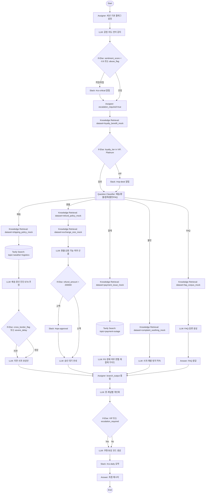
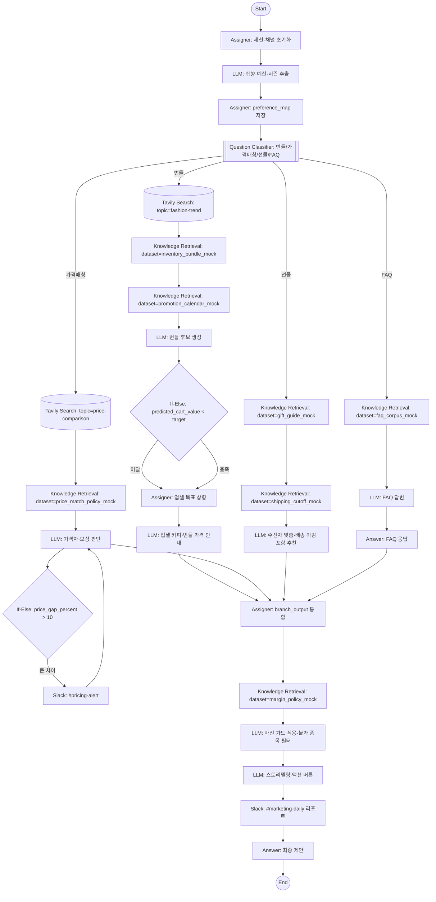
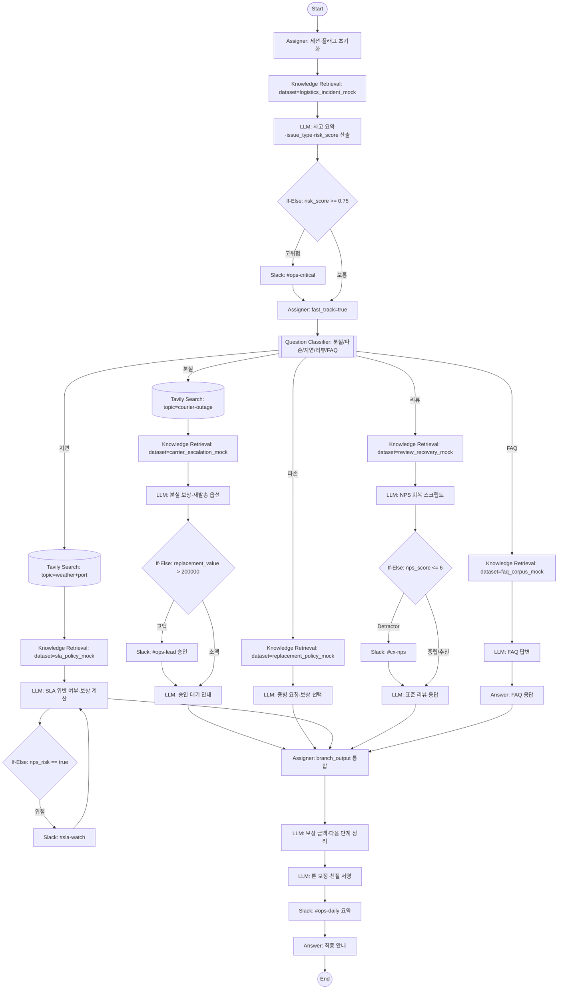

# Demo Scenario 2: Creative Agent Templates (Mock Store Enterprise Acting)

### 템플릿 1: 위기대응 CS & VIP 컨시어지 지휘관
* **[기획 의도]:** 감정 악화와 VIP 고객을 동시에 관리하는 CS 지휘관. 목업 환경에서도 `Tavily`로 외부 배송 이슈(날씨, 파업)를 끌어오고, `Knowledge`로 내부 정책을 근거로 삼아 실제 연동처럼 보이게 연기한다. 20개가 넘는 노드를 통해 감정 스크리닝, VIP 라우팅, 배송/환불/결제/불만 경로, 쿠폰 생성, Slack 보고까지 엔터프라이즈급 복잡성을 시연한다.
* **[가상 데이터 설정]:** `loyalty_benefit_mock.txt`(등급별 혜택), `shipping_policy_mock.txt`(국내/해외 배송 SLA, 파손 처리), `delay_playbook_mock.txt`(날씨·세관·파업 대응), `refund_policy_mock.txt`(환불 가능 조건, 차감 규칙), `exchange_size_mock.txt`(사이즈 교환 규정), `payment_issue_mock.txt`(PG 오류, 재결제 가이드), `complaint_soothing_mock.txt`(사과 템플릿, 보상 메뉴), `faq_corpus_mock.txt`(일반 FAQ).
* **[와이어프레임 (Mermaid Flowchart) - ⭐️ 핵심]:**

* **[노드별 상세 파라미터 (Detailed Configs)]:**
    - **S0 Start**: `ports.outputs=[{name:"query",type:"string",required:true},{name:"session_id",type:"string",required:false}]`, `port_bindings={query:{type:"user_message"},session_id:{type:"session_id"}}`.
    - **A1 Assigner (세션/플래그)**: `operations=[{id:"set_session",write_mode:"set",input_type:"variable",target_variable:{port_name:"session_id"},source_variable:{port_name:"start.session_id"}},{id:"init_escalation",write_mode:"set",input_type:"constant",target_variable:{port_name:"escalation_required"},constant_value:false},{id:"init_loyalty",write_mode:"set",input_type:"constant",target_variable:{port_name:"loyalty_tier"},constant_value:"Standard"}]`.
    - **L0 LLM (감정·의도)**: `provider="openai"`, `model="gpt-4"`, `prompt="너는 목업 쇼핑몰 1차 스크리너다. 사용자 메시지에서 sentiment_score(-1~1), intent_label(배송/환불/결제/불만/FAQ), language, abuse_flag(true/false), urgency_tag(low/medium/high)를 JSON으로만 반환. 실제 재고는 없으니 가이드 중심으로 답하도록 플래그를 함께 반환한다."`, `temperature=0.2`, `maxTokens=400`, `variable_mappings={query:{source:{variable:"start.query",value_type:"string"}}}`.
    - **IF0 If-Else (위험 감지)**: `cases=[{case_id:"critical",logical_operator:"or",conditions:[{id:"c1",varType:"number",variable_selector:"l0.response.sentiment_score",comparison_operator:"<",value:-0.6},{id:"c2",varType:"boolean",variable_selector:"l0.response.abuse_flag",comparison_operator:"=",value:true}]},{case_id:"else_default",logical_operator:"and",conditions:[]}]`.
    - **SL0 Slack (#cs-critical)**: `channel="#cs-critical"`, `use_blocks=true`, `integration_id=4101`, `variable_mappings={text:{source:{variable:"start.query",value_type:"string"}}}`.
    - **A2 Assigner (에스컬레이션 플래그)**: `operations=[{id:"flag_escalation",write_mode:"set",input_type:"constant",target_variable:{port_name:"escalation_required"},constant_value:true}]`.
    - **KR0 Knowledge Retrieval (로열티)**: `dataset="loyalty_benefit_mock"`, `retrievalMode="hybrid"`, `topK=3`, `variable_mappings={query:{source:{variable:"start.query",value_type:"string"}}}`.
    - **IF1 If-Else (VIP 판정)**: `cases=[{case_id:"vip_or_platinum",logical_operator:"or",conditions:[{id:"c1",varType:"string",variable_selector:"kr0.context.loyalty_tier",comparison_operator:"is",value:"VIP"},{id:"c2",varType:"string",variable_selector:"kr0.context.loyalty_tier",comparison_operator:"is",value:"Platinum"}]},{case_id:"else_default",logical_operator:"and",conditions:[]}]`.
    - **SL1 Slack (#vip-desk)**: `channel="#vip-desk"`, `use_blocks=true`, `integration_id=4102`, `variable_mappings={text:{source:{variable:"start.query",value_type:"string"}}}`.
    - **QC1 QuestionClassifier**: `classes=[{id:"shipping",name:"배송"},{id:"refund",name:"환불"},{id:"payment",name:"결제"},{id:"complaint",name:"불만"},{id:"faq",name:"FAQ"}]`, `instruction="문의 의도를 배송/환불/결제/불만/FAQ로 분류한다. 다중 의도가 있으면 가장 위험도 높은 것을 선택한다."`, `query_variable_selector=["start.query"]`, `model={provider:"openai",name:"gpt-4",mode:"chat",completion_params:{temperature:0.25}}`.
    - **KR1 Knowledge Retrieval (배송 정책)**: `dataset="shipping_policy_mock"`, `retrievalMode="hybrid"`, `topK=4`, `variable_mappings={query:{source:{variable:"start.query",value_type:"string"}}}`.
    - **TS1 Tavily Search (물류 외부 이슈)**: `search_depth="basic"`, `topic="weather+logistics"`, `max_results=5`, `time_range="week"`, `include_answer=false`, `include_raw_content=false`, `variable_mappings={query:{source:{variable:"start.query",value_type:"string"}}}`.
    - **L1 LLM (배송 진단)**: `provider="openai"`, `model="gpt-4"`, `prompt="shipping_policy_mock 컨텍스트와 Tavily 물류/날씨 결과를 결합해 지연 원인 후보, cross_border_flag(true/false), severe_delay(true/false), 예상 배송일을 JSON으로 산출한다. 실제 배송 시스템은 없으니 정책 기반 추정임을 메모 필드에 남긴다."`, `temperature=0.25`, `variable_mappings={policy:{source:{variable:"kr1.context",value_type:"string"}},tavily:{source:{variable:"ts1.context",value_type:"string"}},query:{source:{variable:"start.query",value_type:"string"}}}`.
    - **IF2 If-Else (지연 여부)**: `cases=[{case_id:"delay",logical_operator:"or",conditions:[{id:"c1",varType:"boolean",variable_selector:"l1.response.severe_delay",comparison_operator:"=",value:true},{id:"c2",varType:"boolean",variable_selector:"l1.response.cross_border_flag",comparison_operator:"=",value:true}]},{case_id:"else_default",logical_operator:"and",conditions:[]}]`.
    - **L2 LLM (지연 안내)**: `provider="openai"`, `model="gpt-4"`, `prompt="사용자 메시지와 배송 진단 JSON을 기반으로 지연 사과, ETA, 다음 단계, 보상 옵션을 한국어로 제공한다. 보상은 목업 쿠폰 코드로 생성한다."`, `temperature=0.3`, `variable_mappings={context:{source:{variable:"l1.response",value_type:"string"}},query:{source:{variable:"start.query",value_type:"string"}}}`.
    - **KR2 Knowledge Retrieval (환불 정책)**: `dataset="refund_policy_mock"`, `retrievalMode="hybrid"`, `topK=5`, `variable_mappings={query:{source:{variable:"start.query",value_type:"string"}}}`.
    - **KR3 Knowledge Retrieval (사이즈/교환)**: `dataset="exchange_size_mock"`, `retrievalMode="hybrid"`, `topK=3`, `variable_mappings={query:{source:{variable:"start.query",value_type:"string"}}}`.
    - **L3 LLM (환불 가능 판정)**: `provider="openai"`, `model="gpt-4"`, `prompt="refund_policy_mock과 exchange_size_mock을 근거로 환불/교환 가능 여부, 필요 서류, restocking_fee, 예상 환불액(refund_amount)을 JSON으로 계산한다."`, `temperature=0.22`, `variable_mappings={policy:{source:{variable:"kr2.context",value_type:"string"}},size:{source:{variable:"kr3.context",value_type:"string"}},query:{source:{variable:"start.query",value_type:"string"}}}`.
    - **IF3 If-Else (고액 가드)**: `cases=[{case_id:"high_amount",logical_operator:"and",conditions:[{id:"c1",varType:"number",variable_selector:"l3.response.refund_amount",comparison_operator:">",value:200000}]},{case_id:"else_default",logical_operator:"and",conditions:[]}]`.
    - **SL2 Slack (#ops-approval)**: `channel="#ops-approval"`, `use_blocks=true`, `integration_id=4103`, `variable_mappings={text:{source:{variable:"l3.response",value_type:"string"}}}`.
    - **L4 LLM (승인 대기/즉시 처리)**: `provider="openai"`, `model="gpt-4"`, `prompt="고액이면 승인 대기 메시지, 아니면 즉시 환불/교환 절차를 한국어로 안내한다. mock 환경임을 한 줄 메모로 명시한다."`, `temperature=0.27`, `variable_mappings={context:{source:{variable:"l3.response",value_type:"string"}}}`.
    - **KR4 Knowledge Retrieval (결제 이슈)**: `dataset="payment_issue_mock"`, `retrievalMode="hybrid"`, `topK=4`, `variable_mappings={query:{source:{variable:"start.query",value_type:"string"}}}`.
    - **TS2 Tavily Search (PG 장애 탐지)**: `search_depth="basic"`, `topic="payment-outage"`, `max_results=4`, `time_range="day"`, `include_answer=false`, `include_raw_content=false`, `variable_mappings={query:{source:{variable:"start.query",value_type:"string"}}}`.
    - **L5 LLM (결제 가이드)**: `provider="openai"`, `model="gpt-4"`, `prompt="payment_issue_mock과 Tavily 결과를 사용해 PG 장애 여부를 추정하고 재결제/대체 수단/보안 안내를 단계별 bullet로 작성한다."`, `temperature=0.26`, `variable_mappings={context:{source:{variable:"kr4.context",value_type:"string"}},tavily:{source:{variable:"ts2.context",value_type:"string"}}}`.
    - **KR5 Knowledge Retrieval (불만 완화 템플릿)**: `dataset="complaint_soothing_mock"`, `retrievalMode="hybrid"`, `topK=3`, `variable_mappings={query:{source:{variable:"start.query",value_type:"string"}}}`.
    - **L6 LLM (불만 대응)**: `provider="openai"`, `model="gpt-4"`, `prompt="complaint_soothing_mock을 근거로 사과문, 재발 방지 조치, 보상 옵션을 작성한다. 감정이 높을 경우 더 공손하게 작성한다."`, `temperature=0.3`, `variable_mappings={context:{source:{variable:"kr5.context",value_type:"string"}},sentiment:{source:{variable:"l0.response.sentiment_score",value_type:"number"}}}`.
    - **FAQ 서브플로우**: `FQK dataset="faq_corpus_mock"`, `retrievalMode="hybrid"`, `topK=5`; `FQL provider="openai", model="gpt-4", prompt="faq_corpus_mock 근거로 짧고 정확한 FAQ 답변 작성"`, `temperature=0.22`, `variable_mappings={context:{source:{variable:"fqk.context",value_type:"string"}},query:{source:{variable:"start.query",value_type:"string"}}}`; `FQA Answer template="FAQ 응답: {{fql.response}}"`.
    - **A4 Assigner (브랜치 결과 통합)**: `operations=[{id:"merge_shipping",write_mode:"set",input_type:"variable",target_variable:{port_name:"branch_output"},source_variable:{port_name:"l2.response"}},{id:"merge_refund",write_mode:"set",input_type:"variable",target_variable:{port_name:"branch_output"},source_variable:{port_name:"l4.response"}},{id:"merge_payment",write_mode:"set",input_type:"variable",target_variable:{port_name:"branch_output"},source_variable:{port_name:"l5.response"}},{id:"merge_complaint",write_mode:"set",input_type:"variable",target_variable:{port_name:"branch_output"},source_variable:{port_name:"l6.response"}},{id:"merge_faq",write_mode:"set",input_type:"variable",target_variable:{port_name:"branch_output"},source_variable:{port_name:"fqa.final_output"}}]`.
    - **L7 LLM (톤·채널 개인화)**: `provider="openai"`, `model="gpt-4"`, `prompt="branch_output을 사용해 한국어 톤을 정중하게 재작성하고, 채널(web/app/chat)에 맞는 길이로 리포맷한다. VIP면 2배 더 공손하게 한다."`, `temperature=0.24`, `variable_mappings={context:{source:{variable:"a4.branch_output",value_type:"string"}},loyalty:{source:{variable:"kr0.context.loyalty_tier",value_type:"string"}}}`.
    - **IF4 If-Else (보상 필요 여부)**: `cases=[{case_id:"vip_or_escalated",logical_operator:"or",conditions:[{id:"c1",varType:"string",variable_selector:"kr0.context.loyalty_tier",comparison_operator:"is",value:"VIP"},{id:"c2",varType:"boolean",variable_selector:"a2.escalation_required",comparison_operator:"=",value:true}]},{case_id:"else_default",logical_operator:"and",conditions:[]}]`.
    - **L8 LLM (쿠폰/보상 생성)**: `provider="openai"`, `model="gpt-4"`, `prompt="VIP 또는 에스컬레이션된 경우 5~15% 할인 쿠폰 코드, 만료일(7일), 사용 제한을 JSON으로 만든다. 일반 고객이면 감사 인사만 JSON으로 반환한다."`, `temperature=0.55`, `maxTokens=180`.
    - **SL3 Slack (#cs-daily)**: `channel="#cs-daily"`, `use_blocks=true`, `integration_id=4104`, `variable_mappings={text:{source:{variable:"l7.response",value_type:"string"}}}`.
    - **ANS Answer**: `template="최종 답변:\n{{l7.response}}\n보상: {{l8.response}}"`, `description="CS 통합 응답"`.
    - **END End**: 기본 설정.

---

### 템플릿 2: 카트 리프트 & 프로모션 번들 플래너
* **[기획 의도]:** 마케터와 세일즈가 함께 쓰는 카트 리프트 플로우. 사용자 취향을 추출한 뒤 외부 트렌드(Tavily)와 내부 목업 재고/프로모션/마진 가드를 결합하여 번들 추천, 가격매칭, 선물가이드를 제공한다. Slack으로 가격 위험 알림과 트렌드 리포트를 전송해 시연 임팩트를 극대화한다.
* **[가상 데이터 설정]:** `inventory_bundle_mock.json`(카테고리별 추천 후보, 재고 레벨), `promotion_calendar_mock.json`(기간별 할인율, 쿠폰 정책), `margin_policy_mock.txt`(마진 최소 기준, 금지 품목), `price_match_policy_mock.txt`(가격보장 규정), `gift_guide_mock.txt`(수신자 유형별 추천), `shipping_cutoff_mock.txt`(명절/주말 발송 마감), `faq_corpus_mock.txt`.
* **[와이어프레임 (Mermaid Flowchart) - ⭐️ 핵심]:**

* **[노드별 상세 파라미터 (Detailed Configs)]:**
    - **S0 Start**: `port_bindings={query:{type:"user_message"},session_id:{type:"session_id"}}`.
    - **A1 Assigner**: `operations=[{id:"set_channel",write_mode:"set",input_type:"constant",target_variable:{port_name:"channel"},constant_value:"web"},{id:"set_locale",write_mode:"set",input_type:"constant",target_variable:{port_name:"locale"},constant_value:"ko-KR"}]`.
    - **L0 LLM (취향 추출)**: `provider="openai"`, `model="gpt-4"`, `prompt="사용자 메시지에서 스타일 키워드, 시즌, 예산(budget_min,budget_max), 선호 카테고리, recent_focus(true/false)를 JSON으로 반환한다."`, `temperature=0.23`, `maxTokens=380`, `variable_mappings={query:{source:{variable:"start.query",value_type:"string"}}}`.
    - **A2 Assigner (취향 저장)**: `operations=[{id:"save_preferences",write_mode:"set",input_type:"variable",target_variable:{port_name:"preference_map"},source_variable:{port_name:"l0.response"}}]`.
    - **QC1 QuestionClassifier**: `classes=[{id:"bundle",name:"번들"},{id:"price_match",name:"가격매칭"},{id:"gift",name:"선물"},{id:"faq",name:"FAQ"}]`, `instruction="문의 의도를 번들/가격매칭/선물/FAQ로 분류한다. 매칭이 애매하면 번들을 우선한다."`, `query_variable_selector=["start.query"]`, `model={provider:"openai",name:"gpt-4",mode:"chat",completion_params:{temperature:0.28}}`.
    - **TS1 Tavily Search (트렌드 탐색)**: `search_depth="advanced"`, `topic="fashion-trend"`, `max_results=6`, `time_range="month"`, `include_answer=false`, `include_raw_content=false`, `variable_mappings={query:{source:{variable:"start.query",value_type:"string"}}}`.
    - **KR1 Knowledge Retrieval (재고 번들)**: `dataset="inventory_bundle_mock"`, `retrievalMode="hybrid"`, `topK=6`, `variable_mappings={query:{source:{variable:"l0.response",value_type:"string"}}}`.
    - **KR2 Knowledge Retrieval (프로모션 캘린더)**: `dataset="promotion_calendar_mock"`, `retrievalMode="hybrid"`, `topK=4`, `variable_mappings={query:{source:{variable:"ts1.context",value_type:"string"}}}`.
    - **L1 LLM (번들 후보)**: `provider="openai"`, `model="gpt-4"`, `prompt="트렌드 요약과 재고/프로모션 정보를 결합해 번들 3세트를 JSON 배열로 생성한다. 각 항목에 bundle_price, stock_level, promo_applied를 포함한다."`, `temperature=0.27`, `variable_mappings={trend:{source:{variable:"ts1.context",value_type:"string"}},inventory:{source:{variable:"kr1.documents",value_type:"array"}},promo:{source:{variable:"kr2.documents",value_type:"array"}},preferences:{source:{variable:"l0.response",value_type:"string"}}}`.
    - **IF1 If-Else (카트 목표)**: `cases=[{case_id:"below_target",logical_operator:"and",conditions:[{id:"c1",varType:"number",variable_selector:"l1.response.predicted_cart_value",comparison_operator:"<",value:80000}]},{case_id:"else_default",logical_operator:"and",conditions:[]}]`.
    - **A3 Assigner (업셀 목표)**: `operations=[{id:"set_target",write_mode:"set",input_type:"constant",target_variable:{port_name:"upsell_target"},constant_value:100000},{id:"flag_need_upsell",write_mode:"set",input_type:"variable",target_variable:{port_name:"need_upsell"},source_variable:{port_name:"if1.case_id"}}]`.
    - **L2 LLM (업셀 카피)**: `provider="openai"`, `model="gpt-4"`, `prompt="번들 후보를 바탕으로 업셀 문구를 작성하고 예상 할인율과 총액을 표로 만든다. need_upsell이 true면 추가 상품을 1개 더 제안한다."`, `temperature=0.3`, `variable_mappings={bundles:{source:{variable:"l1.response",value_type:"string"}},target:{source:{variable:"a3.upsell_target",value_type:"number"}}}`.
    - **TS2 Tavily Search (가격 비교)**: `search_depth="basic"`, `topic="price-comparison"`, `max_results=5`, `time_range="week"`, `include_answer=false`, `include_raw_content=false`, `variable_mappings={query:{source:{variable:"start.query",value_type:"string"}}}`.
    - **KR3 Knowledge Retrieval (가격보장 정책)**: `dataset="price_match_policy_mock"`, `retrievalMode="hybrid"`, `topK=3`, `variable_mappings={query:{source:{variable:"start.query",value_type:"string"}}}`.
    - **L3 LLM (가격매칭 판단)**: `provider="openai"`, `model="gpt-4"`, `prompt="price_match_policy_mock과 Tavily 경쟁사 가격을 비교해 price_gap_percent, eligible(true/false), 적용 쿠폰 또는 차액 반환액을 JSON으로 계산한다."`, `temperature=0.24`, `variable_mappings={policy:{source:{variable:"kr3.context",value_type:"string"}},competitor:{source:{variable:"ts2.context",value_type:"string"}}}`.
    - **IF2 If-Else (가격 갭 경보)**: `cases=[{case_id:"high_gap",logical_operator:"and",conditions:[{id:"c1",varType:"number",variable_selector:"l3.response.price_gap_percent",comparison_operator:">",value:10}]},{case_id:"else_default",logical_operator:"and",conditions:[]}]`.
    - **SL1 Slack (#pricing-alert)**: `channel="#pricing-alert"`, `use_blocks=true`, `integration_id=4201`, `variable_mappings={text:{source:{variable:"l3.response",value_type:"string"}}}`.
    - **KR4 Knowledge Retrieval (선물 가이드)**: `dataset="gift_guide_mock"`, `retrievalMode="hybrid"`, `topK=4`, `variable_mappings={query:{source:{variable:"start.query",value_type:"string"}}}`.
    - **KR5 Knowledge Retrieval (배송 마감)**: `dataset="shipping_cutoff_mock"`, `retrievalMode="hybrid"`, `topK=2`, `variable_mappings={query:{source:{variable:"start.query",value_type:"string"}}}`.
    - **L4 LLM (선물 추천)**: `provider="openai"`, `model="gpt-4"`, `prompt="gift_guide_mock과 shipping_cutoff_mock을 결합해 수신자 유형별 추천 3개와 배송 가능 일정을 표로 만든다."`, `temperature=0.29`, `variable_mappings={guide:{source:{variable:"kr4.context",value_type:"string"}},cutoff:{source:{variable:"kr5.context",value_type:"string"}},preferences:{source:{variable:"l0.response",value_type:"string"}}}`.
    - **FAQ 서브플로우**: `FQK dataset="faq_corpus_mock"`, `retrievalMode="hybrid"`, `topK=5`; `FQL provider="openai", model="gpt-4", prompt="faq_corpus_mock을 근거로 FAQ 답변을 작성한다."`, `temperature=0.22`, `variable_mappings={context:{source:{variable:"fqk.context",value_type:"string"}},query:{source:{variable:"start.query",value_type:"string"}}}`; `FQA Answer template="FAQ 응답: {{fql.response}}"`.
    - **A4 Assigner (브랜치 통합)**: `operations=[{id:"merge_bundle",write_mode:"set",input_type:"variable",target_variable:{port_name:"branch_output"},source_variable:{port_name:"l2.response"}},{id:"merge_price",write_mode:"set",input_type:"variable",target_variable:{port_name:"branch_output"},source_variable:{port_name:"l3.response"}},{id:"merge_gift",write_mode:"set",input_type:"variable",target_variable:{port_name:"branch_output"},source_variable:{port_name:"l4.response"}},{id:"merge_faq",write_mode:"set",input_type:"variable",target_variable:{port_name:"branch_output"},source_variable:{port_name:"fqa.final_output"}}]`.
    - **KR6 Knowledge Retrieval (마진 정책)**: `dataset="margin_policy_mock"`, `retrievalMode="hybrid"`, `topK=3`, `variable_mappings={query:{source:{variable:"a4.branch_output",value_type:"string"}}}`.
    - **L5 LLM (마진 가드 필터)**: `provider="openai"`, `model="gpt-4"`, `prompt="branch_output을 margin_policy_mock 기준으로 점검하여 금지 품목을 제거하고 최소 마진율을 유지하도록 가격을 조정한다. 조정 이유를 JSON으로 반환한다."`, `temperature=0.25`, `variable_mappings={context:{source:{variable:"a4.branch_output",value_type:"string"}},policy:{source:{variable:"kr6.context",value_type:"string"}}}`.
    - **L6 LLM (스토리텔링·CTA)**: `provider="openai"`, `model="gpt-4"`, `prompt="마진 검증된 추천을 한국어 스토리텔링 문단과 CTA 버튼 텍스트(장바구니 담기, 가격보장 신청, 배송 일정 확인)로 렌더링한다."`, `temperature=0.32`, `variable_mappings={context:{source:{variable:"l5.response",value_type:"string"}},channel:{source:{variable:"a1.channel",value_type:"string"}}}`.
    - **SL2 Slack (#marketing-daily)**: `channel="#marketing-daily"`, `use_blocks=true`, `integration_id=4202`, `variable_mappings={text:{source:{variable:"l6.response",value_type:"string"}}}`.
    - **ANS Answer**: `template="추천 결과:\n{{l6.response}}"`, `description="번들/가격매칭/선물/FAQ 통합 응답"` .
    - **END End**: 기본 설정.

---

### 템플릿 3: 배송 사고 조사 & 리뷰 복구 워룸
* **[기획 의도]:** 배송 분실·파손·지연과 리뷰 불만을 한 번에 처리하는 운영 워룸. Tavily로 물류 뉴스와 기상 이슈를 끌어와 사고 원인을 추정하고, Knowledge로 SLA/보상 규정을 근거로 하여 현실감 있게 연기한다. 위험 점수에 따라 법무/운영 Slack에 자동 보고하며 보상 계산까지 자동화한다.
* **[가상 데이터 설정]:** `logistics_incident_mock.txt`(분실/파손/지연 유형별 체크리스트), `sla_policy_mock.txt`(SLA 기준, 보상 금액 범위), `replacement_policy_mock.txt`(재발송, 대체품 규정), `review_recovery_mock.txt`(NPS 회복 스크립트, 쿠폰 옵션), `carrier_escalation_mock.txt`(택배사 연락 포맷), `faq_corpus_mock.txt`.
* **[와이어프레임 (Mermaid Flowchart) - ⭐️ 핵심]:**

* **[노드별 상세 파라미터 (Detailed Configs)]:**
    - **S0 Start**: `ports.outputs=[{name:"query",type:"string",required:true},{name:"session_id",type:"string",required:false}]`, `port_bindings={query:{type:"user_message"},session_id:{type:"session_id"}}`.
    - **A1 Assigner (초기화)**: `operations=[{id:"set_session",write_mode:"set",input_type:"variable",target_variable:{port_name:"session_id"},source_variable:{port_name:"start.session_id"}},{id:"init_fast_track",write_mode:"set",input_type:"constant",target_variable:{port_name:"fast_track"},constant_value:false}]`.
    - **KR0 Knowledge Retrieval (사고 체크리스트)**: `dataset="logistics_incident_mock"`, `retrievalMode="hybrid"`, `topK=4`, `variable_mappings={query:{source:{variable:"start.query",value_type:"string"}}}`.
    - **L0 LLM (사고 요약·위험 점수)**: `provider="openai"`, `model="gpt-4"`, `prompt="logistics_incident_mock을 참조해 issue_type(lost/damage/delay/review/faq), risk_score(0~1), 요약, 필요한 증빙을 JSON으로 반환한다. 목업 환경임을 memo 필드에 명시한다."`, `temperature=0.24`, `maxTokens=420`, `variable_mappings={context:{source:{variable:"kr0.context",value_type:"string"}},query:{source:{variable:"start.query",value_type:"string"}}}`.
    - **IF0 If-Else (고위험 여부)**: `cases=[{case_id:"high_risk",logical_operator:"and",conditions:[{id:"c1",varType:"number",variable_selector:"l0.response.risk_score",comparison_operator:">=",value:0.75}]},{case_id:"else_default",logical_operator:"and",conditions:[]}]`.
    - **SL0 Slack (#ops-critical)**: `channel="#ops-critical"`, `use_blocks=true`, `integration_id=4301`, `variable_mappings={text:{source:{variable:"l0.response",value_type:"string"}}}`.
    - **A2 Assigner (패스트트랙 플래그)**: `operations=[{id:"flag_fast_track",write_mode:"set",input_type:"constant",target_variable:{port_name:"fast_track"},constant_value:true}]`.
    - **QC1 QuestionClassifier**: `classes=[{id:"lost",name:"분실"},{id:"damage",name:"파손"},{id:"delay",name:"지연"},{id:"review",name:"리뷰"},{id:"faq",name:"FAQ"}]`, `instruction="사고 유형을 분실/파손/지연/리뷰/FAQ 중 하나로 분류한다. risk_score가 높으면 분실/파손을 우선한다."`, `query_variable_selector=["start.query"]`, `model={provider:"openai",name:"gpt-4",mode:"chat",completion_params:{temperature:0.26}}`.
    - **TS1 Tavily Search (택배사 장애)**: `search_depth="basic"`, `topic="courier-outage"`, `max_results=4`, `time_range="week"`, `include_answer=false`, `include_raw_content=false`, `variable_mappings={query:{source:{variable:"start.query",value_type:"string"}}}`.
    - **KR1 Knowledge Retrieval (택배사 에스컬레이션 포맷)**: `dataset="carrier_escalation_mock"`, `retrievalMode="hybrid"`, `topK=3`, `variable_mappings={query:{source:{variable:"ts1.context",value_type:"string"}}}`.
    - **L1 LLM (분실 대응 옵션)**: `provider="openai"`, `model="gpt-4"`, `prompt="carrier_escalation_mock과 Tavily 결과를 참고해 재발송, 환불, 쿠폰 옵션을 포함한 대응안을 JSON으로 작성하고 replacement_value 필드를 포함한다."`, `temperature=0.27`, `variable_mappings={context:{source:{variable:"kr1.context",value_type:"string"}},tavily:{source:{variable:"ts1.context",value_type:"string"}},query:{source:{variable:"start.query",value_type:"string"}}}`.
    - **IF1 If-Else (고액 분실 가드)**: `cases=[{case_id:"high_value",logical_operator:"and",conditions:[{id:"c1",varType:"number",variable_selector:"l1.response.replacement_value",comparison_operator:">",value:200000}]},{case_id:"else_default",logical_operator:"and",conditions:[]}]`.
    - **SL1 Slack (#ops-lead)**: `channel="#ops-lead"`, `use_blocks=true`, `integration_id=4302`, `variable_mappings={text:{source:{variable:"l1.response",value_type:"string"}}}`.
    - **L2 LLM (분실 안내)**: `provider="openai"`, `model="gpt-4"`, `prompt="분실 대응 JSON을 기반으로 승인 대기 또는 즉시 조치를 안내한다. 택배사 문의 링크와 내부 티켓 번호를 포함한다."`, `temperature=0.28`, `variable_mappings={context:{source:{variable:"l1.response",value_type:"string"}},fast_track:{source:{variable:"a2.fast_track",value_type:"boolean"}}}`.
    - **KR2 Knowledge Retrieval (파손 정책)**: `dataset="replacement_policy_mock"`, `retrievalMode="hybrid"`, `topK=4`, `variable_mappings={query:{source:{variable:"start.query",value_type:"string"}}}`.
    - **L3 LLM (파손 대응)**: `provider="openai"`, `model="gpt-4"`, `prompt="replacement_policy_mock을 근거로 사진 증빙 요청, 재포장 주의사항, 대체품 제안, 보상 금액을 JSON으로 작성한다."`, `temperature=0.29`, `variable_mappings={context:{source:{variable:"kr2.context",value_type:"string"}},query:{source:{variable:"start.query",value_type:"string"}}}`.
    - **TS2 Tavily Search (날씨/항만 이슈)**: `search_depth="basic"`, `topic="weather+port"`, `max_results=5`, `time_range="week"`, `include_answer=false`, `include_raw_content=false`, `variable_mappings={query:{source:{variable:"start.query",value_type:"string"}}}`.
    - **KR3 Knowledge Retrieval (SLA 정책)**: `dataset="sla_policy_mock"`, `retrievalMode="hybrid"`, `topK=3`, `variable_mappings={query:{source:{variable:"start.query",value_type:"string"}}}`.
    - **L4 LLM (지연 보상 계산)**: `provider="openai"`, `model="gpt-4"`, `prompt="sla_policy_mock과 Tavily 날씨/항만 정보를 사용해 SLA 위반 여부를 판단하고 보상액, ETA, 대체 옵션을 JSON으로 계산한다. nps_risk(true/false)도 포함한다."`, `temperature=0.25`, `variable_mappings={context:{source:{variable:"kr3.context",value_type:"string"}},tavily:{source:{variable:"ts2.context",value_type:"string"}},query:{source:{variable:"start.query",value_type:"string"}}}`.
    - **IF2 If-Else (NPS 위험)**: `cases=[{case_id:"nps_risk",logical_operator:"and",conditions:[{id:"c1",varType:"boolean",variable_selector:"l4.response.nps_risk",comparison_operator:"=",value:true}]},{case_id:"else_default",logical_operator:"and",conditions:[]}]`.
    - **SL2 Slack (#sla-watch)**: `channel="#sla-watch"`, `use_blocks=true`, `integration_id=4303`, `variable_mappings={text:{source:{variable:"l4.response",value_type:"string"}}}`.
    - **KR4 Knowledge Retrieval (리뷰 회복 스크립트)**: `dataset="review_recovery_mock"`, `retrievalMode="hybrid"`, `topK=4`, `variable_mappings={query:{source:{variable:"start.query",value_type:"string"}}}`.
    - **L5 LLM (리뷰 응답)**: `provider="openai"`, `model="gpt-4"`, `prompt="review_recovery_mock을 기반으로 리뷰 응답 초안을 작성하고 예상 nps_score(0~10)를 추정해 JSON으로 반환한다."`, `temperature=0.28`, `variable_mappings={context:{source:{variable:"kr4.context",value_type:"string"}},query:{source:{variable:"start.query",value_type:"string"}}}`.
    - **IF3 If-Else (Detractor 판별)**: `cases=[{case_id:"detractor",logical_operator:"and",conditions:[{id:"c1",varType:"number",variable_selector:"l5.response.nps_score",comparison_operator:"<=",value:6}]},{case_id:"else_default",logical_operator:"and",conditions:[]}]`.
    - **SL3 Slack (#cx-nps)**: `channel="#cx-nps"`, `use_blocks=true`, `integration_id=4304`, `variable_mappings={text:{source:{variable:"l5.response",value_type:"string"}}}`.
    - **L6 LLM (리뷰 보상/응답)**: `provider="openai"`, `model="gpt-4"`, `prompt="detractor이면 추가 보상과 재방문 제안을 포함한 응답을 작성하고, 아니면 감사 인사를 담은 표준 응답을 작성한다."`, `temperature=0.3`, `variable_mappings={context:{source:{variable:"l5.response",value_type:"string"}},fast_track:{source:{variable:"a2.fast_track",value_type:"boolean"}}}`.
    - **FAQ 서브플로우**: `FQK dataset="faq_corpus_mock"`, `retrievalMode="hybrid"`, `topK=5`; `FQL provider="openai", model="gpt-4", prompt="faq_corpus_mock 근거로 FAQ 답변 작성"`, `temperature=0.22`, `variable_mappings={context:{source:{variable:"fqk.context",value_type:"string"}},query:{source:{variable:"start.query",value_type:"string"}}}`; `FQA Answer template="FAQ 응답: {{fql.response}}"`.
    - **A4 Assigner (브랜치 통합)**: `operations=[{id:"merge_lost",write_mode:"set",input_type:"variable",target_variable:{port_name:"branch_output"},source_variable:{port_name:"l2.response"}},{id:"merge_damage",write_mode:"set",input_type:"variable",target_variable:{port_name:"branch_output"},source_variable:{port_name:"l3.response"}},{id:"merge_delay",write_mode:"set",input_type:"variable",target_variable:{port_name:"branch_output"},source_variable:{port_name:"l4.response"}},{id:"merge_review",write_mode:"set",input_type:"variable",target_variable:{port_name:"branch_output"},source_variable:{port_name:"l6.response"}},{id:"merge_faq",write_mode:"set",input_type:"variable",target_variable:{port_name:"branch_output"},source_variable:{port_name:"fqa.final_output"}}]`.
    - **L7 LLM (보상·다음 단계 정리)**: `provider="openai"`, `model="gpt-4"`, `prompt="branch_output을 표준 포맷으로 재구성하여 보상액, ETA, 필요한 사용자 행동, 티켓 ID를 bullet로 반환한다."`, `temperature=0.26`, `variable_mappings={context:{source:{variable:"a4.branch_output",value_type:"string"}},fast_track:{source:{variable:"a2.fast_track",value_type:"boolean"}}}`.
    - **L8 LLM (톤 보정)**: `provider="openai"`, `model="gpt-4"`, `prompt="L7 내용을 정중하고 공감 어린 한국어 문장으로 풀어쓰고, mock 환경 안내 문구를 괄호로 덧붙인다."`, `temperature=0.25`, `variable_mappings={context:{source:{variable:"l7.response",value_type:"string"}}}`.
    - **SL4 Slack (#ops-daily)**: `channel="#ops-daily"`, `use_blocks=true`, `integration_id=4305`, `variable_mappings={text:{source:{variable:"l7.response",value_type:"string"}}}`.
    - **ANS Answer**: `template="최종 안내:\n{{l8.response}}"`, `description="배송 사고/리뷰/FAQ 통합 응답"`.
    - **END End**: 기본 설정.
